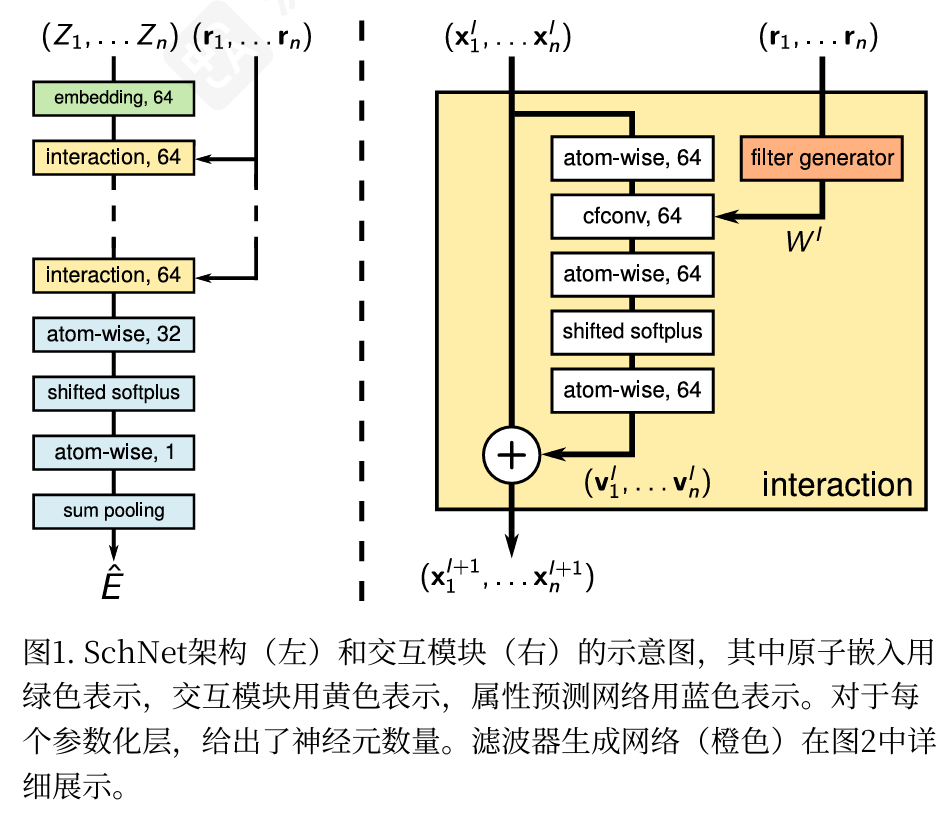
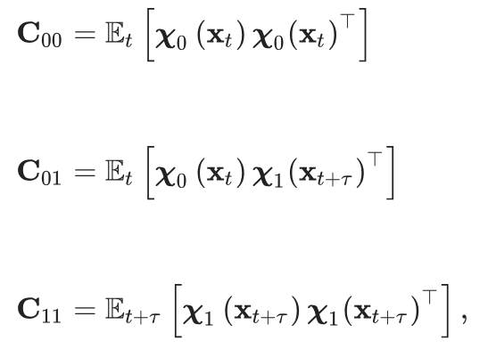
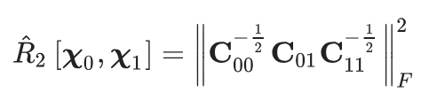
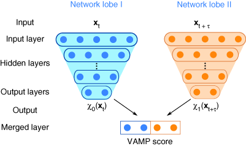

# Classical

## SchNet – A deep learning architecture for molecules and materials

> K. T. Schütt, H. E. Sauceda, P.-J. Kindermans, A. Tkatchenko, K.-R. Müller; SchNet – A deep learning architecture for molecules and materials. **J. Chem. Phys.** 28 June 2018; 148 (24): 241722. https://doi.org/10.1063/1.5019779

**分子嵌入表示领域的开山之作。不得不品鉴的经典啊**。

基本思路：把一个分子用核电荷张量和位置张量表示。原始的数据是
$$
( Z_{1},\cdots ,Z_n )\quad ( r_{1},\cdots ,r_n )
$$
为了保持不变性（平移，旋转），这里 $r$ 用的是相对坐标。

首先先embedding 进 64维张量，之后进Interaction模块（有点类似于Attention），接下来就是各种加和给出最终能量值。

重点看交互模块。这里用到了连续滤波卷积cfvonv，但我暂时看不懂。

---

## VAMPnets for deep learning of molecular kinetics

> Mardt, A., Pasquali, L., Wu, H. *et al.* VAMPnets for deep learning of molecular kinetics. *Nat Commun* **9**, 5 (2018). https://doi.org/10.1038/s41467-017-02388-1

简单来说，就是先预测一条trajectory，之后不断通过给模型喂t时刻的坐标和$t+\tau$ 这个未来时间的坐标，让模型自己找关系。 

先要了解**Koopman**理论，即对于一段时间 $\tau$ 的坐标演化
$$
\va{x}_{t+\tau } = F( \va{x}_t )
$$
这里这个变换可能是非线性的。但如果改成某一个定义的observable
$$
f( \va{x} ) = r\qor \theta  \qor \cdots 
$$
之后定义一个算子对函数进行变换，这样就是线性的了
$$
\mathbf{K}_{\tau }f( x_{t} ) = f'( x_{t+\tau } )
$$
问题在于这个时候函数变成无限维了。不过是线性的就好处理。

论文用到的observable是神经网络输出的函数 $\chi$，因为分子力学是统计性质的，所以我们看他的期望
$$
E[ \chi_{1}( x_{t+\tau } ) ] \approx K^{T}E[ \chi _0( x_t ) ]
$$
这里神经网络的输出函数是有限维度的，假设是m维。

之后就吃最小二乘找K了，

$$
K = C_{00}^{-1}C_{01}
$$
现在唯一的文艺就是，没法求出 $\chi$ 函数具体的变换。这时候用到VAMP变分。

定义得分函数为

然后让这个得分函数最大就行了。

后面的数学推导看不懂了，有时间再来看。

---

## **Machine Learning for Molecular Simulation**

> - Vol. 71:361-390 (Volume publication date April 2020) https://doi.org/10.1146/annurev-physchem-042018-052331
> - First published as a Review in Advance on February 24, 2020

综述啊总数

