# Lecture 1: 晶体学基础与对称性

## 1.1 晶胞与宏观晶体

### 1.1.1 晶胞的选取

众所周知，**晶胞**指的是晶体中可以通过**平移**无限延展的一种重复单元，一般由一个几何体以及其内部填充的原子组成。需要注意的是，一个晶胞不仅需要包含其内部的原子，还需要包含几何体内的空间，这意味着构成晶胞的几何体必须**仅通过平移形成二维或三维密铺**。

在二维情况，这类的情况有很多，主要包括以下两种结构的衍生：

|          **平行四边形**（包括正方形，矩形，菱形等）          |                     含有对称中心的六边形                     |
| :----------------------------------------------------------: | :----------------------------------------------------------: |
|  |  |

不难看出，对于二维结构而言，其共同含有**对边平行且相等**的特征，不妨称为**平行多边形**（parallelogon）。我们把这一特征运用的三维情况下，可以构造出如下**平行多面体**（parallelohedron）：

|                        **平行六面体**                        |                     截角八面体($4^66^8$)                     |                        菱形十二面体($4^{12}$)                        |                         拉长十二面体($4^86^4$)                         |                        中心对称六棱柱                        |
| :----------------------------------------------------------: | :----------------------------------------------------------: | :----------------------------------------------------------: | :----------------------------------------------------------: | :----------------------------------------------------------: |
|  |  |  |  |  |
|  |       |       |  |  |

形如 $4^66^8$ 的记号被称为多面体记号（正式的叫**施莱夫利符号**，严格来说数学上并没有这样的写法，但是竞赛里一般都用这种写法表示），表示一个多面体由6个四边形面和8个六边形面组成。

一般而言，这样的多面体选取越简单越好，于是乎人们规定二维晶胞的形状为**平行四边形**，三维晶胞的形状为**平行六面体**。

常见的平行六面体晶胞分为两种：

- **素晶胞**（primitive cell，也叫原胞）：恰好只包含一个点阵点的晶胞，即所选的晶胞恰好是一个最小的重复单元，对平行六面体的具体形状没有要求。

习惯上对于素晶胞，常常选择一个点阵点作为顶点，这样方便定位。对于平行六面体而言，只需确定其棱边上的三个向量 $\vec{a}, \vec{b}, \vec{c}$ 即可确定其在空间内的位置，所以我们只需要先找到一个点阵点，再在它周围选择其他三个点阵点构建向量，最后由平移对称性即可构建整个素晶胞。

!!! example "素晶胞的画法"
    画出以下三种点阵：(1) 简单立方；(2) 体心立方；(3) 面心立方 对应的素晶胞。

    
    
    ??? success "答案"
        从紫色点阵点出发，找到红绿蓝三个向量，之后平移向量即可得解。
    
        

- **正当晶胞**（conventional cell）：

正当晶胞是为了更便捷的研究晶体的对称性取出的晶胞，因此引入了允许带心晶胞的概念（我们之后介绍），使晶胞整体呈现更加对称的形状。满足所谓“三原则”：

1. 完全反映点阵的对称性；
2. 包含尽可能多的直角；
3. 体积尽量小（但不一定是最小）。

一般而言，通常说的“晶胞”都指的是反映对称性的**正当晶胞**。

除此以外还有**超晶胞**（supercell）的概念，即由多个正当晶胞叠加形成的晶胞 ，通常只是作为计算或构建模型的辅助工具。

!!! note "拓展：维格纳-赛茨原胞（Wigner–Seitz cell）"
    物理学家创造了一种特殊的原胞，其通过**画出一个点阵点与周围相邻点阵点连线的垂直平分线**围出。它同样满足平移密铺，且只含一个点阵点，但是并不一定是平行四边形：

    
    
    在三维空间里也是同理，我们需要画出**一个点阵点与周围相邻点阵点连线的垂直平分面**，围出的立体图形即为维格纳-赛茨原胞。对于体心立方点阵和面心立方点阵而言，其对应的维格纳-赛茨原胞原胞分别为截角八面体和菱形十二面体。
    
    | 体心立方-截角八面体                                          | 面心立方-菱形十二面体                                        |
    | ------------------------------------------------------------ | ------------------------------------------------------------ |
    |  |  |

---

### 1.1.2 晶面与晶向

我们考虑一个立方体晶胞中的一个面：


显而易见的，他与三个坐标轴的交点为 $a, b, c$ ，因此我们可以用着三个数值表示这个晶面。但是如果是这样呢？


此时这个晶面在 $c$ 轴上没有交点，此时再想用上面那种方法表示就难了。于是我们不妨不直接用截距表示，而是用截距的倒数表示，定义：

$$
h = \frac 1a, k = \frac1b, l = \frac 1c
$$

我们就可以用 $(hkl)$ 来代表一个晶面，这样就可以利用 $0 = 1/\infty$ 把无穷远点消除掉。例如，上面这种晶面就可以表示为 $(\frac 1a, \frac 1b, 0)$ ，这样的定义方法叫做**Miller 晶面指数**。这样的定义方法对于其他形状的晶胞也是适用的。


!!! quote "更多晶面指数"
    一般而言，在晶体学里的 $-1$ 常常用 $\overline{1}$ 表示，由此可以延申出各个取向的晶面。符号相同的晶面都是互相平行的：

    
    
    对于立方晶胞，由于其对称性，$(100)$, $(010)$ 和 $(001)$ 的环境其实是一样的。为了方便起见，我们可以把它们设成一个集合 $\{100\}$ ，这便称为一个**晶面族**。同理我们还有 $\{110\}$ 晶面族和 $\{111\}$ 晶面族。

学过高中数理都知道，平面实际上是有方向的，不过我们一般只在向量运算中讨论。所以，如果严格讨论晶面的取向，晶面 $(100)$ 应当具有指向前方和指向后方两种向量，我们可以分别记为 $[100]$ 和 $[\overline{1}00]$ 。这被称为**晶向指数**。

同样的，晶向指数形成的族称为**晶向族指数**，用尖括号括起来，例如 $\left<100\right>$ 代表的是 $[100], [\overline{1}00], [010], [0\overline10], [001], [00\overline1]$ 六个晶向指数的集合。

!!! abstract "总结"
    | 名称           | 符号                   | 描述对象         | 核心含义                                         | 举例（立方晶系）                                             |
    | :------------- | :--------------------- | :--------------- | :----------------------------------------------- | :----------------------------------------------------------- |
    | **晶面指数**  | **$(hkl)$**            | **单个晶面**     | 一组相互平行的原子平面            | **(100)**：与a轴垂直的平面。                                 |
    | **晶面族指标** | **$\{hkl\}$**          | **所有等效晶面** | 性质相同的一系列晶面 | **{100}**：包括$(100), (010), (001)$的所有立方体表面。       |
    | **晶向指数**   | **$[uvw]$**            | **单个晶向**     | 晶体中的一个方向                           | **[100]**：沿着a轴的方向。                                   |
    | **晶向族指数** | **$\left<uvw\right>$** | **所有等效晶向** | 性质相同的一系列晶向 | **<100>**：包括$[100], [\overline{1}00], [010], [0\overline10], [001], [00\overline1]$的所有立方体棱边方向。 |

---

### 1.1.3 晶体生长与宏观晶体

现在我们来研究关于宏观晶体的性质。


由于实际晶体不能满足平移对称性（否则整个空间就全是晶体了），所以不可避免的会产生形状。早期科学家通过对晶体的研究，确认了其具有以下性质：

- **二面角守恒定律**：同种晶体在相同条件下结晶，其相邻晶面**夹角总是保持一个恒定的值**；
- **各向异性**：晶体的热传导性质，力学性质等**在不同方向上存在差异**；
- **自范性**：人为改变晶体形状后使之在饱和溶液中继续结晶，晶体会**重新生长成多面体形**；
- **均匀性**：晶体内部的微观结构始终是均匀的，使之**具有恒定的熔点**。

观察这些性质，不难发现：**宏观晶体的表面和微观晶胞的晶面存在关系**。

事实上，宏观晶体的表面正是微观结构中某些晶面的对应，如何找出其对应关系呢？我们从晶体的生长考虑：晶体生长无非就是原子/分子靠近并沉积在晶面上的过程，因此，如果各个晶面上的沉积速度相同，**晶面上原子密度更大者，相同时间内沉积的层数就越小，进而生长速度也越小**。在最终晶体的形状上，生长快的晶面会消失，而**生长最慢，也就是原子密度最大的晶面会被保留下来**。这一规律被称为**布拉维法则**（Bravais' Rule）。

下图演示了这一沉积过程， $BC$ 晶面生长速度快而更快消失。


哪些晶面容易形成晶体表面呢？通常是**低指数的晶面**，因为其通常具有较低的原子密度。对于高指数晶面而言，其通常具有较大的表面积，因此其生长速度也是相当快的。


!!! question "另一种理解方式"
    我们也可以从吉布斯自由能变理解。晶体生长时需要满足**最低的吉布斯自由能**，而晶体本身的自由能包括内部能量和表面能两部分。在表面能上，原子密度越大的晶面，原子间的相互作用力越强，致使其在最终宏观晶体上得以体现。

以氯化钠晶体作为例子，我们来看看布拉维规则的运用。

!!! example "氯化钠的晶型"
    已知氯化钠晶体如下图所示，根据布拉维法则判断其宏观晶体形状。

    
    
    ??? success "答案"
        因其晶体结构相对简单，考虑较低指数的晶面族，如 $\{100\}, \{110\}, \{111\}$ 三个晶面族（不久前我们说过，对于立方晶系而言很多晶面都是等效的）：
    
        
    
        所以在 $\{100\}$ 族的六个晶面将在宏观晶体里体现出来，即为**立方体形**。
    
        

以立方晶系为例子，从最低指数的晶面开始考虑， $\{100\}$ 族对应**立方体形**，而 $\{111\}$ 族对应着沿体对角线的八个晶向生长的晶面，不难想出其对应**八面体形**，一个典型的例子是明矾晶体。 $\{110\}$ 族则对应沿体心到棱形延申的12个晶向生长的晶面，形状有些复杂，对应的是**菱形十二面体形**。

从这三种基础模式，我们可以延伸出更多“杂交”的晶形：


您可以在这个网站 [Pyrite Crystal](https://shengzhiwu.github.io/pyrite-crystal-morphology-graph.html) 上查看不同晶面生长对应的3d结构图。

实际晶体的结构远比上面介绍的更加复杂，往往会体现更多的晶面，例如黝铜矿（$\ce{Cu3SbS3}$）：

|                         黝铜矿的晶面                         |                       黝铜矿的宏观晶体                       |
| :----------------------------------------------------------: | :----------------------------------------------------------: |
|  |  |

一个有趣的例子是黄铁矿。在黄铁矿的宏观晶体里，常常同时体现 $\{100\}$ 和 $\{210\}$ 两个晶面族，前者对应6种晶向，后者对应12种晶向。当后者在主体结构中占上风时。会形成类似五角十二面体的结构；然而晶体中**并不能存在五重轴**，这样的结构实际上只是对称性更低的 $T_h$ 结构。

|                         黄铁矿的晶面                         |                       黄铁矿-立方体形                        |                   黄铁矿-类五角十二面体形                    |
| :----------------------------------------------------------: | :----------------------------------------------------------: | :----------------------------------------------------------: |
|  |  |  |

!!! abstract "准晶体"
    事实上，通过某种方式真能结出来五角十二面体的晶体。某种Ho-Mg-Zn合金的晶体具有**准晶**（quasicrystal）的性质，其结构如下图所示，具有五重对称性但并不满足平移对称性，神奇的是居然能密铺整个空间。

    |                        准晶的微观结构                        |                      五角十二面体的准晶                      |
    | :----------------------------------------------------------: | :----------------------------------------------------------: |
    | .svg.png) |  |
    
    有趣的是，已知最早的准晶居然是“三位一体”核试验中的一块核爆玻璃样本。~~失重的魅力这一块，发现这个的也是神人了。~~

再比如说对于氧化亚铜 $Cu_2O$ 的微晶，控制其结晶条件不同，可以获得含有多种晶面甚至高指数晶面的宏观晶体。


<center><b><i>Nanoscale</i></b>, 2020,<b>12</b>, 16657-16677</center>

上述所探讨的都是**单晶**，即认为宏观晶体内只有一种连续的晶格结构。然而，由于结晶情况不同，有时候会由于产生了多种晶格结构而产生**多晶**。这样的产生的晶体内部并没有长程的平移对称性，可视为多种单晶形状的叠加。


---

### 1.1.4 液晶

液晶（Liquid Crystal）是一种介于液体和固体之间的一种状态，表示其中的分子像晶体一样有固定的趋向，但可以像液体一样流动。这样的分子通常需要很长且具有一定的刚性，如下图所示的分子MBBA：


通常情况下的液晶存在三种状态：

- **近晶相**（**Smectic phases**）：液晶仍然很大程度上趋向层状固体的排列方式，层间可以互相滑动。通常在较低的温度下产生。
- **向列相**（**Nematic phase**）：无晶体的整齐排列，但每个分子都近似呈平行趋向。通常在较高的温度下产生。
- **胆甾相/手性相**（**Chiral phases**）：由手性分子形成，存在螺旋扭曲。

|                            近晶相                            |                            向列相                            |                            胆甾相                            |
| :----------------------------------------------------------: | :----------------------------------------------------------: | :----------------------------------------------------------: |
|  |  |  |

---

## 1.2 晶体的宏观对称性

### 1.2.1 宏观对称元素

所谓“宏观对称性”，意思就是从宏观上可以观测到的对称性，包括旋转轴，反映面，反演中心三种。

!!! question "什么叫“宏观可以观测”？"
    即**最终会从宏观晶体上体现出来**，对于旋转轴的信息，由于宏观晶体的晶面就是由微观晶体生长而来的，所以这个信息自然可以得到体现，如我们所看到的绝大部分晶体都是相对对称的图形。

    与之相反的是，**与平移相关的对称性不属于宏观对称性**，因为宏观晶体是有限的，而平移是无限的。我们后面会说到这一类对称元素。

我们先从基本元素的记号出发。对于这三种对称元素一般记作（其中括号内的是讨论分子对称性的常用形式，括号外是讨论晶体对称性的常用形式）：

- **旋转轴**：$1\ (C_1)$，$2\ (C_2)$，$3\ (C_3)$ ，$4\ (C_4)$ ，$6\ (C_6)$
- **反映面**： $m\ (\sigma)$
- **反演中心**：$(i)$

!!! question "为什么只有这几种旋转轴？"
    这实际上被称为**晶体学限制定理**（crystallographic restriction theorem）。我们还是从平移对称性出发：

    
    
    - 对于一个矢量连成的多边形而言，把所有矢量移到点中间构成一个相同对称性的图形，则对于6重对称以上的图形，**平移后的多边形更小**，如此重复会得到格点间距无限小的离谱结论。
    - 对于五重对称而言，使其首尾相接形成五角星的五重对称图形，同样也会造成这一矛盾。
    
    也可以通过三角学证明：
    
    
    
    对于一个原子列，考虑向左和向右旋转 $2\pi/n$ 的角。而由于平移对称性，其下面的点间距必须满足是**原子间距的整数倍** $r = ma$。于是：
    
    $$
    2a\cos\frac{2\pi}{n} = m
    $$
    
    仅当 $n=1,2,3,4,6$ 满足条件。

!!! warning "注意"
    很大程度上，分子的最高轴旋转轴和其形成的晶体的最高次旋转轴**不一定一致**。一个显而易见的例子是富勒烯 $\ce{C60}$ ，你肯定不能指望一个晶体里有五次轴。

和分子对称性一样，如果我们将旋转操作和反演操作结合起来（即将(旋转 $360/n^\circ$ + 反演一次)作为一步操作），我们就可以得到**反轴**。

- **反轴**：$\overline 1 \ (I_1, i)$, $\overline 2 \ (I_2) \equiv m$，$\overline 3 \ (I_3)$ ，$\overline 4 \ (I_4)$ ，$\overline 6 \ (I_6)$

我们可以看到一重反轴（就是旋转一圈再反演）和反演中心完全一样，事实上在晶体里，我们一般更常用 $\overline 1$ 记号代表反演中心。而对于二重反轴，其和反映面是相同的，但我们还是更常用反映面 $m$ 的记号。

对于分子对称性，有一个类似的概念叫**映轴**（一般不在晶体对称性里提），即将(旋转 $360/n^\circ$ + 沿对称轴反映一次)作为一步操作，事实上这和反轴是存在对应关系的：

| 反轴记号               | 对应的映轴记号 |
| ---------------------- | -------------- |
| $\overline 1$          | $(S_2)$        |
| $\overline 2 \equiv m$ | $(S_1)$        |
| $\overline 3$          | $(S_6)$        |
| $\overline 4$          | $(S_4)$        |
| $\overline 6$          | $(S_3)$        |

---

### 1.2.2 晶系

我们前面提到，晶胞的选取需要整体是平行四边形/平行六面体。我们先从二维的平行四边形来考虑。

对于不同的平行四边形而言，其对称性是不同的。我们都知道，任何一个平行四边形都有二重旋转轴 $2$ 。而当其夹角为直角时，其就会由平行四边形“进化”成矩形；再有邻边相等，就会“进化”成正方形。

如果科学的描述这个进化过程，实质上是对称性的提高：


对于某类**有相同对称性的晶格点阵**，我们称之为属于一种**晶系**（Crystal System）。于是我们可以对二位点阵进行分类：

- **单斜晶系**：“一般平行四边形晶胞（$a\neq b, \alpha\neq 90^\circ$）”，仅有二重轴；
- **正交晶系**：“矩形晶胞（$a\neq b, \alpha = 90^\circ$）”，存在二重轴和**两个垂直方向的镜面**；
- **正方晶系**：“正方形晶胞（$a\neq b, \alpha = 90^\circ$）”，存在**四重轴**和两个垂直方向的镜面。

!!! warning "注意"
    我们说是“$n$ 重轴”，指的是包括旋转轴，反轴，甚至后面要说的螺旋轴等所有对称轴，因为我们只管**宏观对称性**，而这些轴在宏观上并没有任何区别。

我们之前说过，晶体里还可能存在六重轴，但这里我们还没被讨论。事实上，六重轴需要对于整个点阵考虑，而不是对单个晶胞（因为平行四边形不可能有六重轴）：


于是我们把这种情况单独提出来：

- **六方晶系**：“（可画出）正六边形晶胞（$a = b, \alpha = 120^\circ$）”，存在**六重轴**。

!!! question "为什么没有三方晶系？"
    其原因是**二维晶胞并不存在独立的三重轴**。我们假设一个二维点阵分别在 $A$ 和 $B$ 存在二重旋转轴和三重旋转轴：

    
    
    现在我们将点阵进行如下操作：
    
    1. 先绕 $B$ 旋转 $-120^\circ$；
    2. 再沿 $\overrightarrow{BA}$ 方向平移；
    3. 再绕 $A$ 旋转 $-180^\circ$；
    4. 再沿 $\overrightarrow{AB}$ 方向平移；
    
    把这些操作加起来，你发现最终得到的点阵就是**绕 $B$ 点旋转 $60^\circ$ 并平移**得到的点阵，这意味着一定能找到某点 $O$ 存在六重旋转轴。
    
    我们假设 $B$ 点在原点，而 $A$ 对应复平面上的复数 $a$ ，对于任意点 $re^{i\theta}$：
    
    $$
    re^{i\theta} \rightarrow re^{i(\theta-2\pi/3)}
    $$
    
    $$
    re^{i(\theta-2\pi/3)} \rightarrow re^{i(\theta-2\pi/3)} + a
    $$
    
    $$
    re^{i(\theta-2\pi/3)} + a \rightarrow (re^{i(\theta-2\pi/3)} + a)e^{i\pi}
    $$
    
    $$
    (re^{i(\theta-2\pi/3)} + a)e^{i\pi} \rightarrow (re^{i(\theta-2\pi/3)} + a)e^{i\pi} -a = re^{i(\theta+\pi/6)} -2a
    $$
    
    于是六重旋转中心位于 $\overrightarrow{BO} = 2\overrightarrow{BA}$ 处。

接下来我们从二维拓展到三维。对于最低对称性平行六面体，其最多存在一重轴（相当于最多只能存在一个对称中心）。我们依次往上叠加对称性：


- **三斜晶系**（Triclinic）：“一般平行六面体晶胞（$a\neq b \neq c, \alpha \neq \beta \neq \gamma \neq 90^\circ$）”，仅有一重轴；
- **单斜晶系**（Monoclinic）：“平行四边形直柱（$a\neq b \neq c, \alpha =  \gamma  = 90^\circ,\beta \neq 90^\circ$）”，有一个**平行于 $b$ 轴的二重轴**；
- **正交晶系**（Orthorhombic）：“长方体（$a\neq b \neq c, \alpha = \beta = \gamma  = 90^\circ$）”，有**三个**相互垂直的二重轴；
- **四方晶系**（Tetragonal）：“底面是正方形的长方体（$a = b \neq c, \alpha = \beta = \gamma  = 90^\circ$）”，有一个**平行于c轴的四重轴**。
- **立方晶系**（Cubic）：“立方体（$a = b = c, \alpha = \beta = \gamma  = 90^\circ$）”，有**四个体对角线上的<mark>三重旋转轴</mark>**。

!!! warning "特别注意"
    对于立方晶系，特别注意这里的三重轴**必须是严格的三重旋转轴（三重反轴包括在内）**，这一特性也使“是否有四个方向的三重旋转轴”称为判断是否立方晶系的标准手段，甚至有的立方晶系晶体都可以不包含四重旋转轴（如 $\ce{NaClO3}$，这是一个手性晶体）。

	

同样的，我们考虑关于三次轴和六次轴的特殊情况。我们说二维里不存在独立的三重轴，但是三维里可以存在，因为并没有“一定存在二重轴”的限制：

- **三方晶系**（Trigonal，有的书也叫菱方晶系Rhombohedral）：“（可画成）正六棱柱晶胞（$a = b \neq c, \alpha = \beta =  90^\circ, \gamma = 120^\circ$） 或 菱方晶胞（$a = b = c, \alpha = \beta = \gamma \neq 90^\circ$）”，有一个**独立的三重轴**。
- **六方晶系**（Hexagonal）：“（可画成）正六棱柱晶胞（$a = b \neq c, \alpha = \beta =  90^\circ, \gamma = 120^\circ$）”，有一个**六重轴**。

结合我们在二维晶系的结论，我们可以知道：**如果一个三方晶系存在平行于c轴的二重轴（平行于c轴的二重旋转轴或是垂直于c轴的镜面），那么就会升级成六方晶系**。

> 读到这里，如果你对“独立的三重轴”的想象有点疑问，请先记住有如此分类的结论，我会在1.3.3节里详细对三方和六方作详细的阐述。

!!! note "特征对称元素"
    特征对称元素就是说**能判定这个晶体是某个晶系的最佳判据**。例如，对于一个四方晶系的晶体，特征对称元素就是其四重旋转轴或四重反轴或四重螺旋轴；对于一个立方晶系的晶体，特征元素就是四个三次旋转轴。

    需要注意两个特殊的情况：
    
    - 同时存在 $\bar 3$ 和 $3$ ：注意三重反轴的作用，其中浅色大球代表位于平面下方与黑球对称的球：
    
      
    
      于是对于三重反轴，实际上就是**三重旋转轴+对称中心**，其包含的内容比三重旋转轴更多，因此我们认为特征对称元素是 $\bar 3$ 。 这也意味着立方晶系同样允许三重反轴代替三重旋转轴（因为前者更高级）。
    
    - 同时存在 $\bar 6$ 和 $6$ ：同样注意六重反轴的作用：
    
      
    
      六重反轴是**三重旋转轴+镜面**，而对比来说六重轴包含的信息肯定更多，因此我们认为特征对称元素是 $6$ 。

---

### 1.2.3 晶体学点阵（晶类）

如果我们用晶系描述晶体对称性，实际上是不完全的，因为我们只描述的特征对称元素。要想描述所有对称元素，我们需要知道这些信息：

- 对称元素是什么？
- 对称元素在哪里？

对第一个问题，我们前面已经说过可以用符号来表示；而第二个问题，就需要知道对于每个晶系而言，对称元素可能出现的位置在哪里。

以立方晶系而言，其对称元素可能出现在**{100}，{110}，{111}**三个方向上，对应的矢量分别是$\vec a, \vec a +\vec b, \vec a +\vec b + \vec c$。而在这三个方向上，可能出现的最高次轴的轴次分别是四重轴，二重轴和三重轴，我们按从高到低排序得到：

$$
\boxed{\vec a}\ \boxed{\vec a +\vec b+ \vec c}\ \boxed{\vec a +\vec b }
$$

> 这里三个框的意思是“有三个待定位置等待填入”，而这三个位置分别在 $\vec a, \vec a +\vec b + \vec c, \vec a +\vec b$ 这三个矢量上。

对于其他晶系，我们也做如此排序：

- **四方晶系**：$\boxed{\vec c}\ \boxed{\vec a}\ \boxed{\vec a + \vec b}$
- **正交晶系**：$\boxed{\vec a}\ \boxed{\vec b}\ \boxed{\vec c}$

- **六方晶系**：$\boxed{\vec c}\ \boxed{\vec a}\ \boxed{2\vec a + \vec b}$
- **三方晶系**：$\boxed{\vec c}\ \boxed{\vec a}$

- **单斜晶系**：$\boxed{\vec b}$

- **三斜晶系**：$\boxed{\vec a}$

六方晶系的有点奇怪，实际上这就是对应正六边形的两种对称轴：


而对应的三方晶系来说，就不存在 $2\vec a + \vec b$ 这一种对称模式：


这样定向之后有什么用呢？我们在每个框里都填了一种对称元素对应的方向，接下来只需要把对应的对称元素填进去就好了。

我们以四方晶系举例，如果在 $c$ 轴的位置存在四重旋转轴（或之后要说的四重螺旋轴），第一个框内就填入 $4$ ；如果是四重反轴，第一个框内就填入 $\bar 4$；如果同时存在四重旋转轴和镜面，第一个框内就一般填入 $4/m$ 。其他框内也是同理，如果这个位置没有对称元素，就留空。

如此这样，我们就可以把晶体的所有对称元素全部表示出来，以这样的表达式归类晶体被称为**晶类**（Crystal Class）或**晶体学点群**（Crystallography Point Group），这种记号被称为 **Hermann-Mauguin 记号**（H-M Symbol）。

!!! example "判断晶类"
    **给出如图所示的氮化锂晶体的晶类。**

    
    
    ??? success "答案"
        很明显这是一个六方晶系且存在一个 $C_6$ 轴，在其垂直方向存在镜面，因此 $\vec c$ 方向的对称元素是 $6/m$ 。
    
        之后，在其余的两个方向上都存在 $2/m$ 对称元素。**为了简便，对于次级的二重对称轴和镜面同时存在，一般只写镜面**。因此后面两个对称元素都写作 $m$ 。
    
        于是就可以得到其晶类：$6/mmm$ 。

很明显，晶体学点群也是点群，所以另一种表示方法是通过分子点群的表示法表示。我们前面说过，晶体中的轴次只包含 $n = 1,2,3,4,6$，我们依次将他们设为主轴：

|   $n$    |       $1$       |   $2$    |       $3$        |          $4$          |          $6$          |
| :------: | :-------------: | :------: | :--------------: | :-------------------: | :-------------------: |
|  $C_n$   |      $C_1$      |  $C_2$   |      $C_3$       |         $C_4$         |         $C_6$         |
| $C_{nv}$ | $C_{1v}=C_{1h}$ | $C_{2v}$ |     $C_{3v}$     |       $C_{4v}$        |       $C_{6v}$        |
| $C_{nh}$ |    $C_{1h}$     | $C_{2h}$ |     $C_{3h}$     |       $C_{4h}$        |       $C_{6h}$        |
|  $D_n$   |    $D_1=C_2$    |  $D_2$   |      $D_3$       |         $D_4$         |         $D_6$         |
| $D_{nh}$ | $D_{1h}=C_{2v}$ | $D_{2h}$ |     $D_{3h}$     |       $D_{4h}$        |       $D_{6h}$        |
| $D_{nd}$ | $D_{1d}=C_{2h}$ | $D_{2d}$ |     $D_{3d}$     | <mark>$D_{4d}$</mark> | <mark>$D_{6d}$</mark> |
| $S_{2n}$ |  $S_2$ = $C_i$  |  $S_4$   | $S_6$ = $D_{3h}$ |  <mark>$S_8$</mark>   | <mark>$S_{12}$</mark> |

注意表格右下角的几个点群，它们都有着过高的反轴轴次（$I_8$ 或 $I_{12}$），因此在晶体学中不存在，加以排除。剩下的除去相同点群还剩下27个点群。

当然，不要忘了还有多面体群：

| 四面体群     | $T, T_d, T_h$ |
| ------------ | ------------- |
| **立方体群** | $O, O_h$      |

> 注意对于十二面体群，由于存在晶体学中不存在的五重轴，因此被排除。

这五个点群加上之前讨论的一共**32个点群**，构成了晶体学中可能存在的所有晶类。

| **晶系**     | 基本情形   | 含反轴                   | 含主镜面        | 含次轴                | 含次镜面                | 含次轴和次镜面             | 含3个镜面         |
| :----------- | :--------- | :----------------------- | :-------------- | :-------------------- | :---------------------- | :------------------------- | :---------------- |
| **立方晶系** | $23$($T$)  | $m\overline{3}$($T_h$)   |                 | $\overline{4}32$($O$) | $\overline{4}3m$($T_d$) | $m\overline{3}m$($O_h$)    |                   |
| **六方晶系** | $6$($C_6$) | $\overline{6}$($C_{3h}$) | $6/m$($C_{6h}$) | $622$($D_6$)          | $6mm$($C_{6v}$)         | $\overline{6}m2$($D_{3h}$) | $6/mmm$($D_{6h}$) |
| **三方晶系** | $3$($C_3$) | $\overline{3}$($S_6$)    |                 | $32$($D_3$)           | $3m$($C_{3v}$)          | $\overline{3}m$($D_{3d}$)  |                   |
| **四方晶系** | $4$($C_4$) | $\overline{4}$($S_4$)    | $4/m$($C_{4h}$) | $422$($D_4$)          | $4mm$($C_{4v}$)         | $\overline{4}2m$($D_{2d}$) | $4/mmm$($D_{4h}$) |
| **正交晶系** |            |                          |                 | $222$($D_2$)          |                         | $mm2$($C_{2v}$)            | $mmm$($D_{2h}$)   |
| **单斜晶系** | $2$($C_2$) |                          | $2/m$($C_{2h}$) |                       | $m$($C_s$)              |                            |                   |
| **三斜晶系** | $1$($C_1$) | $\overline{1}$($C_i$)    |                 |                       |                         |                            |                   |

> 你可能注意到这里有两种记号，其中，前者称为 **Hermann-Mauguin 记号**，也被称为**国际记号**，在晶体上比较常用；后者称为 **Schonflies 记号**，在分子上比较常用。

你并不需要精确的记忆每一种晶类，只需掌握其逻辑判断方法即可。读者不妨选择几种记号，试着思考一下对称元素分布的位置。

#### *极射赤平投影图

由于晶体具有无限的平移对称性，等效点实际上有无限多个点。为了方便，我们取**一个晶胞**来观察，把晶胞中各个方向（对称元素和点的位置）投影到一张平面图上，这就是**极射赤平投影图**（stereographic projection, 对于晶体叫 pole figure）。具体步骤为：

1. 把晶胞想象成放在球心，每个方向用从球心出发的射线表示，与球面交于一点；
2. 从球的北极（或南极）出发，把球面上的点沿射线投影到赤道平面上；
3. 约定：**上半球投影的点画成空心圆圈，下半球投影的点画成实心圆圈**（上下两个点恰好投影到同一位置时，用括号等特殊记号区分）。

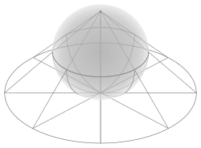

这样一来，投影图上的点数目就代表了该位置等效点系的**阶次**——注意这其实反映的是**宏观对称性**（只在一个晶胞内考虑，不涉及无限平移）。

极射赤平投影图不止画等效点，还画出了对称元素：旋转轴画在圆心或对应位置（如正方形代表四重轴、三角形代表三重轴），镜面用直线或圆表示。例如对于旋转轴，他的符号是多边形：（以下图片节选自知乎问题 [32个空间点群的投影图究竟是怎么画出来的？](https://www.zhihu.com/question/433801434)）

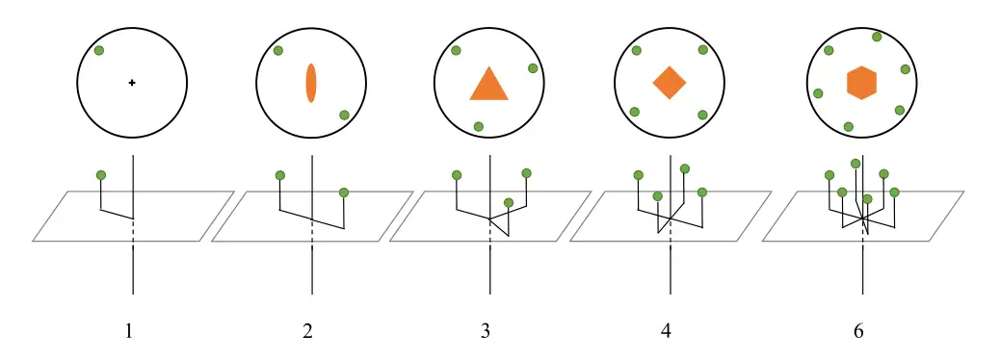

对于对称面，通常而言，垂直于平面的对称面用一条粗直线表示，平行于平面的会加粗一圈：

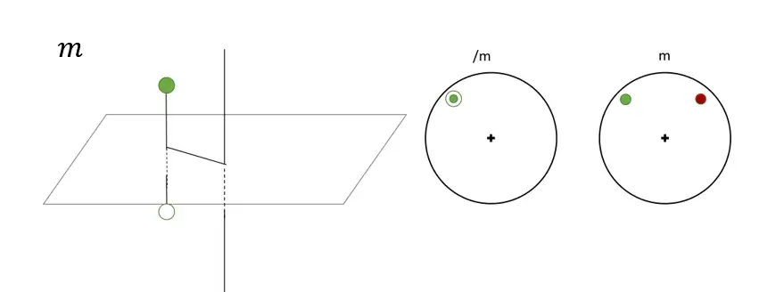

对于反轴的记号比较特殊：

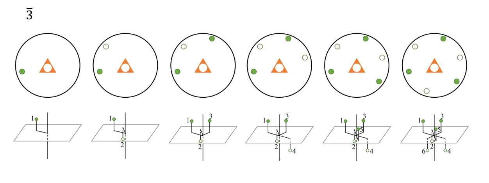

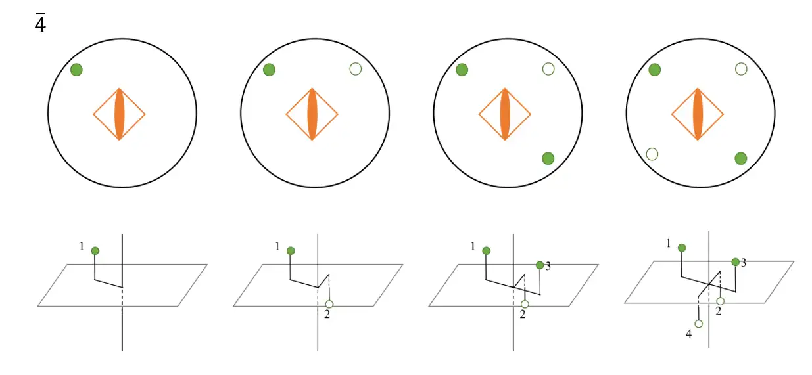

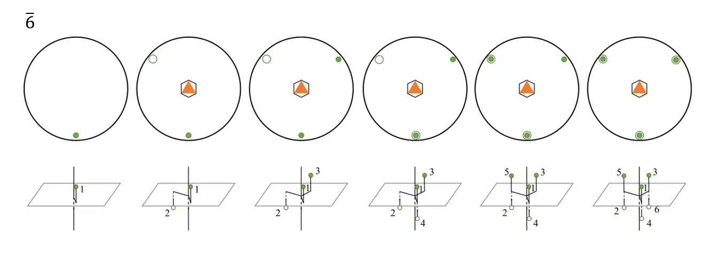

例如，对于 $222$ 点群，作图方法如下，也就是得到了4个等效点：

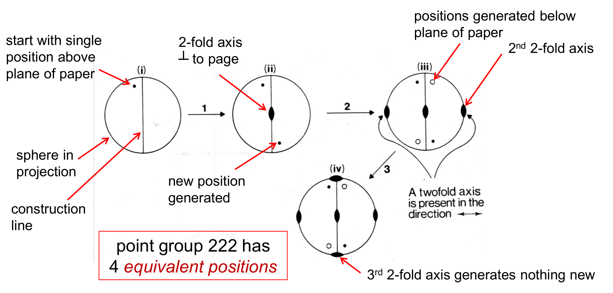

利用极射赤平投影图，我们可以把全部 32 种晶体学点群的对称元素和一般位置画出来，一张图对应一个点群。这也是 另一种直观记忆 32 种晶类的方法。

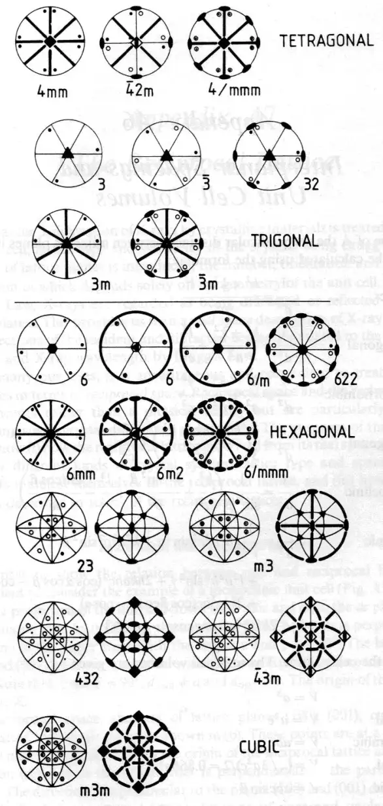

---

## 1.3 微观对称元素

> 关于对称性的内容，大部分图片来自于这个网站 <https://learnspacegroups.com/> ，如果有兴趣也可以了解。

### 1.3.1 二维点阵形式

前面说过，宏观对称元素就是不包含平移的对称操作，而相反，微观对称元素就是**包含单一方向平移的对称操作**。一个典型的表象就是**点阵**（Lattice）。其思想包括：

- 将满足平移对称性的一个或多个原子抽象成一个**点阵点**；
- 将用点阵点抽象成**点阵**，进而根据点阵不同的排布分类，得到的类别称为 **(Bravais) 点阵形式**（Bravais lattice）；
- 点阵应满足**平移对称性**，即沿着从一个点阵点$A$到另一个点阵点$B$的向量$\overrightarrow{AB}$平移点阵，仍得到原来的点阵。满足平移对称性的点阵点中，存在一个包含的原子最少的，其包括的内容称为**结构基元**。

我们先从“平移”这个操作开始说起。我们知道，“晶胞”本身就是可以通过平移重复的单元，于是很自然的想到，对于任意一个晶体而言，只需考虑沿晶胞轴方向的平移就一定能重合。这就是说，最简单的点阵就是在晶胞顶点放一个原子。以二维晶胞作为例子：

|                           简单单斜                           |                           简单正交                           |                           简单正方                           |                           简单六方                           |
| :----------------------------------------------------------: | :----------------------------------------------------------: | :----------------------------------------------------------: | :----------------------------------------------------------: |
|  |  |  |  |

我们考虑完全了吗？其实并没有，因为我们只考虑点阵点在晶胞顶点的情况。如果在晶胞内部还存在点阵点呢？

从平移对称性我们知道，如果内部存在点阵点，那么**其只能位于中心或棱心处**，因为这样才能使相同距离平移时仍有对应的点可以重合（也就是先平移原向量一半的向量到达“心”点，之后再次平移到原向量）。

> 当然也有可能是在整数分之一的位置加多个棱心，但由于平移对称性可知这样加点和加在棱心是等同的。

回到这四种晶胞本身，我们考虑在中心加入点阵点会带来什么改变：

|                         ==带心单斜==                         |                           带心正交                           |                         ==带心正方==                         |                         ==带心六方==                         |
| :----------------------------------------------------------: | :----------------------------------------------------------: | :----------------------------------------------------------: | :----------------------------------------------------------: |
|  |  |  |  |

你可以注意到：**加心不是没有代价的**。对于一个加心的晶胞而言，我们总能找到一个更小的正当晶胞。回顾之前我们说过的“晶胞三原则”：

> 1. 完全反映点阵的对称性；
> 2. 包含尽可能多的直角；
> 3. 体积尽量小（但不一定是最小）。

注意到“体积尽量小”这一条的重要性是最低的，可他毕竟也是一项啊！因此，在一般的情况下，晶胞都会“坍缩”成更小的同等的晶胞，除非它波坏了前两个要求：

- 加心**破坏了原晶胞的对称性**；
- 或着 加心画出的更小晶胞**直角数比原晶胞更少**。

对于第一条，首当其冲的就是六方晶胞。我们知道六方晶胞满足 $C_6$ 对称性，而**加心会把这个旋转轴降级成 $C_2$** 。当然对称面是还在的，因此我们大概知道**带心的简单六方会退化成简单正交**。我们也可以通过画图证明这一点：


而对于第二条，回顾这些带心晶胞，**仅有带心正交一种画出的小晶胞直角数更少**，因此“带心正交”这种点阵形式就被保留了下来。而对于带心单斜和和带心正方而言就没有这种福利了：它们统统都会退化成简单点阵。

汇总一下：（向右箭头表示“退化成**同等级**点阵形式”，向下箭头表示“退化成**低等级**点阵形式”，）

|      |              单斜               |      正交      |              正方               |              六方               |
| :--: | :-----------------------------: | :------------: | :-----------------------------: | :-----------------------------: |
| 简单 |         {==简单单斜==}          | {==简单正交==} |         {==简单正方==}          |         {==简单六方==}          |
| 带心 | {--带心单斜--} → {++简单单斜++} | {==带心正交==} | {--带心正方--} → {++简单正方++} | {--带心六方--} ↓ {++简单正交++} |


在晶体学中，我们也把这种可以取更小正当晶胞的点阵称为**复点阵**，就相当于是多个正当晶胞的叠加。

对于棱心而言，很容易就得到单斜和正交都能画出直角数不变的更小晶胞。而对于正方和六方而言会退化成对称性更低的点阵形式：


!!! question "疑惑"
    为什么不存在两个棱都加心的点阵呢？这是因为**这根本不是一个点阵**，因为连续沿a方向和b方向移动半个单位长度的地方并没有原子。事实上，这是一个简单点阵，其新点阵点包括原来的3个点阵点。

    
    
    在三维情况下也是同理，不存在“所有棱都加心”的点阵。

---

### 1.3.2 三维点阵形式（前篇）

二维的事情说完了，我们来聊聊三维的情况。三维总共要考虑 **三斜a，单斜m，正交o，四方t，立方c，六方h，三方r** 这么多晶系，而可能加的心也增加到了 **面心F，体心I，A心A，B心B，C心C** 这五种（A、B、C心分别指在α，β，γ轴对应的面上加面心）。

> 附加的字母是表示晶系或者加心的代号字母，比如面心立方可以简写成cF，体心四方可以简写成tI。

对于三斜来说最简单了：因为它根本没有对称性，所以**无论怎么加心都能找到一个更小的正当晶胞**。它们都是简单三斜点阵。


对于单斜点阵，记住他的晶胞结构相当于**底面是平行四边形的直四棱柱**。我们可以把它拆解成两个投影：其中沿b轴的投影是**简单单斜**，沿c轴的投影式**简单正交**。


我们前面又说过，只有正交点阵才能加心产生新点阵，因此**B心单斜会退化成简单单斜**。而C心单斜是一个新点阵，同理A心单斜也是一个新点阵，但由于一般情况下a轴和c轴可以调换（就是换个记号的事情），所以我们都把他们统称成**底心单斜**点阵（mC）。


!!! warning "注意"
    这个“底心”的说法有点误导人，因为理论上我们把这个晶胞视作直四棱柱的时候，它的“底面”应该是B面。所以这里的加心理论上加的是“侧心”，只不过约定俗成了。

再来看体心。对于二维来说我们没有考虑这种情况，是因为所有的点都是等同的；但是三维里我们需要考虑**不同高度的点在投影图上是不同的**。对此我们通过画投影图的方式（其中空心球代表在 b = 1/2 处有点阵点，实心球表示在 b = 0 处有点阵点）可以看出它们都是底心单斜的复点阵。


于是我们知道：单斜点阵有 **简单单斜 (mP)** 和 **底心单斜 (mC)** 两种。


对于正交点阵而言，因为三个方向的投影图都为二维正交点阵，因此**任何方式的带心都无法画出更小的正当晶胞**。


再来看四方。对于四方点阵，**在A面或者B面加心都会导致对称性的破缺**，把点阵降级成底心正交。

观察沿底面的投影图可以知道这是一个二维正方点阵，因此加底心可以取更小的晶胞。而面心四方点阵可以画出更小的体心四方点阵，体心四方就画不出更小的了：


因此我们知道：四方点阵总共有2个点阵形式：


最后一个立方晶系比较特殊。我们之前说过，立方晶系的特征对称元素是**4个三重旋转轴**，因此再任何一面单独加心都会导致对称性的破缺，进而退化成“底心四方”，也就是简单四方点阵。因此能单独存在的只有 **体心立方** 和 **面心立方** 两种点阵形式。


---

### 1.3.3 三维点阵形式（后篇）

我们再来处理三方晶系和六方晶系里的东西。前面我们说过，六方晶系和三方晶系都可以画成 $\beta = 120^\circ$ 的柱体形式。显然它们的简单格子就是在顶点处加一个原子：


你会发现一个有趣的现象：这两种点阵形式对应的是**同一个点阵**。所以我们一般规定以**简单六方**为标准，就算是三方晶系也写成简单六方。

!!! question "为什么会变成这样呢？"
    我们在把一个有实际原子的晶胞画成点阵时，本质上是**丢失了除平移对称性外的所有对称性**，因为抽象成的点阵点是全对称的，因此导致**原本经过对称操作后取向不一致的原子团，抽象成点阵点后，因为没有取向限制在表观上重合了**。一个典型的例子是 $\ce{CdI2}$：

    
    
    这里一个点阵点（结构基元）包括1个 $\ce{CdI2}$ 化学式。当把他们整合成顶点位置的点阵点后，2个碘原子不同的取向就消失了。

我们再次回想：三方晶系好像还能化成菱方的形式。事实上这种形式可以在六方晶胞里表示出来：


我们可以发现这种形式同样满足平移对称性，所以我们加入一个特殊的点阵 **R心六方**，其中*R*是菱面体的意思。

!!! question "关于六方和三方的点阵形式"
    **提请注意**：菱面体晶胞的形状决定了 **R心六方不可能是六方六方晶系** ，因为这个形状压根就没有六重轴。我们可以总结成：

    |              |             三方晶系              |             六方晶系             |
    | :----------: | :-------------------------------: | :------------------------------: |
    | **R心六方**  | 存在（R心六方点阵均属于三方晶系） |          ==**不存在**==          |
    | **简单六方** |     存在（不能画成R心的情况）     | 存在（六方晶系均为简单六方点阵） |

再次回到加心的问题，很显然除了R心这一种加法，其他全部都会破坏三重对称性。前面我们已经讨论过在C面加心的情况（即二维加中心，简单正交），其他情况我们用投影图说明：


我们可以整理出这样一张总表：

|                | 简单 P | C心/底心 C | 体心 I | 面心 F | A心 A | B心 B | R心 |
| :------------: | :--------: | :------------: | :-----------: | :-----------: | :-----------: | :-----------: | :----: |
| **三斜晶系 a** |   {==aP==}   | {--aC--} → {++aP++}  | {--aI--} → {++aP++} | {--aF--} → {++aP++} | {--aA--} → {++aP++} | {--aB--} → {++aP++} |        |
| **单斜晶系 m** |   {==mP==}   |     {==mC==}     | {--mI--} → {++mC++} | {--mF--} → {++mC++} | {--mA--} → {++mC++} | {--mB--} → {++mP++} |        |
| **正交晶系 o** |   {==oP==}   |     {==oC==}     |    {==oI==}     |    {==oF==}     | {--oA--} → {++oC++} | {--oB--} → {++oC++} |        |
| **六方晶系 h** |   {==hP==}   | {--hC--} ↓ {++oP++}  | {--hI--} ↓ {++oC++} | {--hF--} ↓ {++oI++} | {--hA--} ↓ {++oC++} | {--hB--} ↓ {++oC++} | {==hR==} |
| **四方晶系 t** |   {==tP==}   | {--tC--} → {++tP++}  |    {==tI==}     | {--tF--} → {++tI++} | {--tA--} ↓ {++oC++} | {--tB--} ↓ {++oC++} |        |
| **立方晶系 c** |   {==cP==}   | {--cC--} → {++tP++}  |    {==cI==}     |    {==cF==}     | {--cA--} → {++tP++} | {--cB--} → {++tP++} |        |

你需要记忆每一中晶系代表的所有点阵形式，但无需记忆具体的点阵形式变化，只需要会判断即可。

现在我们思考：什么情况下我们会用到高级点阵形式的退化呢？通常有以下几种可能：

- 晶胞参数发生变化；
- 晶胞里的原子增多/减少/改变。

!!! example "晶胞参数改变引起点阵变化"
    众所周知，白锡在低温下会变成很脆的灰锡，灰锡的结构是下图所示的金刚石结构。而白锡的结构可看作在灰锡的结构上使c轴压缩得到。白锡的结构如何？

    
    
    ??? success "答案"
        我们知道灰锡是金刚石结构，也就是面心立方。而当c轴被压缩时，由于三重旋转轴消失，会从面心退化成“面心四方”，而这种点阵形式会通过取1/2晶胞进一步退化成体心四方。
    
        

---

### 1.3.4 微观对称元素

在 1.2 节里我们讨论的宏观对称元素，本质上都是**不含平移**的对称操作，它们可以由宏观晶体的外形直接观测到。但晶体内部是由无限重复的原子排列构成的，在内部还存在着**与平移组合在一起的对称操作**，这就是微观对称元素。它有两种基本类型：

- **螺旋轴**（screw axis）：旋转操作与沿轴方向的平移操作组合；
- **滑移面**（glide plane/glide reflection）：反映操作与沿面内方向的平移操作组合。

!!! note "为什么宏观上看不到它们？"
    原因和 1.2.1 里说的一样：宏观晶体是有限的，而平移是无限的操作。螺旋轴和滑移面产生的"平移分量"在有限的宏观晶体上无法体现（除非通过审理弄到一个无限大的超级晶体），因此它们在宏观上和对应的旋转轴、镜面完全不可区分。我们只能通过微观手段来区分它们。

#### 螺旋轴

记号为 $n_m$ 的螺旋轴的操作是：**将晶体绕轴旋转 $360/n^\circ$ 后，再沿轴方向平移 $m/n$ 个晶胞周期**。用人话说就是，**边旋转边上升，转的角度和旋转轴相同，但是需要往上平移一段距离**。你可以看到这跟一根弹簧一样是螺旋上升的。

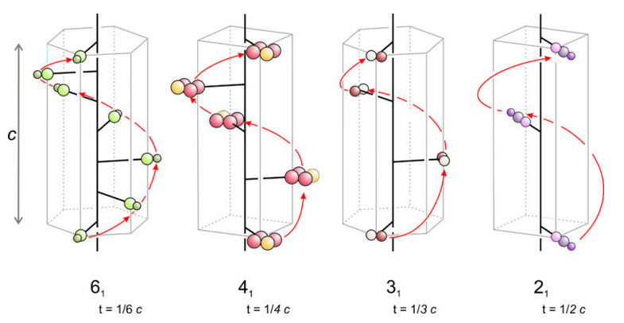

不难发现，把这个操作连续重复 $n$ 次后，晶体恰好旋转了整整一圈，并且整体平移了一个完整的晶胞周期——而这正是晶体本来就具有的平移对称性。例如 $4_1$ 轴的操作是"旋转 $90^\circ$ 并上升 $1/4$ 周期"，所以转4次就正好回到晶胞上方的原点。

可能一个显而易见的事情是，$m$ 只能取与 $n$ 互质的整数，否则旋转和上升会提前"重合"，需要的操作次数就不是 $n$ 了。

另一种等效的表达方式是：**将晶体绕轴旋转 $360/n \cdot  m^\circ$ 后，再沿轴方向平移 $1/n$ 个晶胞周期**。用人话说就是，**前一个数字表示转几次转完一个晶胞，后一个数字表示每次旋转的角度**。(尽管这个不是标准定义，但逻辑上完全等价，而且相对比较好看。)

!!! queation "记号问题"
 一般而言规定螺旋轴的正向旋转方向为向上逆时针旋转，因此，$3_1$ 螺旋轴和 $3_2$ 螺旋轴的旋转方向是相反的，这就是螺旋轴的手性。下图示出Te晶体的 $3_1$ 螺旋轴：
 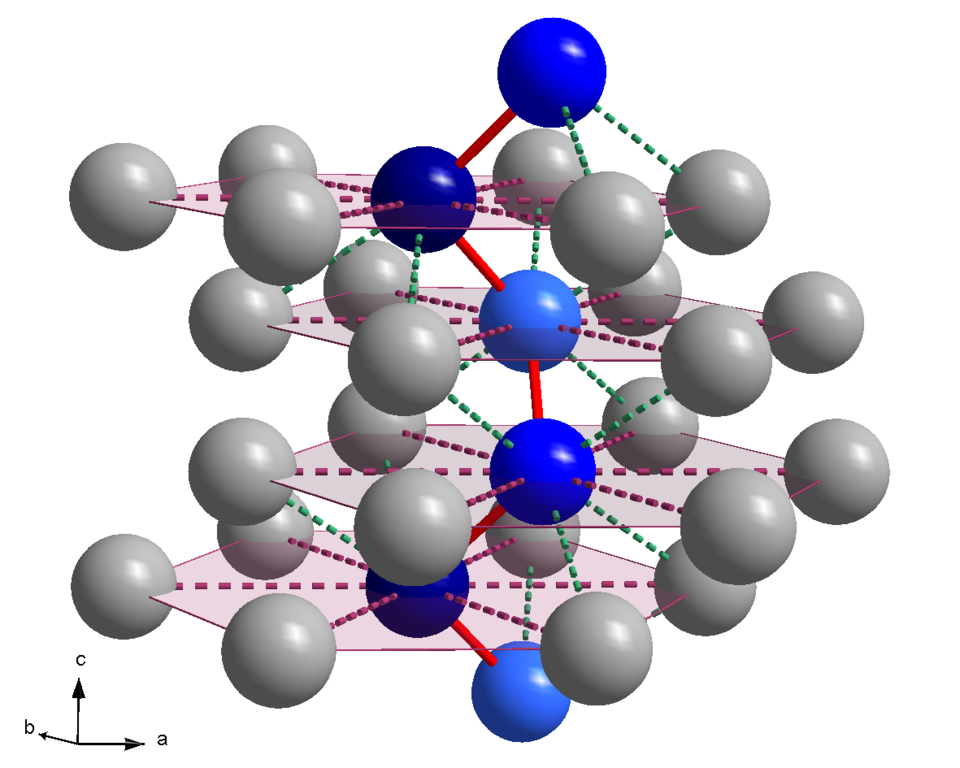

由晶体学限制定理，轴次只可能是 $2, 3, 4, 6$，晶体学中一共只有 **11 种螺旋轴**：

$$
2_1,\quad 3_1,\ 3_2,\quad 4_1,\ 4_2,\ 4_3,\quad 6_1,\ 6_2,\ 6_3,\ 6_4,\ 6_5
$$

其中 $4_1$ 与 $4_3$（以及 $3_1$ 与 $3_2$、$6_1$ 与 $6_5$、$6_2$ 与 $6_4$）互为**镜像关系**——它们螺旋上升的方向相反（一个是右旋、一个是左旋），这就是手性的螺旋轴。而 $2_1, 4_2, 6_3$ 则与自身的镜像重合，不存在手性。读者可以自行将下图展示的螺旋轴与上面的记号对应。

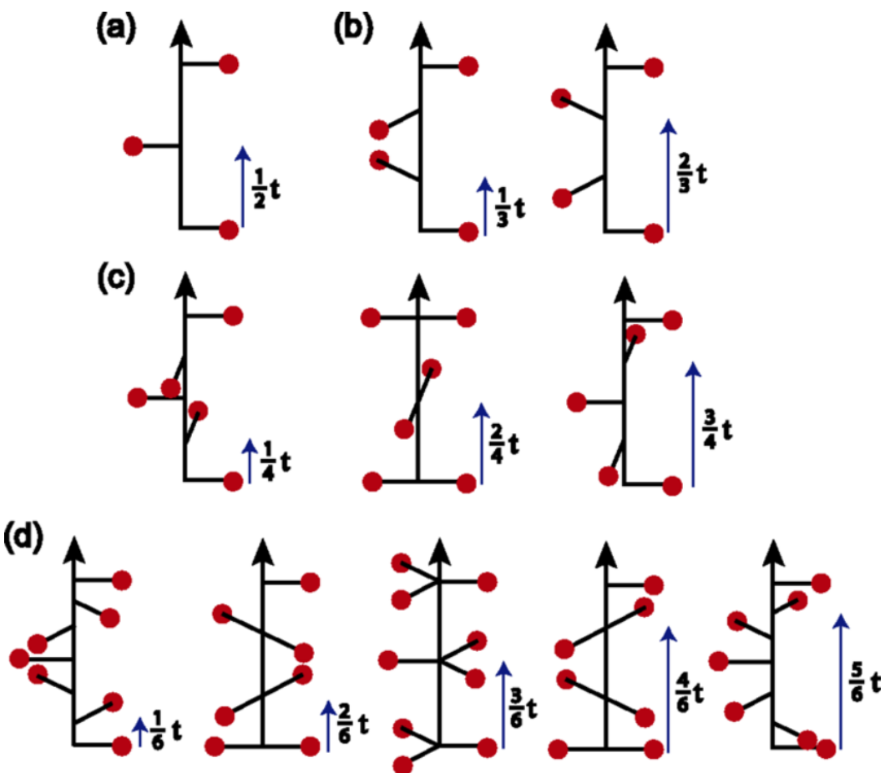

!!! question "等一下，你不是说要互质吗？"
 上面出现了两个出乎意外的情况，$4_2$ 和 $6_3$，那么*人不知理定有祸，事出反常必有妖，言不由衷定有鬼，邪乎到家必有诈*。回顾定义，例如 $4_2$ 螺旋轴，应该是每次转 $90^\circ$ ，平移 $2/4 = 1/2$ 个周期。所以这样的点阵转 $180^\circ$ 就和自己重合了。于是你可以看到在上图中旋转的点是两个而不是一个，这才能保证转 $180^\circ$ 能重合。对于 $6_3$ 也是如此。下图是金红石结构中的 $4_2$ 轴，位于棱边中心：
 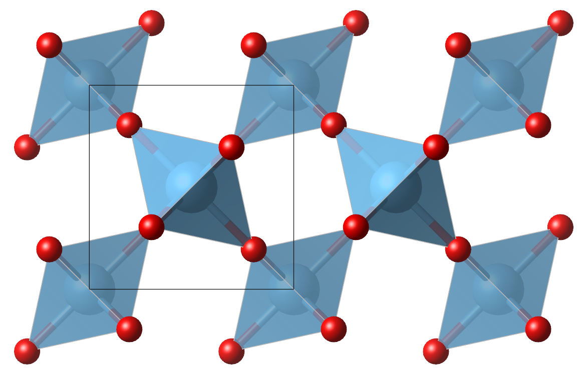

!!! example "左旋石英与右旋石英"
    石英是螺旋轴的一个经典例子。$\alpha$ 石英存在两种互为镜像的晶体（对映体），它们的结构完全相同，只是螺旋轴的手性相反：右旋石英含 $3_1$ 螺旋轴，左旋石英含 $3_2$ 螺旋轴。这两种石英在光学性质上也是镜像的（旋光方向相反）。
    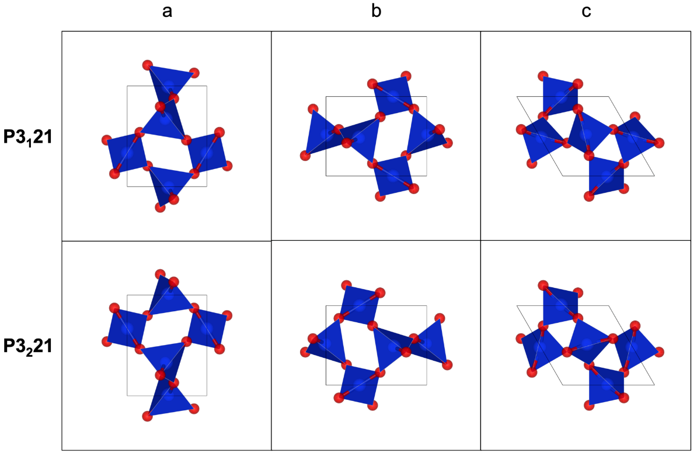

虽然螺旋轴在宏观上等同于旋转轴，但它在微观上带来了"每层原子错开"的效果，这会在 X 射线衍射中造成**系统消光**，这正是区分螺旋轴与旋转轴的手段。我们在下一节会提及。

#### 滑移面

滑移面是"镜面反映 + 沿面内方向平移"的组合操作：先将晶体经过一个平面反映，再沿着**平行于该平面**的方向平移一段距离。和螺旋轴类似，滑移面在宏观上与普通的镜面 $m$ 完全等价。

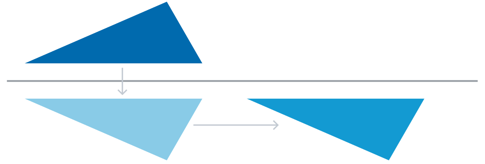

显而易见的，如果是沿晶胞轴上的滑移，那么滑移的距离只能是 $a/2$ ，也就是操作两次一定能回到原点。除此以外，也可以向对角方向平移。按照滑移的方向和距离，滑移面分为几种，常用记号如下表：

|     记号      |             滑移方向             |     平移距离      |       说明       |
| :-----------: | :------------------------------: | :---------------: | :--------------: |
|     $a$       |          沿 $a$ 轴方向           |      $a/2$        |    轴向滑移面    |
|     $b$       |          沿 $b$ 轴方向           |      $b/2$        |    轴向滑移面    |
|     $c$       |          沿 $c$ 轴方向           |      $c/2$        |    轴向滑移面    |
|     $n$       | 沿面对角线方向                  | $(a+b)/2,\ (b+c)/2$ 等 | 对角滑移面      |
|     $d$       | 沿面对角线方向                  | $(a\pm b)/4$ 等   | 金刚石滑移面    |

!!! note "为什么 $d$ 叫金刚石滑移面？"
    因为它的名字就来自于**金刚石结构**：金刚石（$Fd\overline{3}m$）中除了镜面以外，还存在 $d$ 滑移面。$d$ 滑移面的平移量只有 $n$ 滑移面的一半（$1/4$ 周期），因此也被称为"半对角滑移面"。

判断一个面是不是滑移面，可以从原子位置入手：如果两个原子关于某个平面近似镜面对称，但镜面反映后还需要再平移 $1/2$（或 $1/4$）个周期才能重合，那么这个平面就是滑移面；如果反映后直接重合，那就是普通的镜面。

!!! example "微观对称元素的判断"
    已知某晶体中，原子 $A$ 位于 $(0.25, 0.5, 0)$，其等价原子 $A'$ 位于 $(0.75, 0.5, 0)$。这两个原子之间可能存在哪些对称元素？请说明理由。

    ??? success "答案"
        先看 $x$ 坐标 $0.25 \leftrightarrow 0.75$，说明存在关于 $x = 0.5$ 平面（垂直于 $x$ 轴的平面）的对称性。由于两个原子的 $y, z$ 坐标完全相同，它们直接关于该平面镜面反映即可重合，因此该平面是一个**普通镜面**。
    
        若 $A'$ 位于 $(0.75, 0.5, 0.5)$，则镜面反映后还需要沿 $z$ 方向再平移 $1/2$ 个周期，此时该平面就是一个 $c$ 滑移面。

!!! note "小结：宏观与微观对称元素"
    | 宏观对称元素 | 微观对称元素 | 组合方式 |
    | :----------: | :----------: | :------: |
    | 旋转轴 $n$   | 螺旋轴 $n_m$ | 旋转 + 沿轴平移 |
    | 镜面 $m$     | 滑移面 $a, b, c, n, d$ | 反映 + 沿面内平移 |

另外，这是目前介绍的所有对称元素的记号，螺旋轴长得和一个螺旋丸似的：

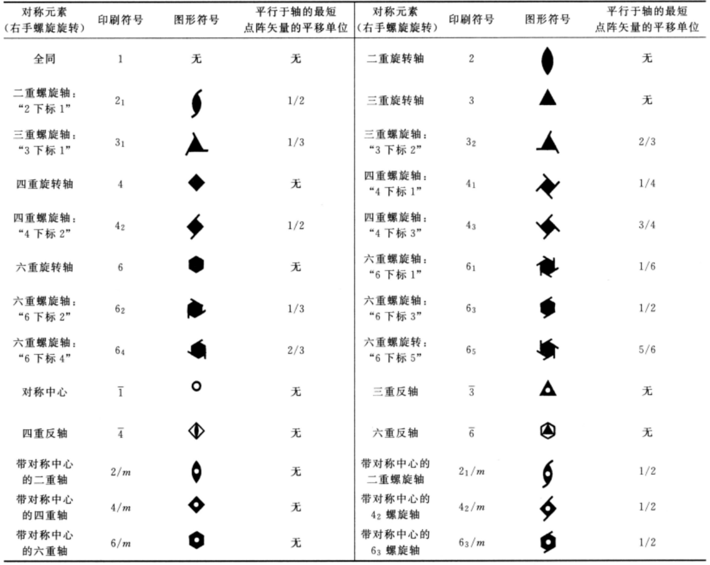

对于滑移面用虚线表示：

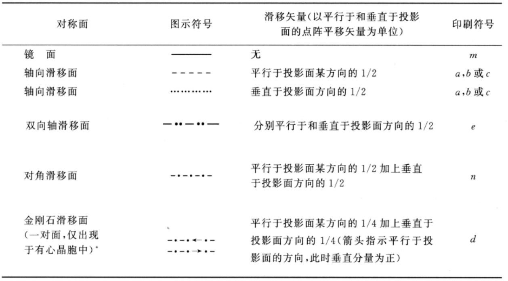

---

### 1.3.5 空间群

#### 从点群到空间群

最后，我们来给晶体的对称性做一个"总账"。宏观上，晶体的对称性由 32 种晶体学点群描述；微观上，晶体内部还存在着平移组合操作（螺旋轴、滑移面）。把 32 个点群的宏观对称元素，逐个用微观对称元素（螺旋轴、滑移面）替换，就会得到晶体学中**全部的空间群**（space group），一共有 **230 种**。空间群是晶体对称性描述的终点，这也是"最终的细分"。

!!! note "点式空间群与非点式空间群"
    230 种空间群中，有 73 种不含螺旋轴和滑移面（对称元素只有旋转轴、反轴、镜面、对称中心），称为**点式空间群**（symmorphic）；其余 157 种含有螺旋轴或滑移面，称为**非点式空间群**（nonsymmorphic）。

#### 国际记号（Hermann–Mauguin 记号）

空间群的国际记号是在点群 H-M 记号的基础上，再加一个**点阵符号**。书写规则可以总结为：

1. **点阵符号放最前**：$P, I, F, C, A, B, R$（对应我们在 1.3.2、1.3.3 里学的点阵形式代号）；
2. 之后按 1.2.3 里的定向顺序（如立方晶系是 $a,\ a+b+c,\ a+b$）写出该方向上的对称元素；
3. **只列出最特征的对称元素**——当一个方向同时存在二重轴和镜面时，习惯上只写镜面（例如 $2/m$ 简写为 $m$，所以 $mm2$、$mmm$、$6/mmm$ 里写的是 $m$ 而不是 $2/m$）；
4. 同一方向同时存在多种对称元素时，按优先级选取：
   - 一般而言：**旋转轴 $>$ 螺旋轴 $>$ 反轴**；
   - 同时存在 $3$ 和 $\overline{3}$ 时取 $\overline{3}$（因为 $\overline{3} = 3 + \overline{1}$，已经包含 $3$）；
   - 同时存在 $6$ 和 $\overline{6}$ 时取 $6$（因为 $\overline{6} = 3 + m$，信息量不如 $6$ 大）；
   - 同时存在 $4$ 和 $\overline{4}$ 时取 $4$。

!!! example "空间群记号判断"
    判断以下结构的空间群记号：

    (1) 氯化钠：$F$ 点阵，点群 $m\overline{3}m$；
    (2) 金刚石：$F$ 点阵，点群 $m\overline{3}m$，但结构中含 $d$ 滑移面；
    (3) 砷化镍 $\ce{NiAs}$：$P$ 点阵（$hP$），$c$ 方向存在 $6_3$ 螺旋轴和垂直于 $c$ 的镜面，$a$ 方向与 $2a+b$ 方向都是 $2/m$。
    
    ??? success "答案"
        (1) $\ce{NaCl}$ 为 $Fm\overline{3}m$。
        (2) 金刚石为 $Fd\overline{3}m$（$d$ 滑移面正是在这个空间群里出现的，故名金刚石滑移面）。
        (3) $\ce{NiAs}$ 为 $P6_3/mmc$：$c$ 方向写 $6_3/m$（螺旋轴与镜面同时存在）；其余两个方向按规则 3 把 $2/m$ 简写为 $m$。

总共的空间群表如下图，不怕死的可以全背下来，怕死的只需要看到晶体能判断，看到空间群能知道对称操作就行。（毕竟你又不是计算机，计算机能干的活为什么要你干呢？）

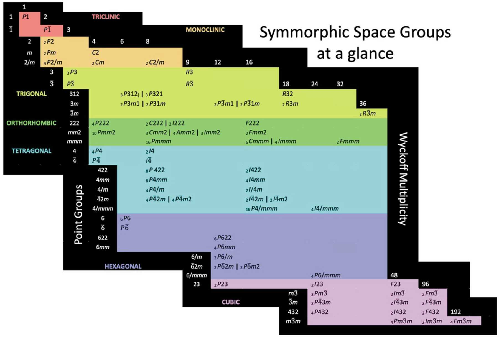

<center>Acta Cryst. (2023). E79, 124-128, https://doi.org/10.1107/S2056989023000786</center>

图中横向的数字代表的是 Wyckoff 未知数，我们之后会说到这一点。你可以先理解为这个数字越大，对应的对称性越强。你可以在[这个网站]([High-Resolution Space Group Diagrams and Tables](http://img.chem.ucl.ac.uk/sgp/large/sgp.htm)) 了解有关每个空间群的具体信息。

230 种空间群按晶系的分布如下，可以看到对称性越高的晶系，空间群的种类越多：

|   晶系   | 三斜 | 单斜 | 正交 | 四方 | 三方 | 六方 | 立方 |  合计   |
| :------: | :--: | :--: | :--: | :--: | :--: | :--: | :--: | :-----: |
| 空间群数 |  2   |  13  |  59  |  68  |  25  |  27  |  36  | **230** |

---

### 1.3.6 晶体中原子的位置

有了微观对称元素，我们就可以回答一个重要的问题：**晶体中的原子到底可以放在哪些位置？** 这就要引入等效点系的概念。

#### 等效点系

所谓**等效点系**（equivalent point system），用人话说，指的是**通过平移和各种对称操作可以互相等价的一整套点**。同一等效点系中的点具有完全相同的"**化学环境**"，这意味着**周围的原子排布完全一样，但是空间取向可以不同**。

回顾一下，点阵的对应的点有完全相同的“**空间环境**”，由于是通过平移重合的，因此**周围的原子排布完全一样，空间取向也完全相同**。

两者都是"一套等价点"，但等价的途径不同：点阵靠平移，等效点系靠平移和全部对称操作。也就是：

|     点阵/平移表述      |   等效点系/全对称表述    |
| :--------------------: | :----------------------: |
| 晶体 = 点阵 & 结构基元 | 晶体 = 等效点系 & 等效点 |

根据前面对称元素的想法，很容易得到：

- 如果某个点**不在任何对称元素上**（一般位置，general position），把它作用上点群的全部操作，会得到数目最多的一套等效点，其数目恰好等于点群的**阶**。这与数学中群的"阶次"概念是一致的：点群 $G$ 中每个操作都把一般位置的点映射到不同的位置，所以一共得到 $|G|$ 个点。
- 如果某个点**恰好落在对称元素上**（特殊位置，special position），那么部分对称操作对这个点不起作用（映射回自己），等效点的数目就会**减少**，这样的等效点系称为**特殊等效点系**。例如，落在 $2$ 旋转轴上的点，旋转 $180^\circ$ 后又回到原来的位置——等效点数目只有一般位置的一半。

举一个很简单的例子，对于正交晶系的 $P 222$ 空间群（也就是简单正交点阵，沿三个方向有 $C_2$ 轴）：

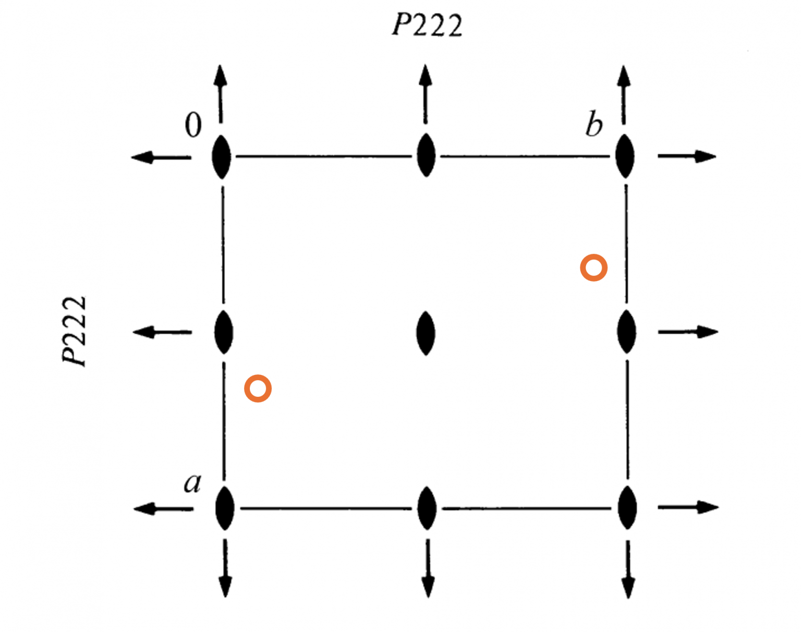

这里各种符号的意思都是“这个位置存在一个 $C_2$ 旋转轴”，只是方向的差别。箭头指的是平行于投影图的方向，橄榄形状的指的是垂直于投影图的方向。你可能暂时会疑惑为什么一定是这么排布的，我们之后就会聊到。

我们取一个随机的点 $(x,y,z)$，如图橙色的点：

- 绕着中心的垂直旋转轴旋转，得到的等效点为 $(1-x,1-y,z)$；

- 由于晶胞的周期性，必然存在另一个等效点 $(-x,-y,z)$；

- 也就是 **在晶胞顶点处必然也存在一个 $C_2$ 轴**，将 $(x,y,z)$ 对称到 $(-x,-y,z)$。以此类推拓展，这就是为什么垂直的 $C_2$ 轴的分布如此。

  > 可以证明：如果二重旋转轴位于 $(x,y,c)$，则对应的 $(x\pm \frac{1}{2}, y\pm \frac{1}{2} , c)$ 位置也一定有二重旋转轴。读者不妨自己尝试。

- 同理，绕着过中心，平行于 $x$ 轴的水平旋转轴旋转，得到的等效点为 $(x,1-y,1-z)$，又通过平移得到 $(x,-y,-z)$。

我们就可以写出一个等效点系：

$$
( x,y,z ), ( -x,-y,z ), ( x,-y,-z ), ( -x,y,-z )
$$

也就是在这样的对称环境里，一个一般位置的点对应会产生 4 个等效点。然而如果是一个特殊位置的点，比如 $(0,0,0)$，那么怎么转都会回到他自己。于是就只有自己一个等效点啦。

如果没那么特殊又没那么一般，比如位于棱边上 $(0,0,z)$，那么它产生的等效点也只有 $(0,0,-z)$，一共2个等效点。所以你能看到，如果点位于特殊的位置上会导致等效点的减少。

!!! note "软件中的实现"
    在晶体学软件中，这样的对称操作会用对称性表记录。如 $P 222$ 对应的项为：


    ```kotlin
    val operationsTable: Map<Int, List<String>> = mapOf(
        ...
        16 to listOf("x,y,z", "-x,-y,z", "x,-y,-z", "-x,y,-z"),
        ...
    ```

现在我们来说镜面。例如 $Pmmm$ 空间群，这里的线条代表该位置存在镜面：


现在对于一个随机位置的点 $(x,y,z)$：

- 经过中心的垂直于 $y$ 镜面反射，得到 $(x,1-y,z)$；
- 由于周期性，平移得到 $(x,-y,z)$。你可以发现实际上就是把一个坐标取倒数，这意味着**在原点处也存在一个镜面**；
- 再对垂直于 $z$ 轴的镜面做一次，得到 $(x,-y,-z)$。这和前面二次轴的转化正好一样！得出结论：**如果存在互相垂直的两个镜面，则必然存在一个同时平行于这两个镜面的二重轴**。这也是为什么上面的每一个方向写的都是 $2/m$ 而不是单独的 $m$。

以此类推，得到了含8个点的等效点系：

$$
\begin{gathered}
( x,y,z ), ( -x,y,z ), ( x,-y,z ), ( x,-y,-z ),  \\
( -x,-y,z ), ( x,-y,-z ), ( -x,y,-z ), ( -x,-y,-z )
\end{gathered}
$$

再来说螺旋轴和滑移面，只是多了一个平移动作，总结起来，考虑位于 $(x,y,z)$ 的点：

- 位于 $(h,k,c)$ 的 $2$ 旋转轴：$(2h-x,2k-y,z)$；
- 位于 $(h,k,c)$ 的 $2_1$ 螺旋轴：$(2h-x,2k-y,z+\frac{1}{2})$；
- 位于 $(a,k,c)$ 的 $m$ 镜面：$(x, 2k-y,z)$；
- 位于 $(a,k,c)$ 的 $a$ 滑移面：$(x+\frac{1}{2}, 2k-y,z)$；
- 位于 $(a,k,c)$ 的 $c$ 滑移面：$(x, 2k-y,z+\frac{1}{2})$。

注意这里我们没有讨论对称中心，实际上，绝大部分情况下对称中心都可以被叠加得到（唯一的例外是 $P\overline{ 1}$，这货真没啥其他对称元素了），所以对称中心不会拿来单独考虑。

!!! abstract "高阶情况"
    对于更高轴次的旋转轴，坐标变换相对比较复杂，读者可以自行根据几何性质推导：

    - 三重旋转轴：$(x,y,z), ( -y,x-y,z), ( y-x,-x,-z)$
    - 四重旋转轴：$(x,y,z), ( -x,-y,z), ( -y,x,z), ( y,-x,z)$
    - 六重旋转轴：$(x,y,z), ( -y,x-y,z), ( y-x,-x,-z), ( -x,-y,z), ( y,y-x,z), ( x-y,x,z)$

#### 未知对称元素

> 本小节习题节选自 [Derivation of Unknown Symmetry Elements – Learn Space Groups](https://learnspacegroups.com/derivation-of-unknown-symmetry-elements)。

通过上一节的推导，我们知道：**对称面的信息会包含对称轴的信息**。假如我们将 $Pmmm$ 空间群部分替换成滑移面，变成 $Pnma$ 空间群，那么它所包含的其他对称元素有什么呢？

先考虑 $m$ 和 $a$ 的共同作用：

- 作用 $m$ 使得 $(x,y,z)\to  ( x,-y,z)$（注意回忆：符号放在第几个位置决定了它垂直于哪个方向）；
- 作用 $a$ 使得 $(x,-y,z) \to ( x+\frac{1}{2}, -y,-z )$；
- 对照对称元素，发现 **这等效于一个平行于 $a$ 的 $2_1$ 螺旋轴**。

因此，似乎滑移面和镜面之间的作用会产生一个螺旋轴而不是旋转轴。这也很好理解：相当于在原来旋转轴的基础上叠加了滑移面的滑移。

再来考虑 $n$ 和 $m$ 的共同作用：

- 作用 $n$ ： $(x,y,z)\to ( -x, y+\frac{1}{2}, z+\frac{1}{2})$；
- 作用 $m$：$( -x, y+\frac{1}{2}, z+\frac{1}{2}) \to ( -x, -y-\frac{1}{2}, z+\frac{1}{2})$；
- 周期性平移一下：$( -x, -y-\frac{1}{2}, z+\frac{1}{2}) \to ( -x, -y+\frac{1}{2}, z+\frac{1}{2})$；
- 对照对称元素，发现 **等效于一个平行于 $c$ 的 $2_1$ 螺旋轴**，并且这个螺旋轴在 $y=1/4$ 的地方。

可以看到，对称元素不是非得在顶点或者中心处，有时也会在一些奇奇怪怪的位置。一般而言，会优先将镜面和滑移面固定在中心或顶点位置上，再去推导轴的位置。

事实上，$m$ 和 $a$ 的作用也会产生一个 $2_1$ 螺旋轴（读者自行推导），这意味着原来的空间群信息其实隐藏了三个螺旋轴：

$$
Pnma \to P\, \frac{2_1}{n} \, \frac{2_1}{m}\, \frac{2_1}{a}
$$

#### 点阵形式的影响

我们漏考虑了什么？还有带心的平移操作。当然这就比较简单了，带过就好，考虑 $(x,y,z)$ 的点：

- 体心：$(x+\frac{1}{2}. y+\frac{1}{2}, z+\frac{1}{2})$;
- C心：$(x+\frac{1}{2}, y+\frac{1}{2}, z)$;
- 面心：$(x+\frac{1}{2},y+\frac{1}{2},z), ( x+\frac{1}{2}, y, z+\frac{1}{2}), ( x,y+\frac{1}{2}, z+\frac{1}{2})$.

!!! question "Challenging"
    对于 $I 4mm$ 空间群而言，一个 $(x,y,z)$ 一般位置的点的等效点坐标有哪些？一共多少个？
    ??? success "答案"
        **第一组：由点群4mm的8个操作产生**
        
        1.  \((x, y, z)\)
        2.  \((-x, -y, z)\)
        3.  \((-y, x, z)\)
        4.  \((y, -x, z)\)
        5.  \((x, -y, z)\)
        6.  \((-x, y, z)\)
        7.  \((-y, -x, z)\)
        8.  \((y, x, z)\)
    
        **第二组：第一组坐标加上体心平移 \((1/2, 1/2, 1/2)\)**
        
        9.  \((1/2+x, 1/2+y, 1/2+z)\)
        10. \((1/2-x, 1/2-y, 1/2+z)\)
        11. \((1/2-y, 1/2+x, 1/2+z)\)
        12. \((1/2+y, 1/2-x, 1/2+z)\)
        13. \((1/2+x, 1/2-y, 1/2+z)\)
        14. \((1/2-x, 1/2+y, 1/2+z)\)
        15. \((1/2-y, 1/2-x, 1/2+z)\)
        16. \((1/2+y, 1/2+x, 1/2+z)\)

通过这类平移，会导致很多空间群记号出现重叠。例如对于空间群 $Ibca$：

- 做一次 $b$ 滑移面：$(x,y,z) \to ( -x, y+\frac{1}{2}, z)$；
- 体心平移：$( -x, y+\frac{1}{2}, z) \to  ( -x + \frac{1}{2}, y, z + \frac{1}{2})$；
- 对照表格，发现这实际上就是 **位于 $a=\frac{1}{4}$ 的 $c$ 滑移面**。

于是 $Icca$ 这个空间群就被 $Ibca$ 吞并了，在空间群表里也没有这个空间群。

类似的，**带心平移与旋转轴、镜面的组合也会产生新的对称元素**。下面两个例子与本节及"未知对称元素"一节的推导完全同理。

!!! example "C 心与二重轴的组合：$C \frac{2}{m} \frac{2}{m} \frac{2}{m}$"
    考虑空间群 $C \frac{2}{m} \frac{2}{m} \frac{2}{m}$（即 $Cmmm$ 用完整记号写出）。将平行于 $a$ 的二重旋转轴与 $C$ 心平移组合起来，会产生什么对称元素？

    ??? success "答案"
        平行于 $a$ 的二重轴把 $y, z$ 取反，$C$ 心平移为 $(x+\frac12, y+\frac12, z)$，依次作用：
        
        - 作用 $2$：$(x,y,z) \to (x,-y,-z)$；
        - 作用 $C$ 心：$(x,-y,-z) \to (x+\frac12, -y+\frac12, -z)$。
        
        对照对称元素的坐标变换，这**等效于一个位于 $(a, \frac14, 0)$ 的 $2_1$ 螺旋轴**——旋转 $180^\circ$ 的同时沿 $a$ 平移 $\frac12$ 个周期。注意这个位置不是固定的：原点是可以移动的（我们想怎么选就怎么选），换个原点，螺旋轴的位置也会跟着平移。

!!! example "F 心与镜面的组合：$Fmmm$"
    记住 $F$ 心有四个点阵点：$(x,y,z)$ 与 $(x+\frac12, y+\frac12, z)$、$(x+\frac12, y, z+\frac12)$、$(x, y+\frac12, z+\frac12)$ 等价。将垂直于 $a$ 的镜面与 $F$ 心组合，除了原来的镜面之外，$Fmmm$ 中还必须存在哪些镜面或滑移面？它们的位置在哪里？由于各轴方向的对称性完全相同，只需解一个轴，再推广即可。

    ??? success "答案"
        垂直于 $a$ 的镜面把 $x$ 取反，三个带心位置分别变为：
        
        $$
        (-x+\tfrac12, y+\tfrac12, z), \quad (-x+\tfrac12, y, z+\tfrac12), \quad (-x, y+\tfrac12, z+\tfrac12)
        $$
        
        - **前两个位置**对应**位于 $a = \frac14$ 的 $e$ 滑移面**。$e$ 就是"任一"（either）滑移面：反射之后可以沿 $b$ **或** $c$ 方向平移 $\frac12$，两种平移方向产生上面两个不同的位置；
        - **最后一个位置**对应**位于 $a = 0$ 的 $n$ 滑移面**（沿面对角线平移 $\frac{b+c}{2}$）——它和我们最初的镜面位置**完全重合**！因此在空间群图里并不额外画出来（被镜面盖住了），但它真实存在。
        
        推广到三个方向：$Fmmm$ 中垂直于每个轴的方向上，都有镜面 $m$（位于 $0$ 处）、$e$ 滑移面（位于 $\frac14$ 处）以及与镜面重叠的 $n$ 滑移面（位于 $0$ 处）。

#### Wyckoff 位置

现代晶体学数据（如国际晶体学表，International Tables for Crystallography）中，原子的位置是用 **Wyckoff 位置**（Wyckoff position）记号记录的。Wyckoff 位置实质上就是**等效点系在空间群中的标注**：把某个空间群里所有可能的位置按等效点的数目从少到多排列，依次用字母 $a, b, c, \dots$ 标记（一般位置总是排在最后），字母前面的数字是该位置的等效点个数。

用 $P4mm$ 空间群做例子，先不考虑 $c$ 轴上的对称，从投影图考虑，有这么几个特殊的位置：

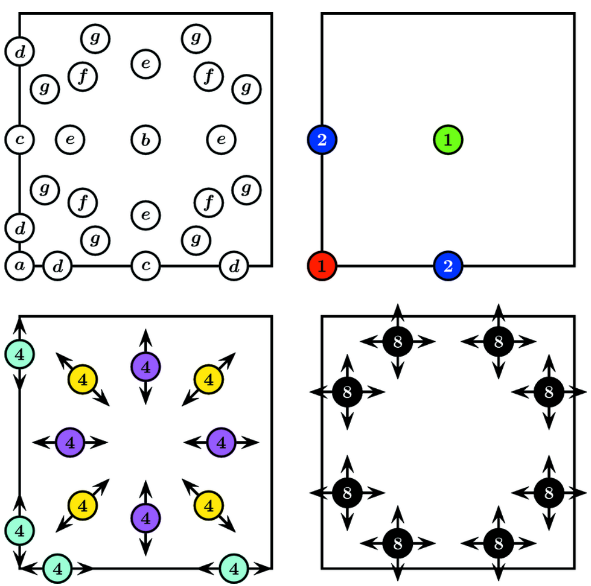

- 晶胞中心和顶点处的位置最特殊，只有一个等效点。分别是 $1a$ 和 $1b$ 的位置；
- 棱心上的点其次，有2个等效点，编号为 $2c$；
- 除此之外，就没有什么特殊的固定的点了。所以我们考虑在棱上的一般点，这样的点会对称出4个等效点。编号为 $4d$；
- 除此之外还有两个能对称出4个等效点的位置，编号为 $4e$ 和 $4f$；
- 在这之后，剩下的点就是啥都不是的一般点了。编号为 $8g$。

再举一个例子。$\ce{NaCl}$（空间群 $Fm\overline{3}m$）中，$\ce{Na}$ 占据 $4a$ 位（坐标为 $(0, 0, 0)$ 及其等效点），$\ce{Cl}$ 占据 $4b$ 位（坐标为 $(\frac12, \frac12, \frac12)$ 及其等效点）。两者都是**特殊位置**——它们分别落在对称中心和 $\overline{3}$ 轴上，等效点只有 $4$ 个；而 $Fm\overline{3}m$ 的一般位置足足有 $192$ 个等效点，给人尿都吓出来两滴。

!!! note "为什么字母越小越特殊？"
    国际晶体学表的约定是：Wyckoff 字母从特殊位置开始编号（$a$ 最特殊、位群对称性最高），等效点数目越来越多，一般位置排在最后。所以看到 $4a$ 就知道该位置一定落在某个对称元素上；而一般位置的记号（如 $192g$）则表示该位置不在任何对称元素上。

我们之后在 Lecture 7 的结构章节里会反复用 Wyckoff 记号来记录原子位置，例如萤石 $\ce{CaF2}$（空间群 $Fm\overline{3}m$）中 $\ce{Ca}$ 占据 $4a$ 位、$\ce{F}$ 占据 $8c$ 位。当然，你不需要记忆具体的符号，能看懂就行，需要用的时候直接查表。

---

#### 第一章总结

到这里，我们已经把晶体学最核心的对称性内容全部讲完了。回顾整个过程，描述一个晶体有两种视角：

- **宏观**：**结构基元 + 点阵**——点阵决定了晶体的平移骨架，结构基元决定了每个点阵点上的内容；
- **微观**：**不对称单元 + 等效点系**——不对称单元（asymmetric unit）是空间群中一个最小的、可以由对称操作生成整个晶体的区域，而等效点系给出了原子可以占据的全部位置。

<center>--- Chapter 1  结束 ---</center>

