# Lecture 2: 晶体的表征：X 射线衍射

说了这么多理论方面的事情，现在我们先来聊点实际的话题：**怎么确定一个晶体中原子的位置？**我们知道原子基本上可以视为一个电荷密度极大的区域，如果把一个晶面上的所有原子联合起来，可以视为一面天然的**三维衍射光栅**。仔细想一想，我们知道当光栅和波长大约一个量级的时候，会发生**干涉**现象，导致光强发生变化。

可见光的波长在几百纳米量级，而晶面间距只有 $0.1 \sim 1\ \text{nm}$，用可见光照射晶体，根本看不出内部的周期结构。X 射线的波长在 $0.01 \sim 0.1\ \text{nm}$，与晶面间距同数量级，于是X射线就成为分析晶体的一个很好的工具。

## 2.1 Bragg 方程

### 2.1.0 *X射线

> 本节图源：<https://chem.libretexts.org/Bookshelves/Inorganic_Chemistry/Introduction_to_Solid_State_Chemistry>

我们先说一件事情：特定波长的X射线怎么产生？

如果我们想要特定波长的 X 射线，就意味着这个射线**有固定的能量**，而最好能利用这一点的方式就是利用量子化的性质。激发态原子的回落就是一个特别好的手段。

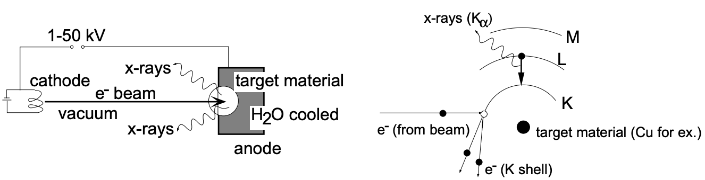

利用电子轰击掉原子的$K$层电子（一般会用铜原子），这之后上层电子会回落到$K$层。当上层电子回落时，如果是 $L$ 层的电子回落，则释放的能量以固定波长的X射线形式射出，这种射线记为 $K_\alpha$ 射线（$\pu{8.04 keV}, \pu{ 1.54\AA}$）。如果是 $M$ 层电子回落，则记为 $K_\beta$ 射线（$\pu{ 8.90 keV}, \pu{ 1.39\AA}$）。

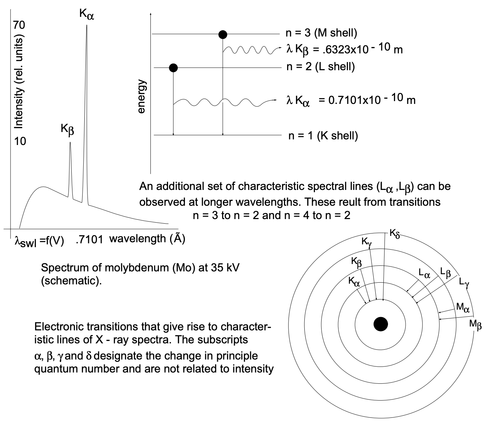

!!! quote "更精细的理论"
 当然我们知道，原子层内部还有角动量量子数的区分，因此还可以往下细分到 $K_{ \alpha 1 }$ 和 $K_{\alpha 2}$。详细可以参考这篇文章：Physics Letters A, Volume 426, 2022, 127900, ISSN 0375-9601, <https://doi.org/10.1016/j.physleta.2021.127900>.

听起来很美好，但是往往有一个问题：$\ce{ Cu}$ 的 $K_\alpha$ 射线和 $K_\beta$ 射线往往会同时产生。此时我们会用到**镍滤光片**：因为 $\ce{ Ni}$ 的K电子吸收在 $\pu{ 1.488 \AA}$，正好卡在$K_\alpha$ 射线和 $K_\beta$ 射线中间。这样就能大幅滤掉波长较短的 $K_{\beta}$ 设备了。

### 2.1.1 衍射条件与 Bragg 方程

**Bragg 方程的推导。** 考虑一束波长为 $\lambda$ 的平行 X 射线，以**掠射角** $\theta$（与晶面的夹角，而非与法线的夹角）入射到一组间距为 $d$ 的平行晶面上：

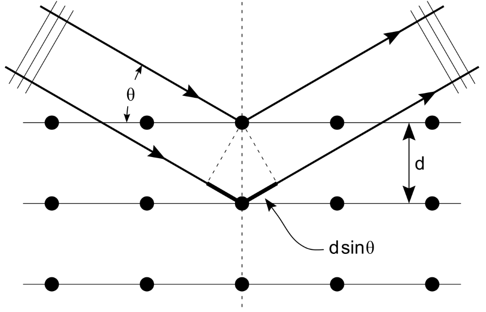

相邻两个晶面反射的 X 射线之间存在光程差。从几何关系可以看出，光程差恰好等于 $2d\sin\theta$：入射束在到达第二个晶面前多走的路程与反射后多走的路程之和，正是两条直角边，各长 $d\sin\theta$。

根据干涉原理，只有当这个光程差是波长的**整数倍**时，反射线才能相互叠加、相干加强（衍射），否则将相互抵消。现在我们只观察衍射强度最强的角度，也就是峰值处的 $\theta$，其满足 **Bragg 方程**：

$$
2d\sin\theta = n\lambda
$$

其中 $n$ 称为衍射级数，取正整数。它的具体意义我们之后会谈到。

!!! note "Bragg 的原式推导"
    Bragg 原式文章中使用了这样一张图，可能更符合原教旨主义上的衍射计算：

    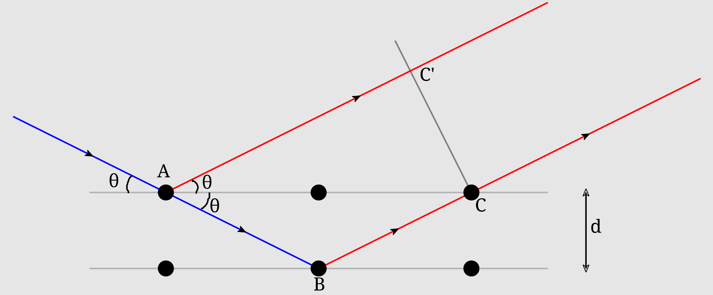
    
    同样计算光程差：
    
    $$
    \Delta = AB+BC-AC' = \frac{2d}{\sin\theta} - \frac{2d}{\sin\theta}\cdot \cos ^{2}\theta = 2d \sin\theta
    $$
    
    得到的结果相同。

!!! warning "关于测量角度"
    很多人看到这个图片，可能会想当然的认为，“啊这样就是可以把原子层想象成一面镜子，然后把光完全反射回去。”**注意这种想法基本上是错误的。**如果真的跟个镜子一样完全反射，那世界上就没有透明的晶体了。

    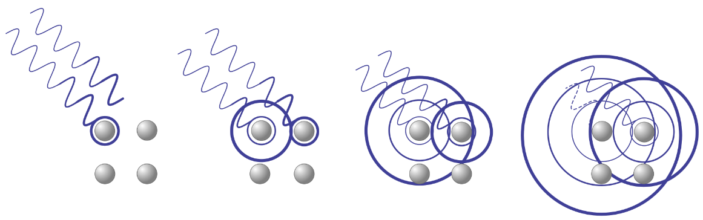
    
    正确的思考方式是：**光射到原子上会以各个方向散射，但是仪器只检测了在反射方向的光线。**也就是说晶体内各种方向光线的衍射实际上是非常复杂的，对各个方向都要代入不同参数分析。这是 Bragg 分析的仪器示意图，可以看到探测器只沿着一个方向。
    
    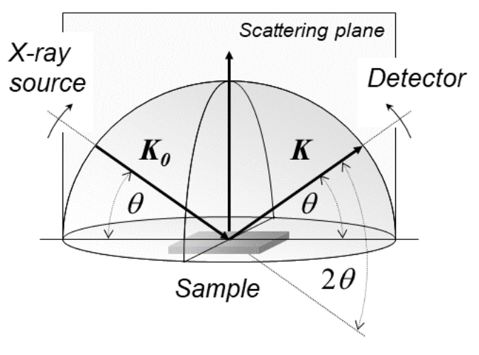
    
    由于仪器条件的限制，实验中直接测得的是入射束与衍射束之间的夹角，恰好为 **$2\theta$**——这也是为什么 X 射线衍射谱图的横轴几乎总是标注为 $2\theta$（或换算后的 $\theta$），而不是反射几何里的 $\theta$。这样做还有另一个好处：我们**只需要把粉末样品放进仪器里即可测量**，这是因为粉末本质上就是很多随机取向的微小单晶，其中总有某些取向符合 Bragg 反射的要求。
    
    在现代晶体学中，也会用到其他方向上的衍射，这样做会形成类似下图的二维点图，之后即可根据这样的点图仍计算机里来推断晶体的具体结构。如果你对此感兴趣，可以看我的 [固体物理笔记](maphy/thermo_phys/Solid_State_Physics.html) 中的 **Laue 方程** 部分。**Laue 方程和 Bragg 方程是完全等价的。**
    
    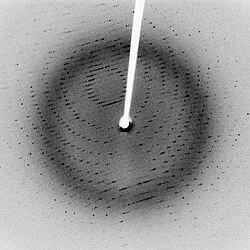

!!! note "关于峰宽"
    在理想情况下，一个无限大的完美晶体给出的衍射峰应当是一条无限窄的"线"。但实际测量中衍射峰总有一定的宽度，一个重要来源就是**晶粒（crystallite）尺寸不够大**：衍射的相干加强需要足够多的晶面参与干涉，晶粒越小，参与干涉的晶面数越少，不完全相消的部分就越多，峰也就越宽。你可以类比窄缝衍射：当峰的数量越多时，观察到的衍射条纹也越密集，这是由于有更多条光线参与衍射的结果。

	这给了我们一个有趣的机会——**峰的位置告诉我们晶面间距，峰的宽度告诉我们晶粒大小**。1918 年 Scherrer 把晶粒尺寸与峰宽定量地联系起来，得到 **Scherrer 公式**（谢乐公式）：
	
	$$
	D = \frac{K\lambda}{\beta \cos\theta}
	$$
	
	其中各量的含义是：
	
	- $D$：晶粒在垂直于该组衍射面方向上的**平均尺寸**（注意不是宏观颗粒的大小！）；
	- $K$：形状因子，与晶粒形状有关，球形微晶通常取 $K \approx 0.9$（有的书也写 $0.89$ 或 $0.94$）；
	- $\lambda$：X 射线波长；
	- $\beta$：衍射峰的**半高宽**（FWHM，即峰值一半高度处的宽度），必须换算成**弧度**代入；
	- $\theta$：Bragg 角（不是仪器上直接读的 $2\theta$！）。
	
	**Scherrer 公式的推导。** 考虑一列由 $N$ 个等间距晶面组成的"小晶体"，晶面间距 $d$，总厚度 $D = Nd$。相邻晶面散射波的相位差为
	
	$$
	\varphi = \frac{4\pi d\sin\theta}{\lambda}
	$$
	
	（光程差 $2d\sin\theta$ 对应的相位就是 $2\pi \times \dfrac{2d\sin\theta}{\lambda}$）。于是 $N$ 个晶面的散射振幅构成一个等比级数：
	
	$$
	A = f\sum_{j=0}^{N-1} e^{ij\varphi}
	  = f\, e^{i(N-1)\varphi/2}\frac{\sin(N\varphi/2)}{\sin(\varphi/2)}
	$$
	
	衍射强度 $I \propto |A|^2$。在 Bragg 角处 $\varphi_0 = 2\pi n$，各晶面的散射波相位相同，强度取极大；偏离 Bragg 条件一个 $\delta\varphi$ 后，当 $N\delta\varphi/2 = \pm\pi$ 时分子第一次取零，即
	
	$$
	\delta\varphi = \frac{2\pi}{N}
	$$
	
	这就是峰的"天然宽度"：**晶粒越小（$N$ 越小），峰越宽**，与我们的直觉一致。
	
	再把相位差换算成角度，由 $\delta\varphi = \dfrac{4\pi d\cos\theta}{\lambda}\,\delta\theta$ 得峰顶到第一个零点的半宽：
	
	$$
	\Delta\theta = \frac{\lambda}{2Nd\cos\theta} = \frac{\lambda}{2D\cos\theta}
	$$
	
	零到零的宽度在 $2\theta$ 尺度上约为 $2\lambda/(D\cos\theta)$。衍射峰近似为 $\mathrm{sinc}^2$ 线形，其半高宽约为零点间距的 $0.44$ 倍（令 $\mathrm{sinc}^2 x = 1/2$ 即得 $x \approx 1.39$），代入即得
	
	$$
	\beta \approx \frac{0.89\lambda}{D\cos\theta}
	\quad\Longrightarrow\quad
	D = \frac{0.89\lambda}{\beta\cos\theta}
	$$

!!! example "计算衍射角"
    已知一组晶面间距 $d = 200\ \text{pm}$，X 射线波长 $\lambda = 150\ \text{pm}$，求该组晶面的（1）一级衍射角；（2）二级衍射角。

    ??? success "答案"
        由 $2d\sin\theta = n\lambda$：
    
        (1) $n=1$：$\sin\theta = \dfrac{\lambda}{2d} = \dfrac{150}{400} = 0.375$，解得 $\theta \approx 22.0^\circ$；
    
        (2) $n=2$：$\sin\theta = \dfrac{2\lambda}{2d} = \dfrac{300}{400} = 0.75$，解得 $\theta \approx 48.6^\circ$。

**指标化的约定。** 为了明确说明“晶面间距指的是哪一个晶面的间距”，我们会用到**衍射指标**来规定晶面的方向，记作 $hkl$ （注意没有括号！）。

这会带来一个问题：光程差只要是相差整数个 $\lambda$ 就能发生衍射，但是只规定方向无法确定到底相差多少个。为了解决这个问题，我们引入**衍射级数** $n$ 。也就是对于同一个晶面，随着 $n$ 不同，会产生不同的衍射角峰值。

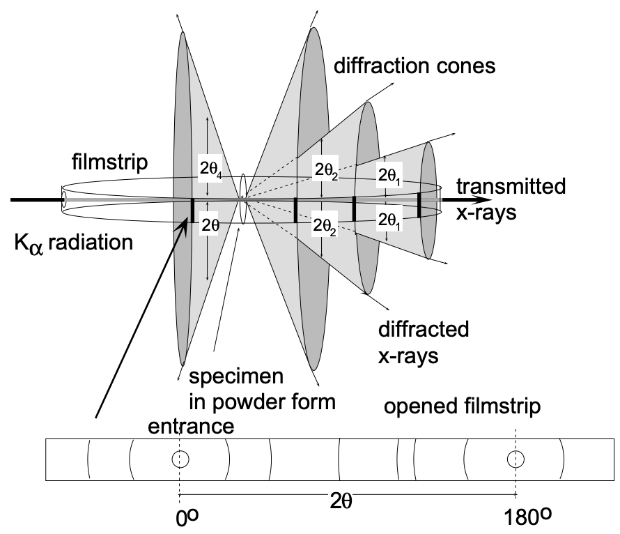

回到Bragg方程上的符号：这里的 $d$ 是**真实存在**的晶面（如 $001$ 面）的间距，$n$ 的存在让指标化不太方便。实际使用时，人们把 $n$ 级衍射等价地"归"到间距为 $d/n$ 的**假想晶面**上，当作该假想晶面的一级衍射来处理，并用 $(nh\ nk\ nl)$ 指标化。例如 $001$ 面的二级衍射就写作 $(002)$。**这可以认为是假象存在一层更密的$(002)$晶面簇，并在这个晶面簇上的一级衍射。**

---

### 2.1.2 晶面间距公式

要应用 Bragg 方程，首先要知道各组晶面的间距 $d$ 与晶胞参数的关系。对于正交晶系，晶面间距公式为：

$$
\frac{1}{d^2} = \frac{h^2}{a^2} + \frac{k^2}{b^2} + \frac{l^2}{c^2}
$$

!!! note "推导思路"
    晶面 $(hkl)$ 的法向量 $\vec n = \dfrac{h}{a}\hat a + \dfrac{k}{b}\hat b + \dfrac{l}{c}\hat c$，其长度倒数即 $1/d$。取模平方时由于正交晶系三轴互相垂直，交叉项全部消失，就得到上式。**详细的推导请查看 Chapter 10 相关内容。**

作为特例，立方晶系（$a = b = c$）退化为：

$$
\frac{1}{d^2} = \frac{h^2 + k^2 + l^2}{a^2}
$$

而六方晶系要计入 $120^\circ$ 的夹角，公式为：

$$
\frac{1}{d^2} = \frac{4}{3}\frac{h^2 + hk + k^2}{a^2} + \frac{l^2}{c^2}
$$

!!! question "如何快速记住这几个公式？"
    正交晶系是"三个方向各自贡献 $h^2/a^2$ 之和"；立方晶系则只剩一个参数；六方晶系多出一个交叉项 $hk$，来自 $a$、$b$ 两轴 $120^\circ$ 的夹角（$\cos 120^\circ = -1/2$，代入向量点积后交叉项系数即为 $4/3$ 的来源）。

---

### 2.1.3 第一次 X 射线衍射实验：NaCl

历史上第一个用 Bragg 方程测定晶体结构的实验，是 1913 年 Bragg 父子对氯化钠单晶的衍射实验。$\ce{NaCl}$ 是面心立方结构，晶胞参数 $a = 564\ \text{pm}$。实验分别测量了 $(100)$、$(110)$、$(111)$ 三个晶面族的衍射数据（图中为理想曲线）：

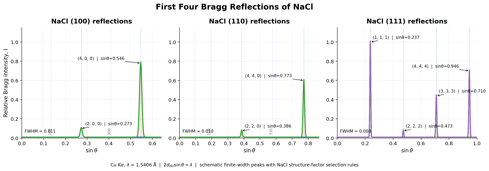

你可能注意到貌似**有些衍射峰消失了**，不过本节暂时不用管他。对每个晶面族列出 Bragg 方程，注意它们的晶面间距不同：

$$
\begin{aligned}
(100): &\quad 2a\sin\theta_1 = n_1\lambda \\
(110): &\quad 2\cdot\frac{a}{\sqrt 2}\sin\theta_2 = n_2\lambda \\
(111): &\quad 2\cdot\frac{a}{\sqrt 3}\sin\theta_3 = n_3\lambda
\end{aligned}
$$

其中用到了立方晶系的晶面间距：$d_{100} = a$，$d_{110} = a/\sqrt 2$，$d_{111} = a/\sqrt 3$。把测得的掠射角代入联立求解，得到 $n_1 = n_2 = 2$、$n_3 = 1$：

- $(100)$、$(110)$ 的衍射从**二级**开始出现，一级衍射消失了；
- $(111)$ 的一级衍射则正常出现。

由此，我们就可以用晶胞参数反推出所用的 X 射线的波长。读者不妨尝试一下问题：

!!! example "用 NaCl 测定 X 射线波长"
    已知 $\ce{NaCl}$ 晶胞参数 $a = 564\ \text{pm}$，测得 $(200)$ 衍射的 $2\theta = 31.8^\circ$。求所用 X 射线的波长。

    ??? success "答案"
        $(200)$ 是假想晶面，间距 $d_{200} = d_{100}/2 = a/2 = 282\ \text{pm}$，按一级衍射处理（$n = 1$）：
    
        $$
        \lambda = 2d_{200}\sin\theta = 2 \times 282\ \text{pm} \times \sin 15.9^\circ \approx 154\ \text{pm}
        $$
    
        这正是铜靶 $\ce{Cu K\alpha}$ 的特征波长（$154.06\ \text{pm}$）。Bragg 父子当年就是用这个思路第一次测定了 X 射线的波长，并反过来确定了 $\ce{NaCl}$ 的晶胞参数——衍射测量与结构解析由此进入了互相印证的良性循环。

---

## 2.2 结构因子与系统消光

### 2.2.1 散射因子与结构因子

**为什么有的衍射强、有的衍射弱、有的直接消失？** 一个晶胞里往往不止一个原子，每个原子散射 X 射线的能力不一样，散射波之间的相位差也不一样。把所有原子的贡献按相位叠加，就能判断某个衍射是否出现、强度如何。为此定义两个量：

- **散射因子**（atomic scattering factor）$f$：表征单个原子散射 X 射线的振幅能力。粗略地说，$f$ 正比于原子的电子数——所以重原子散射强、轻原子散射弱；更精细地说，由于电子云在空间上有一定的延展，$f$ 还会随散射角增大而减小。
- **结构因子**（structure factor）$F$：把晶胞内所有原子的散射波按相位相加：

$$
F(hkl) = \sum_j f_j \exp\left[2\pi i (hx_j + ky_j + lz_j)\right]
$$

其中 $(x_j, y_j, z_j)$ 是第 $j$ 个原子的**分数坐标**，$f_j$ 是其散射因子。结构因子决定了衍射是否出现：**$F = 0$ 时该衍射消失**。

**Friedel 定律**：衍射强度与结构因子的平方成正比：

$$
I \propto |F(hkl)|^2
$$

!!! note "讲座小技巧"
    对于大多数带心点阵，附加的原子坐标都是 $1/2$（面心、体心、棱心），代入结构因子后指数里的相位都是 $h,k,l$ 的简单组合，求和非常方便。我们马上就用它来推导消光规则。

### 2.2.2 系统消光

**基本认知。** 对于一个体心立方点阵来说，$(100)$ 面中间插入了一层原子（体心原子正好落在 $(200)$ 的位置上），相当于光栅间距减半，导致其实际衍射峰从 $(200)$ 开始出现。更一般地，某些点阵或对称元素会导致**一部分衍射峰整体消失**，这就是**系统消光**（systematic absences）。

我们利用结构因子推导带心点阵的消光规则。

!!! example "推导体心点阵的消光规则"
    体心点阵每个晶胞有两个点阵点，坐标 $(0,0,0)$ 和 $(\frac12,\frac12,\frac12)$。设每个点阵点贡献一个散射因子 $f$，则：

    $$
    F = f\left[1 + \exp(\pi i (h + k + l))\right]
    $$
    
    - $h + k + l$ 为偶数：$e^{\pi i \cdot 偶} = 1$，$F = 2f \neq 0$，衍射保留；
    - $h + k + l$ 为奇数：$e^{\pi i \cdot 奇} = -1$，$F = 0$，**消光**。
    
    这就是"体心点阵要求 $h + k + l$ 为偶数"的来源。面心点阵（四个点阵点）与底心点阵（两个点阵点）同理，读者可自行验证下表。

各种带心点阵的消光规则汇总如下：

| 点阵 | 保留条件 | 消光条件 |
| :--: | :------: | :------: |
| $P$ | 全部保留 | 无 |
| $C$（底心） | $\dfrac{h+k}{2}$ 为整数，即 $h + k$ 为偶数 | $h + k$ 为奇数 |
| $I$（体心） | $\dfrac{h+k+l}{2}$ 为整数，即 $h + k + l$ 为偶数 | $h + k + l$ 为奇数 |
| $F$（面心） | $h, k, l$ 同奇同偶（$\frac{h+k}{2},\ \frac{h+l}{2},\ \frac{k+l}{2}$ 均为整数） | $h, k, l$ 奇偶混杂 |

回到 2.1.3 的 $\ce{NaCl}$：面心点阵要求 $h,k,l$ 同奇同偶，$(100)$、$(110)$ 奇偶混杂被消光，所以一级衍射从 $(200)$、$(220)$、$(111)$ 开始——这与实验测得的 $n_1 = n_2 = 2$、$n_3 = 1$ 完全吻合。

**螺旋轴与滑移面的消光。** 若晶体中存在螺旋轴或滑移面，**沿该方向**的部分晶面衍射也会被消光。例如：

- 沿 $c$ 方向的 $2_1$ 螺旋轴：$(00l)$ 中 $l$ 为奇数时消光；
- 垂直于 $b$ 轴的 $c$ 滑移面：$(h0l)$ 中 $l$ 为奇数时消光。

这正是 1.3.4 里说的"区分螺旋轴与旋转轴的手段"：它们宏观上等价，但在衍射图上的消光规律截然不同。

!!! note "假消光"
    如果是**混合晶体**（不同原子部分占据同一套位置，如 $(\ce{Ni_{0.9}Fe_{0.1}})$ 型固溶体），由于散射因子不同，可能出现"假消光"现象：衍射强度**显著减小但不为 $0$**——因为 $f$ 只是部分抵消而不是完全抵消。这与真正的系统消光（强度严格为 $0$）有本质区别。

    

### 2.2.3 衍射强度的影响因素

实际测得的衍射强度由多个因素共同决定，最主要的三个有：

1. **结构因子平方** $|F|^2$：$n$ 个原子贡献的叠加（Friedel 定律），这是核心项；
2. **倍数因子**（multiplicity factor）：该晶面族 $\{hkl\}$ 中**等效晶面的数目**。等效晶面越多，衍射越强——例如立方晶系的 $\{100\}$ 有 6 个等效晶面，衍射强度就会放大 6 倍；
3. **偏振因子**（polarization factor）：入射的**非偏振** X 射线经晶体散射后发生偏振化，使强度随衍射角增加而衰减的修正项。

!!! note "完整的衍射强度公式"
    实际上还有洛伦兹因子、吸收因子、温度因子等修正，粉末衍射法还要计入样品中晶粒取向的统计分布。这些超出了本课程的范围，我们只需知道：**只要结构因子 $F$ 为零，其他任何因素都救不了这个衍射峰**——这就是系统消光如此可靠的原因。

---

## 2.3 X 射线衍射分析

### 2.3.1 立方晶系的指标化

现在我们来处理实际问题。先从对称性最高的立方晶系说起，拿到一张粉末衍射图，我们的目标是回答三个问题：这是什么**点阵**？晶胞参数多大？原子的位置在哪？

第一步是**指标化**（indexing）——从一系列 $2\theta$ 值反推出每个峰对应的衍射指数 $(hkl)$。

对于立方晶系，把 Bragg 方程与晶面间距公式合并：

$$
\sin^2\theta = \frac{\lambda^2}{4a^2}(h^2 + k^2 + l^2)
$$

于是各个衍射峰的 $\sin^2\theta$ 之比，就是 $(h^2+k^2+l^2)$ 之比。而三个平方数之和只能取特定的值：$1, 2, 3, 4, 5, 6, 8, 9, 10, 11, 12, 13, 14, 16, \dots$（注意 $7$ 和 $15$ 取不到，因为 $7 = 1+1+5$ 不存在、$15$ 无法表示为三平方和）。

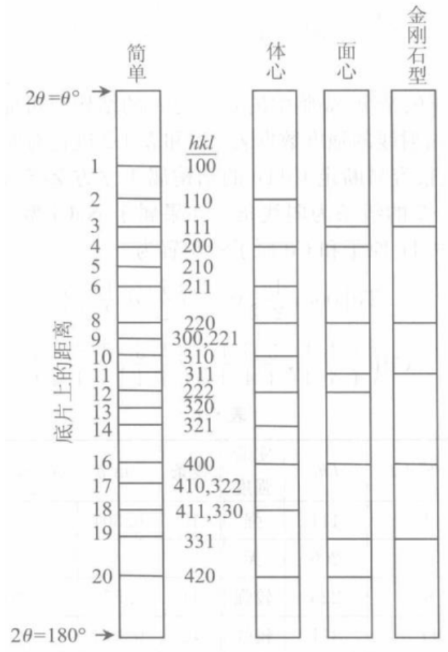

把实验数据按 $\sin^2\theta$ 从小到大排列并归一化，再对照各点阵的消光规则，就可以判断点阵类型：

| 点阵 | 归一化序列（$h^2+k^2+l^2$ 的前几项） | 特征 |
| :--: | :--: | :--: |
| $P$ | $1, 2, 3, 4, 5, 6, 8, \dots$ | **不规律**的条状（中间缺 $7$、$15$） |
| $I$ | $2, 4, 6, 8, 10, \dots$ | **连续**的条状（等差数列） |
| $F$ | $3, 4, 8, 11, 12, 16, \dots$ | **两线 + 一线 + 两线 + 一线** 的重复模式 |
| 金刚石 | $3, 8, 11, 16, 19, \dots$ | 部分谱线（$(200)$、$(222)$）被 $d$ 滑移面消光 |

!!! note "金刚石的序列为什么这样？"
    金刚石结构（$Fd\overline{3}m$）在面心点阵消光的基础上，还叠加了 $d$ 滑移面的消光：当 $h + k + l \equiv 2 \pmod 4$ 时衍射消失。于是 $F$ 序列中的 $4$（$(200)$，和 $=2$）与 $12$（$(222)$，和 $=6$）都被消光，只剩 $3, 8, 11, 16, 19, \dots$。这一序列是判断金刚石结构（以及闪锌矿型结构）的标志。

**求晶胞参数。** 判断完点阵类型后，代入**最大的 $\theta$ 值**（对应最大的 $h^2+k^2+l^2$，即最后面那个峰）求 $a$：大角度衍射的测量误差相对占比小，算出来的 $a$ 最精确。

### 2.3.2 四方晶系的指标化

四方晶系多了一个晶胞参数 $c$，指标化要麻烦得多。关键突破口是：**当 $l = 0$ 时，$(hk0)$ 类衍射的公式仍然是"整数"的样子**：

$$
\sin^2\theta = \frac{\lambda^2}{4a^2}(h^2 + k^2) \qquad (l = 0)
$$

所以先从数据里挑出 $l = 0$ 的峰（它们保持着 $h^2+k^2$ 整数序列的特征），据此求出 $a$。求得 $a$ 之后，把 Bragg 方程移项：

$$
\frac{l^2}{c^2} = \frac{4\sin^2\theta}{\lambda^2} - \frac{h^2 + k^2}{a^2}
$$

对每个峰尝试 $l = 1, 2, 3, \dots$，使得 $l^2/c^2$ 保持恒定的那组 $(hkl)$ 就是正确的指标，进而解出 $c$。

---

### 2.3.3 低对称晶系

对于正交、单斜等低对称晶系，一般难以直接指标化。不过我们可以利用一个直观的现象做初步判断：**线的分裂**（line splitting）。

在立方、四方等对称性较高的晶系中，属于同一晶面族 $\{hkl\}$ 的晶面彼此等效，衍射角完全相同；而在低对称晶系中，这些晶面不再等价，晶面间距 $d$ 各不相同，原本的一条衍射峰就会**分裂为不等价的 $n$ 条**。

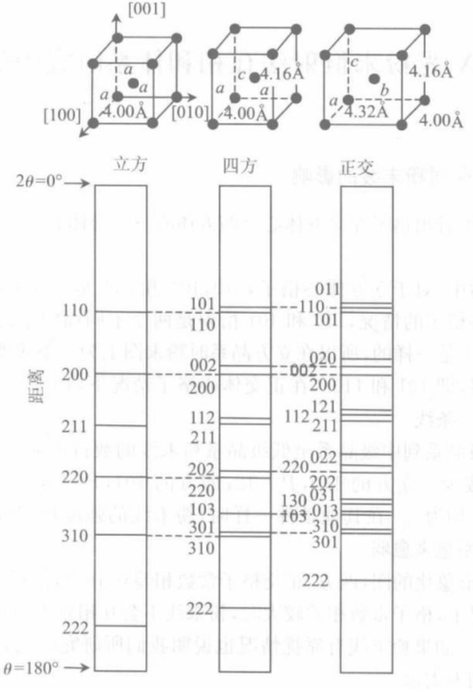

---

第二章 结束

