# 人名反应 · D

## Dakin Oxidation

### 反应式和反应机理

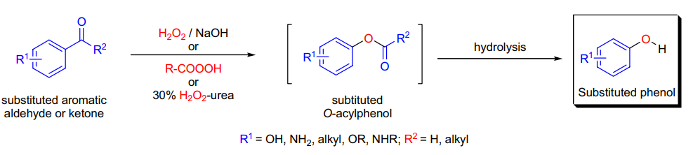

和 BV 的区分：

R2 为 H ，当芳环为强给电子基团时，芳基才能优先迁移，反之经历消除生成羧酸

H2O2-urea （ UHP ）过氧化氢尿素配合物

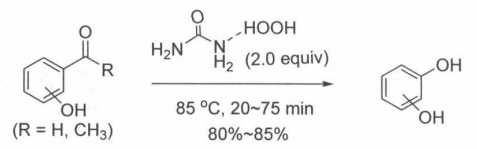

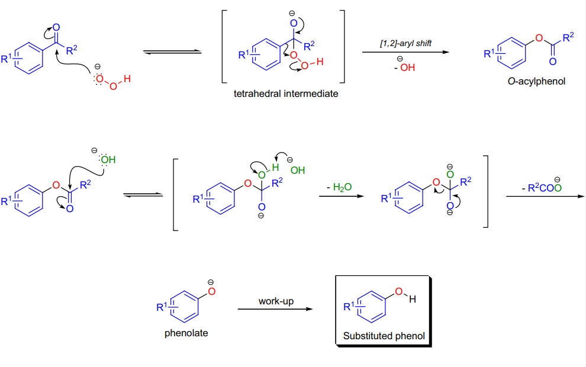

相似的 Hock 反应（制取苯酚）

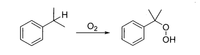

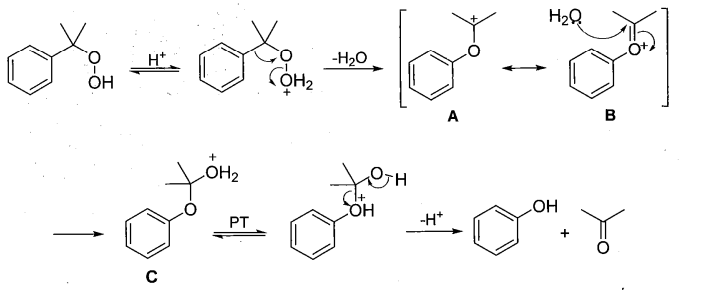

需要没有α - H 的底物！

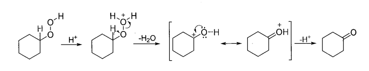

虽然没什么用，但是我一定要记下这个令人震撼的反应，太 tm 神奇了

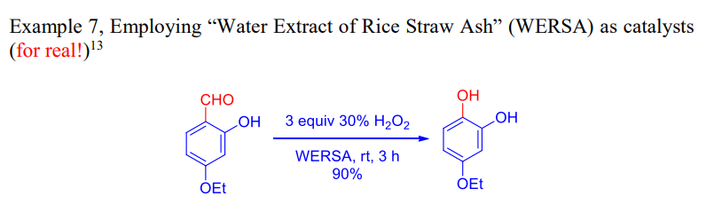

气相 O2 氧化

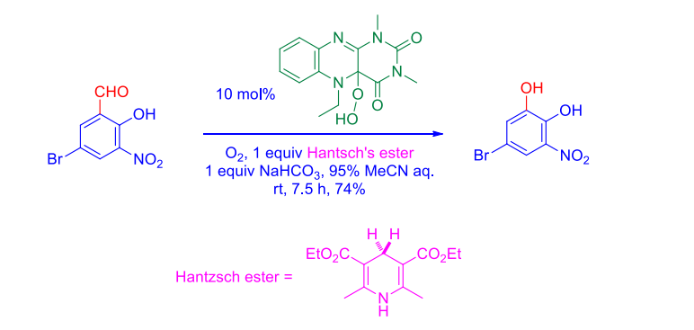

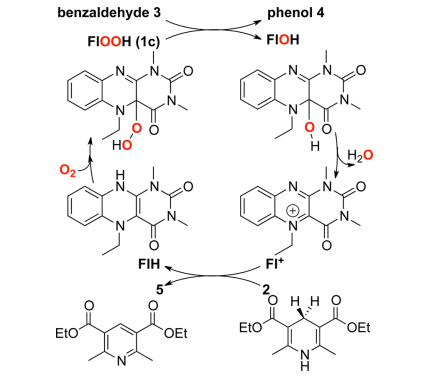

## Dakin-West Reaction

### 反应式和反应机理

识别：氨基酸 + 酸酐→氨基酮（即酸上变成了酸酐的基团）

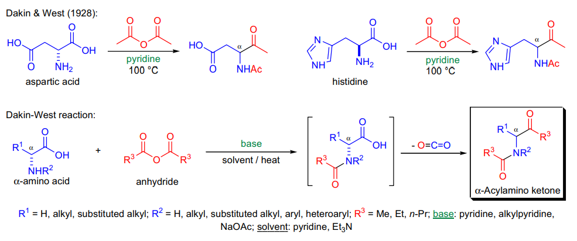

我愿称之为宇宙无敌究极爆炸难人名反应

尝试分析机理：

①生成 N- 取代物

②酰胺进攻活化后的羧酸，芳构化

③原来的羧酸α碳进攻酸酐

④开环后不惜代价脱去 CO2

一般温度很高，加入亲核催化剂可以降低一点（ DMAP ）

后一步进行水解，可以制的氨上无取代的氨基酮

## Danheiser Benzannulation

### 反应式和反应机理

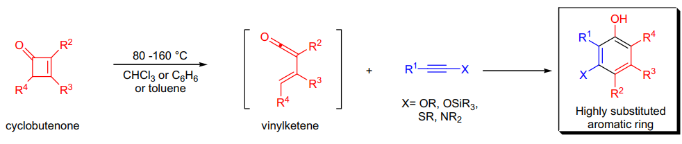

4 Π→ 2+2 → 4 Π→ 6 Π

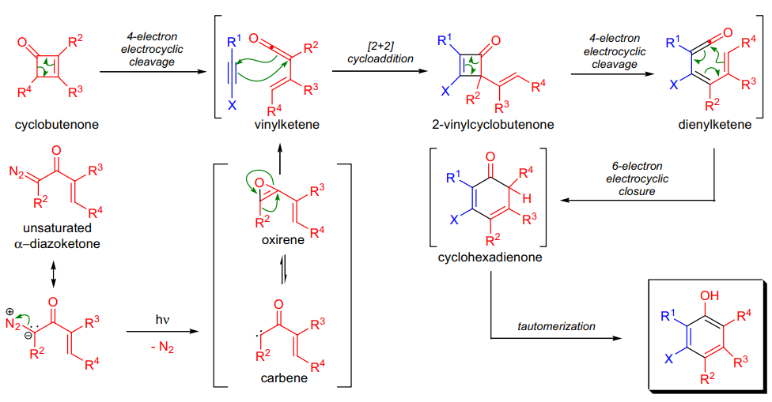

注意易碎裂化的四元共轭环酮的中间体

## Danheiser Cyclopentene Annulation

### 反应式和反应机理

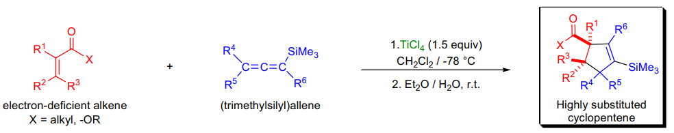

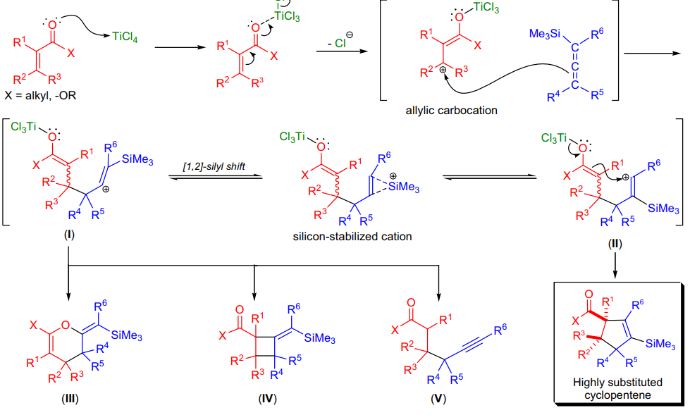

形式上的连烯 - 不饱和羰基的 3+2 加成，加入 LA

可制的高官能团化的环戊烯

可能经历 12 Si 迁移生成副产物

烯可以为其他物质：例如 C=O ：

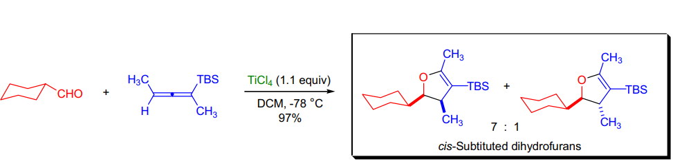

## Danishefsky's Diene Cycloaddition

### 反应式和反应机理

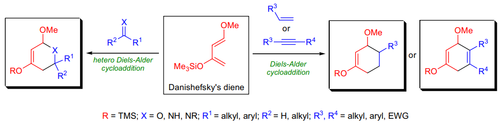

Preperation

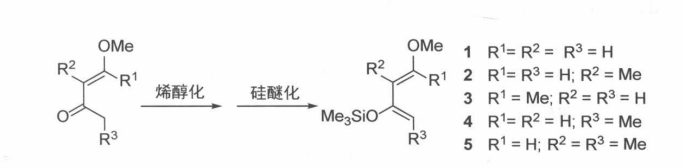

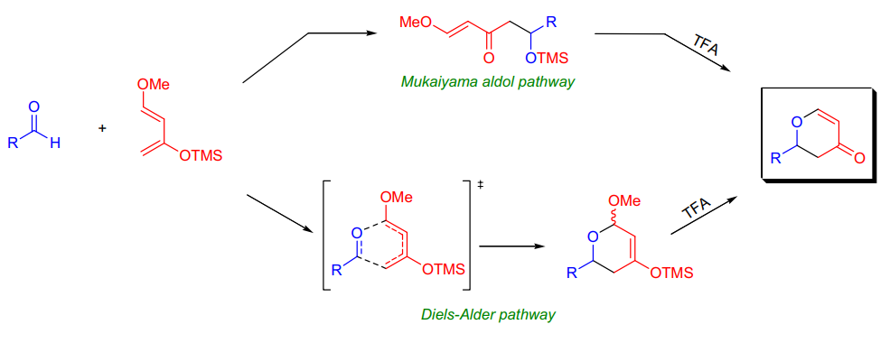

立志往前 Bazzard Diene 差不多，均为富电子底物，可以与 C=C 、 C=O 、 C=N 发生加成

通常： B 、 Ti 一类的 LA 导致分步机理，而其他的走协同机理

## Darzens Condensation

### 反应式和反应机理

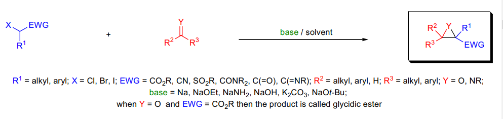

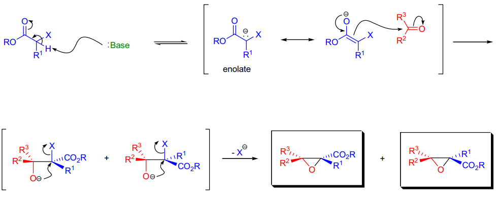

通常用 NaOMe/Na/NaNH2/LDA/t-BuOK 等强碱

### 实际应用

只有α - 氯酯的产率最高（更少的 SN2 取代反应）

同系化串联反应：酮→醛

Darzen 缩合卤代酯 + 酯水解，开环氧

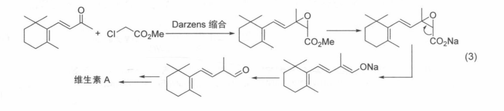

当连接芳环极度缺电子的时候，重氮也可以进行 Darzens ，反之 AE 先发生

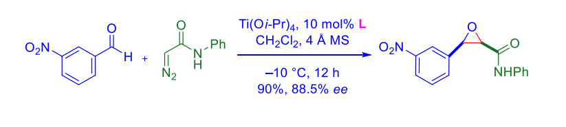

当底物为亚胺 /Micheal 受体时，也可以合成吖啶 / 环丙烷产物

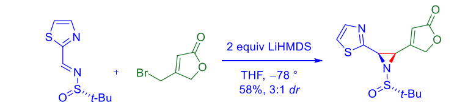

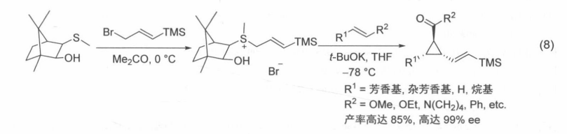

我很疑惑为什么啊这个东西不发生重排？而即使是溴代：

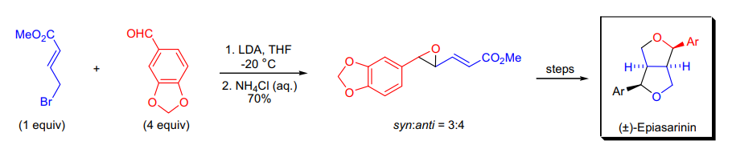

也成了环丙烷， why ？

## Davis' Oxzziridine Oxidations

### 反应式和反应机理

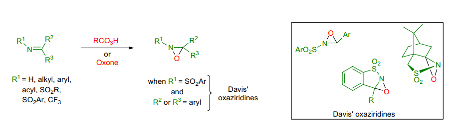

最常见的为 N 上带磺酰基的配合物

可以有以下反应：

1 ） S 、 Se →亚砜

2 ）烯烃→环氧

3 ）胺→羟胺、氧化胺

4 ）金属有机化合物→醇

5 ）羰基α位羟基化（最重要）

氧化过程经历螺形过渡态

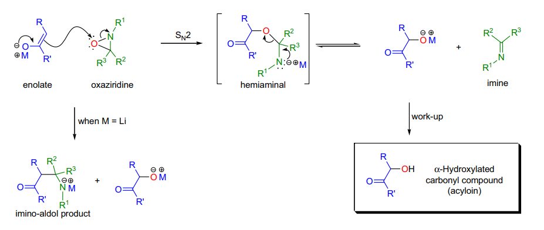

若加入底物过量，可能与副产物亚胺反应

### 实际应用

手性催化剂使用例：

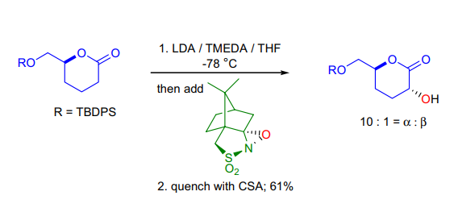

## Delepine Reaction

### 反应式和反应机理

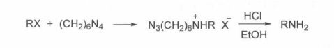

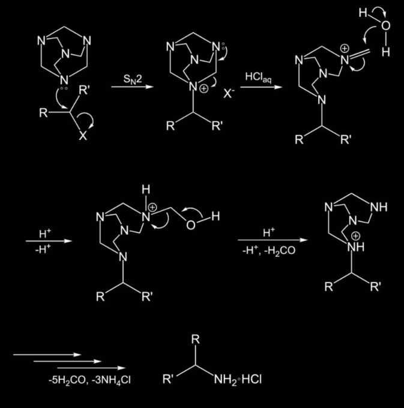

### 实际应用

应用：一锅煮下二氢吡咯

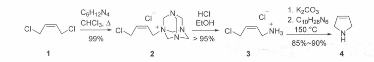

## Demjanov & Tiffeneau-Demjanov Rearrangement

### 反应式和反应机理

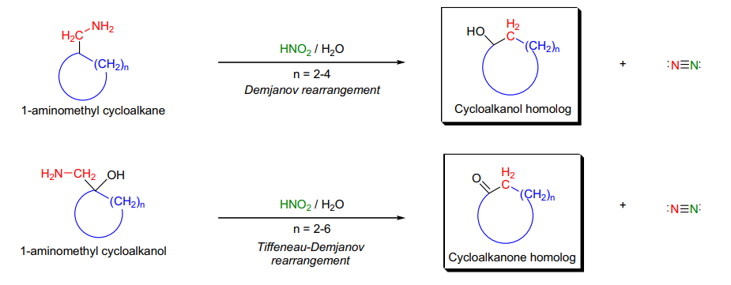

重排的选择性与立体电子效应有关：

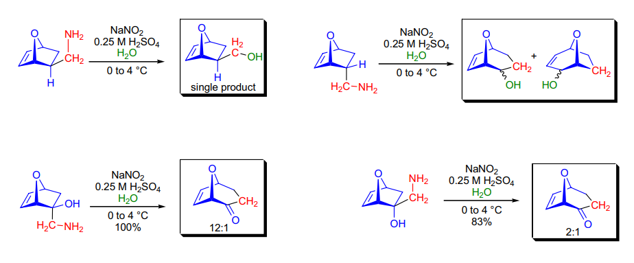

讨论：为何上面两种中左边不发生重排？

形成重氮后，重氮会和氧发生相互作用，导致构象受到限制，没有可迁移基团

### 实际应用

改进前的重排只能处理 4-6 的环系，改进后（类似 semi-pinacol ）可以处理较大的环系

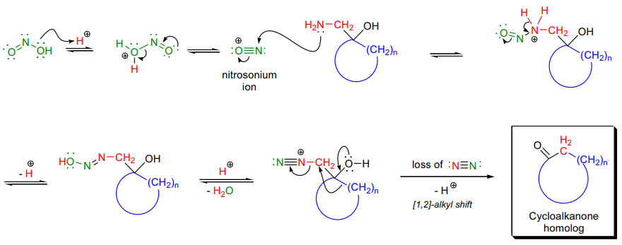

一种常用的扩环方法学：氰亲核羰基形成氰醇，之后使用 LAH 还原，之后重排

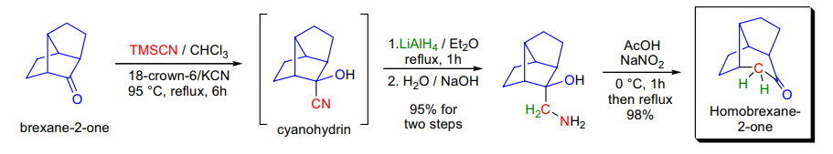

可能生成的副产物：

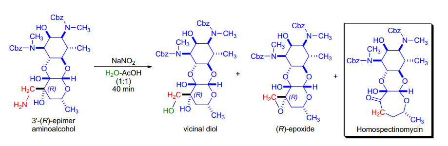

## DEPBT Reagent

### 反应式和反应机理

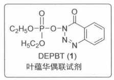

### 实际应用

用于氨基醇的脱水偶联

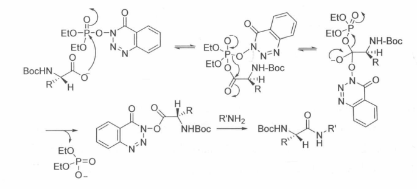

## Dess-Martin Oxidation

### 反应式和反应机理

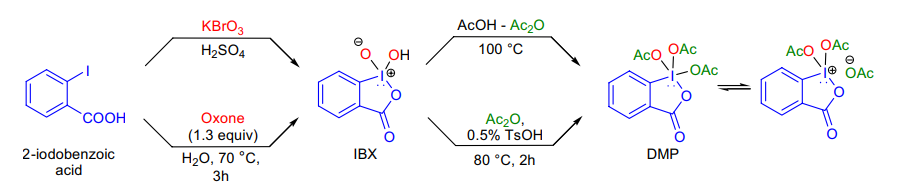

一般不用 IBX ：高极性带来的有机相溶解度低，稳定性低

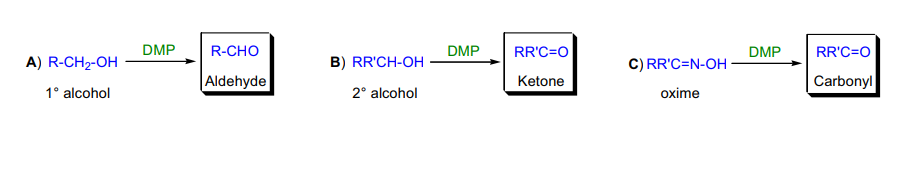

只氧化到醛

其他可运用反应：

不改变手性中心的氧化

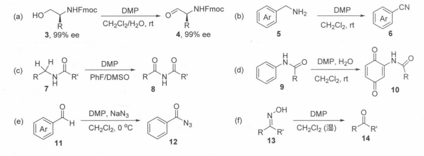

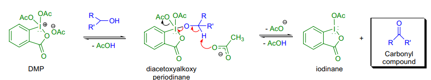

通常在 CH2Cl2 中进行，有时加少量缚酸剂（ NaHCO3/Pr ）以维持碱性条件氧化

加入过量乙醇 / 水可以催化反应（生成不稳定乙氧基配合物 /IBX ，氧化性更强）

### 实际应用

方法学： DMP+NaClO2 温和条件下的醇→酸

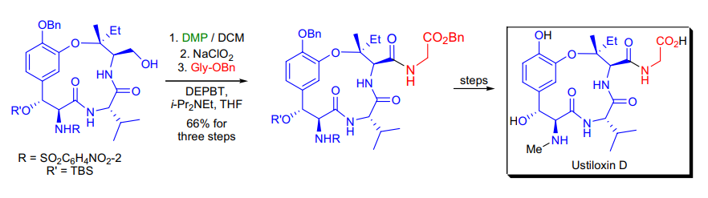

可替代试剂： IBX-OTs

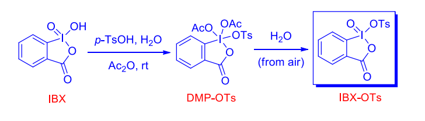

可能发生的副反应：碘苯甲酸亲核

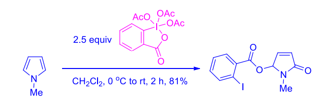

## Dieckmann Condensation

### 反应式和反应机理

即环内 Claisen 缩合

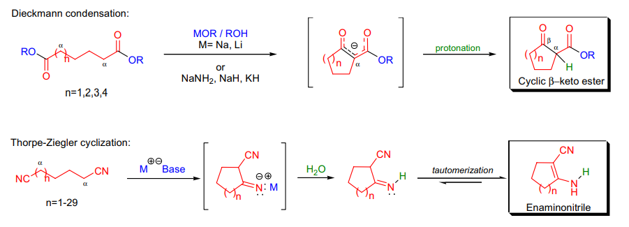

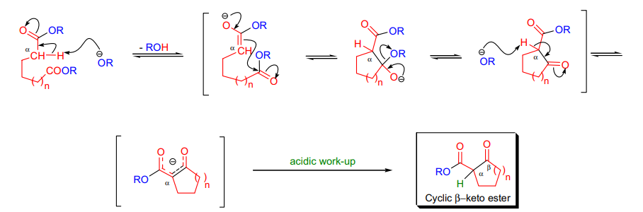

## Diels-Alder Reaction

### 反应式和反应机理

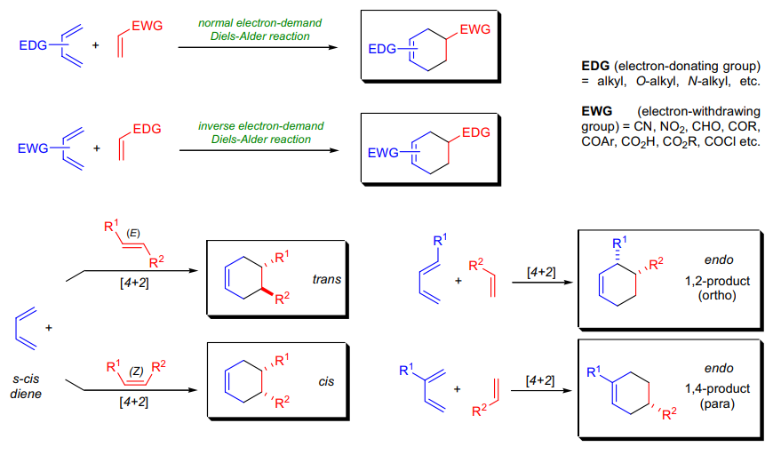

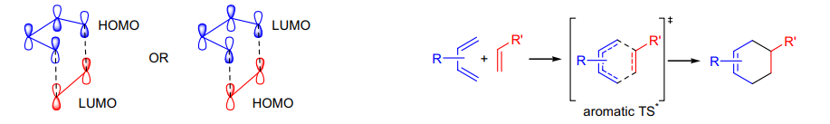

谁都会的 4+2

立体选择性：由于次级轨道相互作用，一般内型

轨道的分析：

正常 D-A 反应：

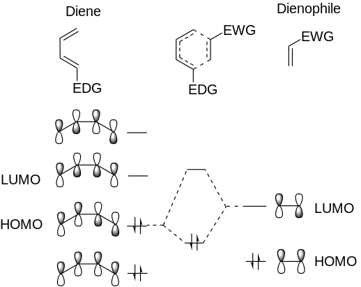

二聚反应由于能量相差巨大，不易进行，仅在同时缺电子或富电子的时候进行


若电子性质完全相反，则进行 D A inv


DA-inv 的选择性可看作由电荷或轨道控制：


endo 选择性仍然奏效——富电子基朝向 endo


在烯丙醛中， C 末端具有最大的 HOMO 和 LUMO 系数（原因见上图）

这意味着，如果在 diene 上有一个很强的吸电子基，则将导致 HOMO 和 LUMO 最大系数位于同一个原子上，自己的 HOMO 和 LUMO 刚好匹配，很容易二聚


因此，共振的电性（只分析了 1 组电子流动）不适用于有 2 组电子流动的体系

关注次级轨道相互作用：反常产物中作用更好


因此，当两组相互作用抵消的时候，其更像一个双自由基的中间体而非电荷分离（类似光照下 2+2 ），得到反常产物

在实际情况中，用到丙烯醛的反应需要加入四氢吡咯防止二聚

### 实际应用

需要注意的变体：

Retro-D-A （需要更高的温度，通常离去好离去的分子）


一个典型是离去氮气（ Boger 吡啶合成）


区域选择性：邻对位选择（可以分步来推）

一些双烯体的制备方法


脱氢的 DA 反应


各种变体：

Hetero-D-A Reaction


当二烯未被杂原子取代时，正常电子需求

当被一个以上杂原子取代时，逆电子需求

当杂二烯连接强给电子基时，正常电子需求


Inverse electron-demand Diels–Alder reaction

某些缺电子芳环也可以用作 diene ，以下是可能的合成路径：


区域选择性讨论：丙烯醛二聚，得到电性相反产物


## Dienone-Phenol Rearrangement

### 反应式和反应机理


需要在酸性 / LA 条件下进行


一些其他的迁移方式：

若为烯丙基，则经历 [3,3] σ迁移得到产物

若为苄基，则经历 [1,5] σ迁移

### 实际应用

脱羧 - 重排例子


## Dimroth Rearrangement

### 反应式和反应机理


一些印象因素：

1 ）氮的取代程度（越多越容易受到亲核进攻）

2 ）吸电子基团的取代程度

3 ）热力学稳定性

机理（哎哟，这不 ANRORC 吗，下次注意）


Smile 更多的是环外取代基的替换，换内部杂原子还得看 ANRORC


## Diering-Laflamme Allene Synthesis

### 反应式和反应机理

烯中插入连烯


造出了非常帅的结构


注意看右边的的环丙烷，可以直接造出重氮环丙烷

分析其机理：


可以有两种机理： N 进攻 orC 进攻（亚硝基的亲核性不太好）

若为 A 衍生物：

经历 Grab 碎裂化生成氰酸锂，然后消除

若为 B 衍生物：

N ：氧进攻羰基形成四元环，碎裂离去乙酸锂后消除

C ：碎裂化后消除

质子溶剂时走 C 更容易（ H-Bond 配位偶极矩较大的 C=O ）

串联一步周环反应：


## Dotz Benzannulation Reaction

### 反应式和反应机理


产物可进一步被 CAN 氧化为醌：


某些情况下的特殊取代：


## Dudeley Reaction

### 反应式和反应机理


