# 人名反应 · E

## Enyne Metathesis

### 反应式和反应机理

即烯炔复分解

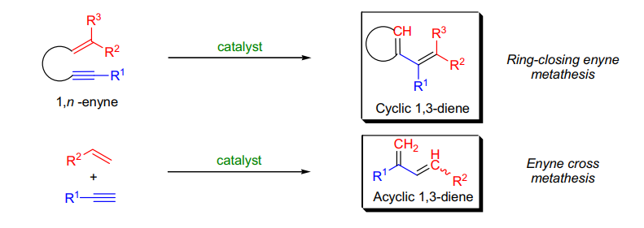

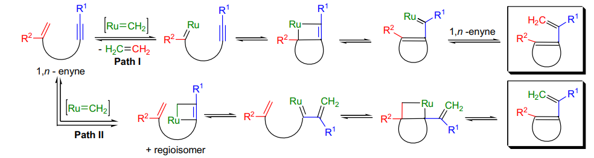

## Eschenmoser-Tanabe Rragmentation

### 反应式和反应机理

其他形成炔酮的方法：

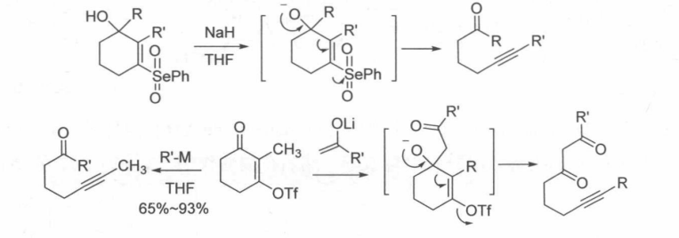

### 实际应用

不饱和酮的环氧化→成磺酰腙→合成炔酮

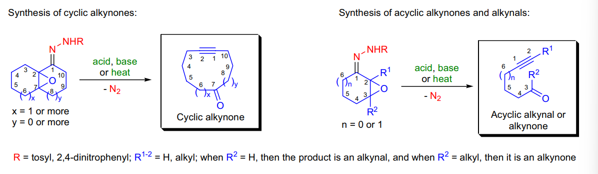

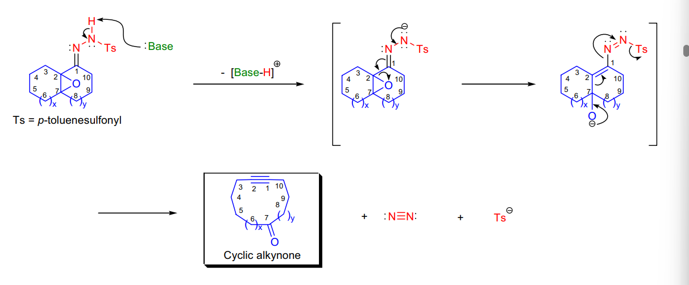

如果环氧腙难以制备，可以直接用过量 NBS 处理不饱和腙碎裂

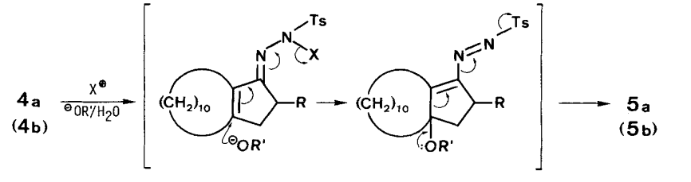

## Eschenmoser 缩硫

### 反应式和反应机理

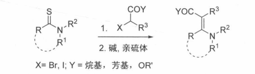

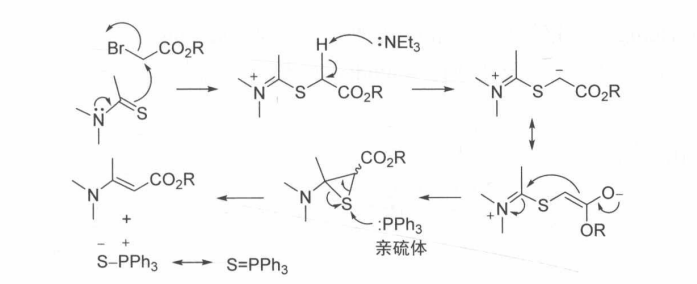

硫酰胺→共轭酯

## Eschweiler-Clarke Methylation

### 反应式和反应机理

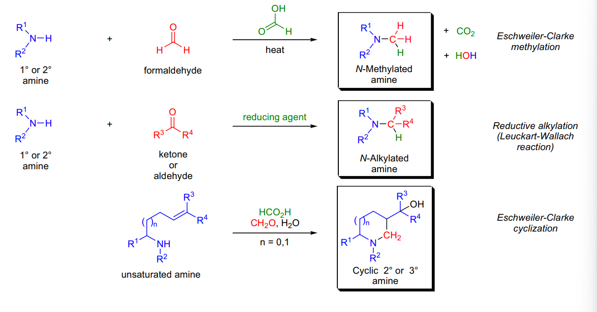

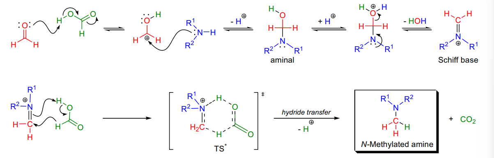

如果是伯胺的话，会经历两次该反应

类似的 aza-Knovangle

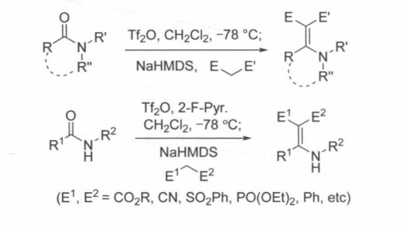

## Evans Aldol Reaction

### 反应式和反应机理

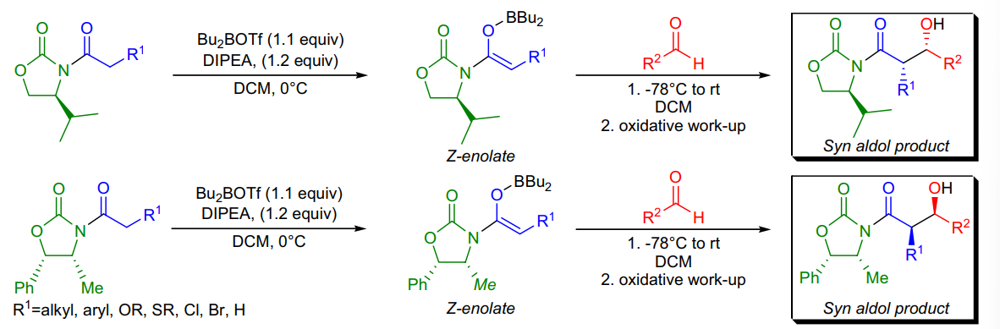

避免偶极排斥的选择性

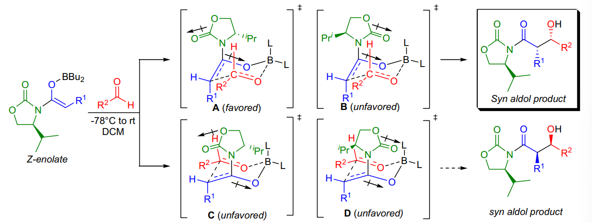

anti 产物：使用 MgCl2 络合，由于 Mg 倾向八面体配位，经历船型过渡态

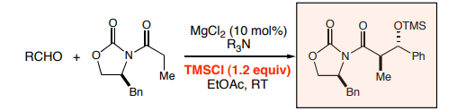

另一种 syn 产物，换了更好配位的 S ，偶极变弱

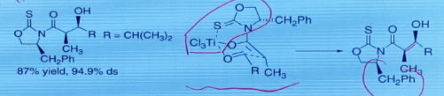

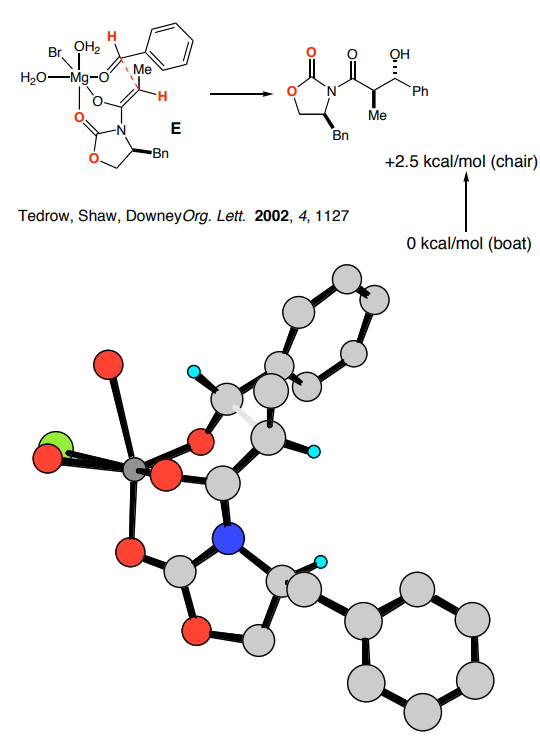

另一种 anti 产物：替换 O 为 S ，此时手性助剂不倾向配位：

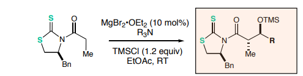

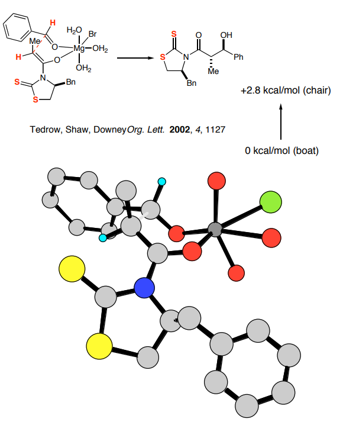

噻唑比噻唑更容易被水解，同时具有不一样的立体选择性

### 实际应用

由于硼体积较小，使用硼试剂有较好的选择性

使用 LiO2H 进行试剂水解，若使用 LiOH 则进攻助剂上羰基（软硬）

一套方法学，做出所有立体产物

另一种 syn 产物：

使用硼试剂进行络合：

## Etard Reaction

### 反应式和反应机理

使用铬酰氯将甲基氧化成醛

从甲苯制取苯甲醛的转换，而不氧化成羧酸

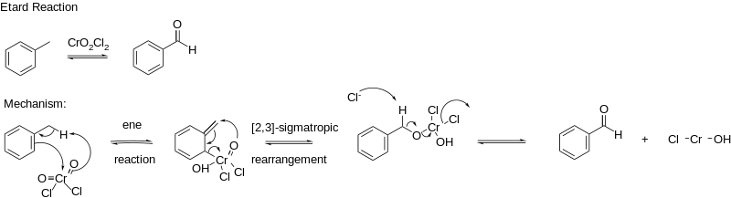

先生成 Etard 复合物，之后水解生成产物

