# 人名反应 · F

## Favorskii Reaction

### 反应式
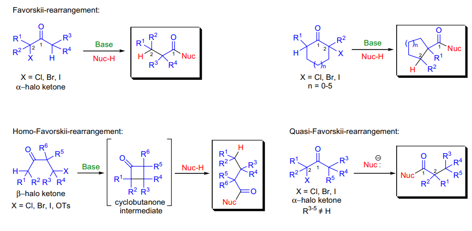

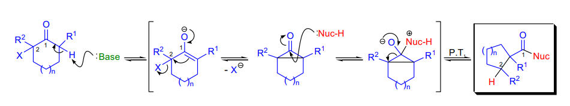

### 反应机理
由于 Baldwin 规则禁阻，关环步骤实际为电环化，因此，若拔氢后不能很好共轭，在很强极性的溶剂中，中间体自发电离成负电荷在氧端，正电荷离域在 3 个 C 上的产物，立体选择性消失：

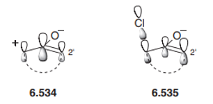

光照条件下进行的重排：

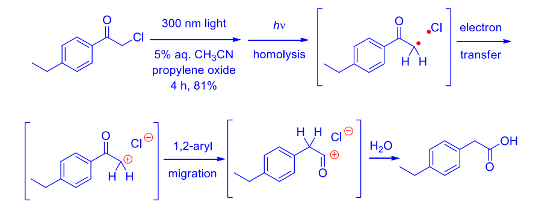

一则立体选择性控制：

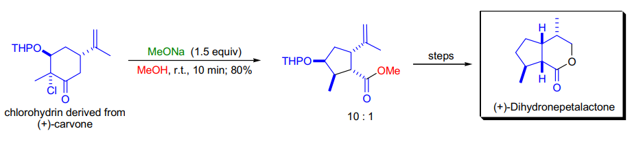

由于实际经历对旋关环，羰基位置向前

高极性下的中间体可以进行 3+4 等周环反应，

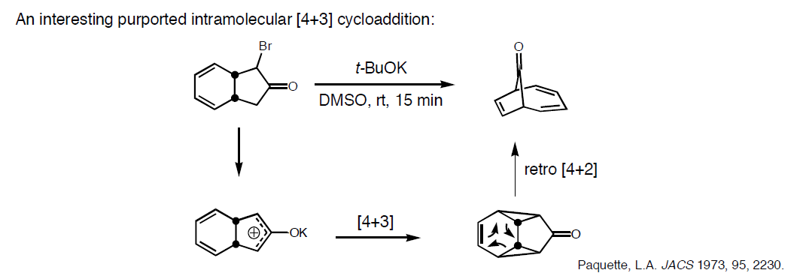

以下是一例选择性：

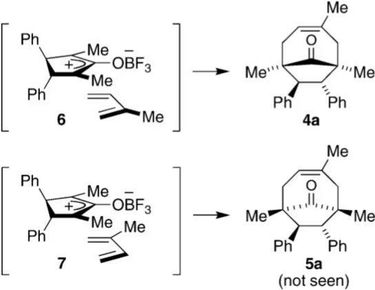

底物的构象为半椅式构象，而改过渡态为不对称的：

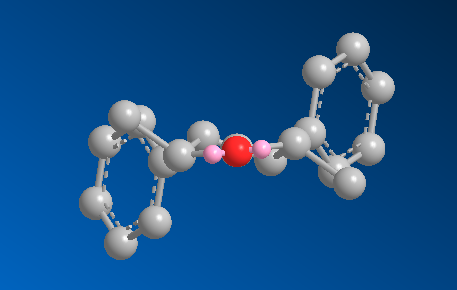

因此，前面的 Me 更容易在下面接受电子，因此由更加富电子的带甲基的烯基进攻

讨论 : 《真正的发我司机》

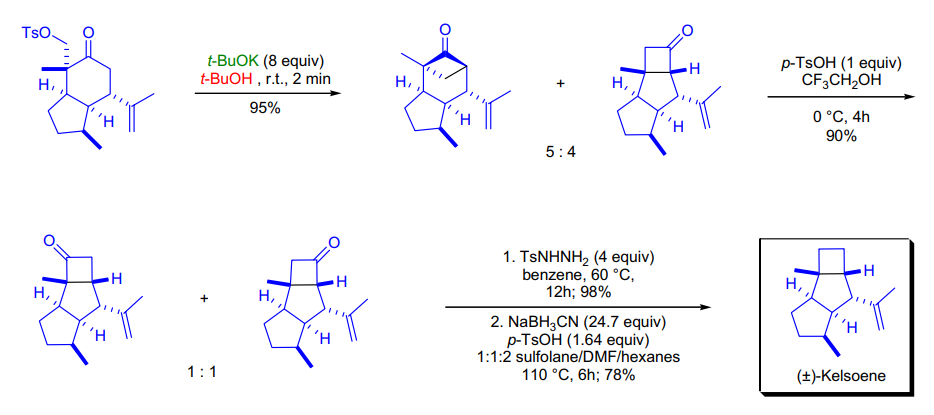

在碱处理 Homo 之后，碳正离子进一步迁移：

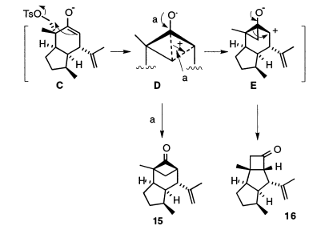

酸处理之后进一步迁移，得到另外一个产物，两个产物经过互变达到 1:1 ：

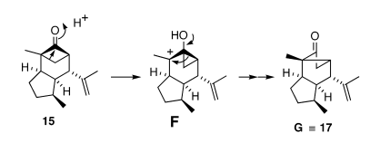

Quasi-Favorskii Reaction

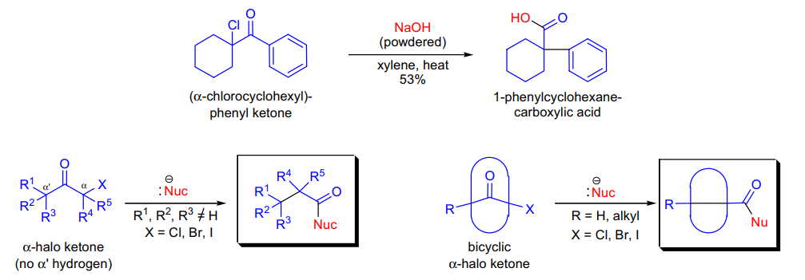

上文提过， favorskii 实际为电关环机理，因此当无无负离子或负离子空间上不满足时则走 quasi 机理

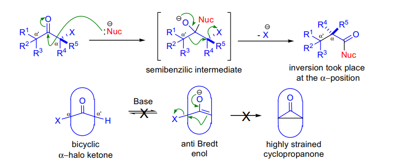

如立方烷的构建：

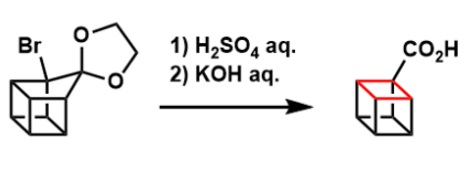

### 实际应用
两个变体：一个关四元环（但很容易经历重排），一个打羰基后迁移（ Semi-Pinacol ）

碱性条件下实际拔 halo 上的氢有利，但由于平衡趋向 favorskii 产物

二卤代物也可以经历重排，最后生成顺式的不饱和羰基

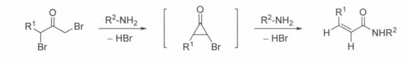

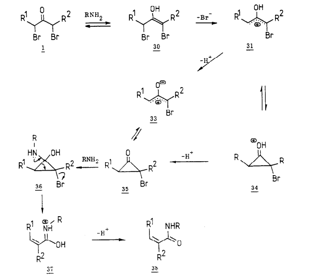

二卤化物也可以由共轭烯烃生成：

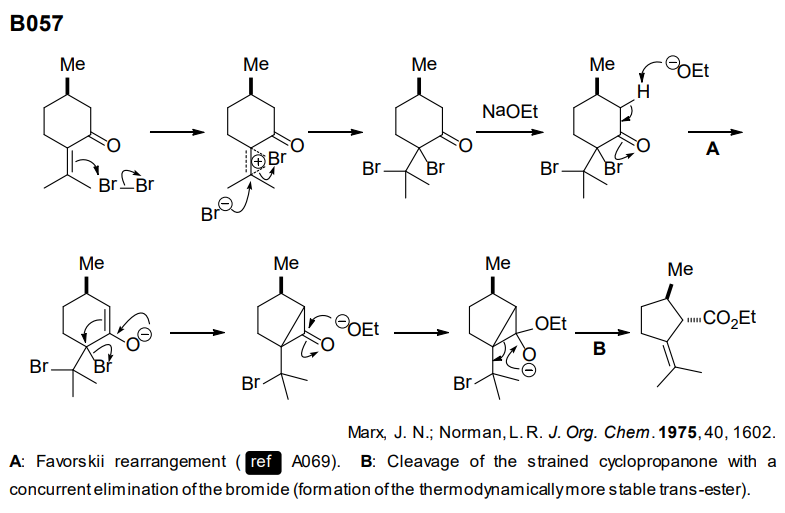

若该反应位于环上，则生成环烯

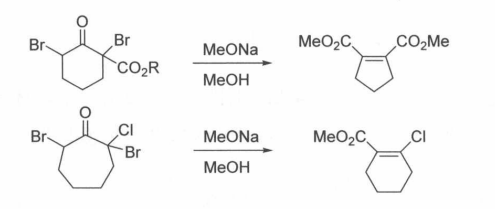

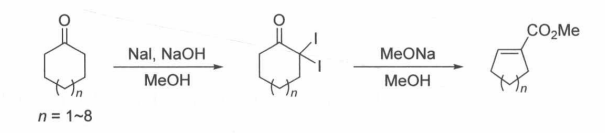

卤代酰胺也能发生类似反应：

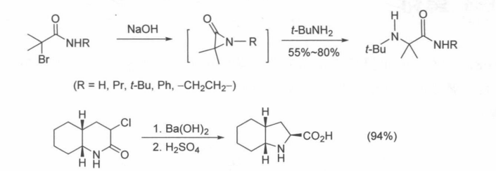

Semi-favorskii

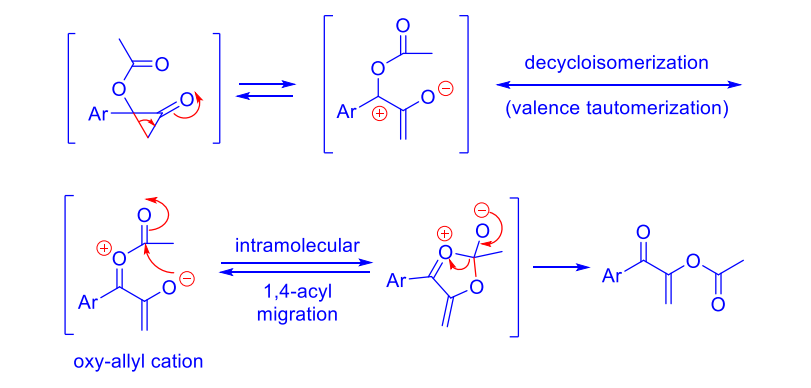

环丙酮在强推拉环境下，自己都绷不住

由于适用范围拓展，很多羰基亲核试剂在α卤代酮中会得到意外的产物

在 Wittig 试剂中得到意外的产物：

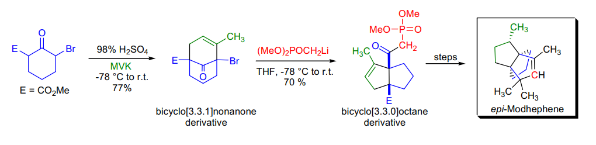

α卤代酮的 LiAlH4 还原重排：

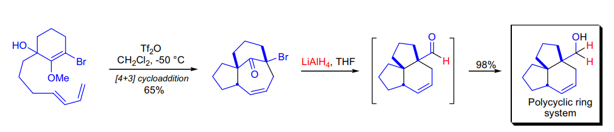

两步反应接连发生：

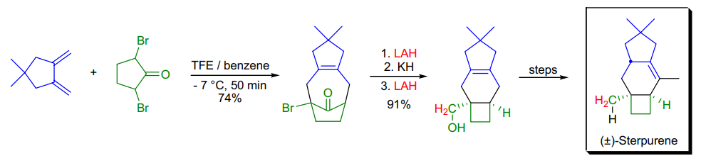

## Feist-Benary Furan Synthesis

### 反应式
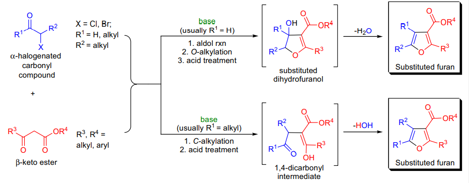

区域选择性取决于羰基类型，若为羰基缺电子则先打羰基，若酮则先打卤素

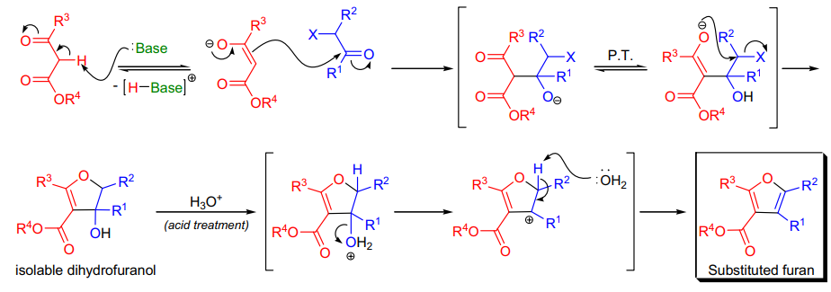

先碱性生成中断产物，然后酸性消除得到呋喃

这里α卤代羰基通过质子转移关五元环

### 反应机理

### 实际应用

## Ferrier Reaction/Rearrangement

### 反应式
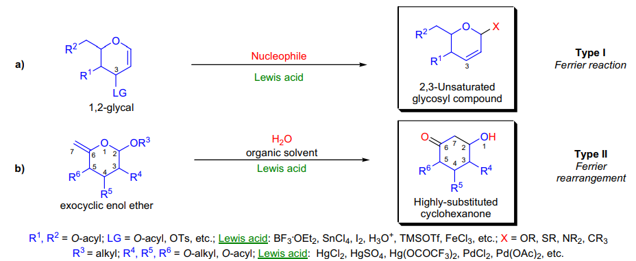

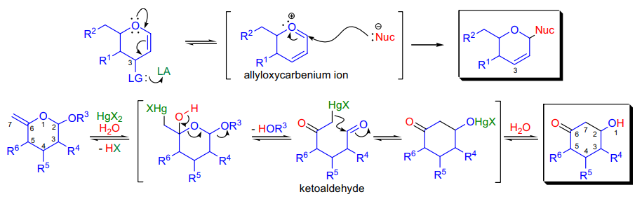

II 型识别：由烯基糖支取环己酮，汞催化，注意羟汞化优先

令人十分迷惑的反应：

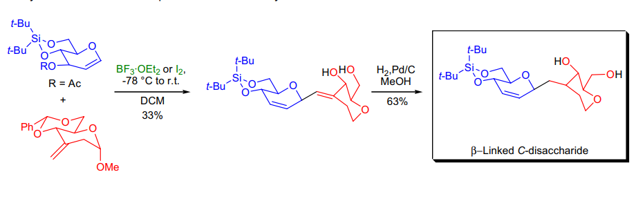

你他妈的，缩酮作为还原剂反应了，导致甲氧基没了！！啊啊！！

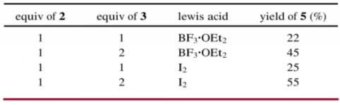

### 反应机理

### 实际应用
I 型如果亲核试剂足够强，可以加热条件下进行反应，不需要 LA

## Fetizon Oxidation

### 反应式
负载在硅藻土 Celite 上的 Ag2CO3

对位阻很敏感，优先氧化维族小的

可以将二醇氧化成内酯

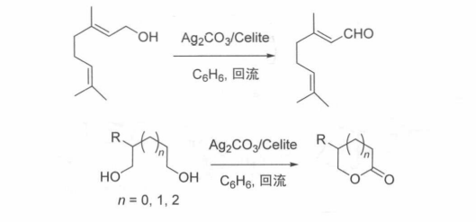

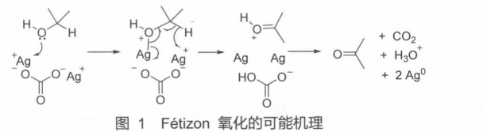

### 反应机理

### 实际应用

## Finkelstein Reaction

### 反应式
我愿封为史上最简单人名

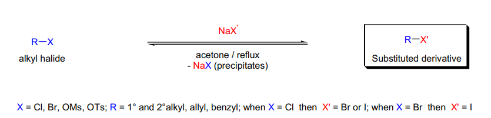

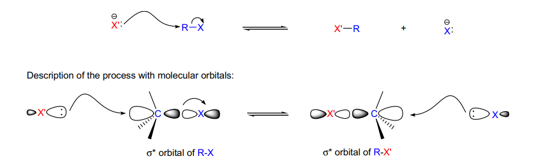

平衡 reason ：生成有机相内难溶的 NaCl/NaBr/NaOMs/NaOTs

一些特殊的烷基取代：

1 ）非偶极溶剂中用 TBAF 氟代

2 ）偶极溶剂中可使用 KF+18c6 氟代

3 ） TMSI 可以取代掉 F

### 反应机理

### 实际应用

## Fischer Indole Synthesis

### 反应式
苯肼 + 有α氢的羰基→吲哚

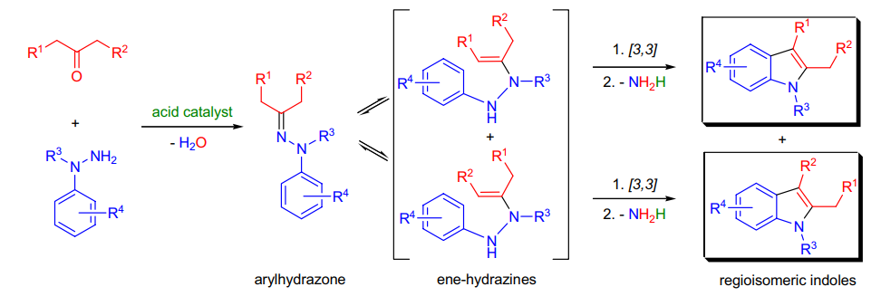

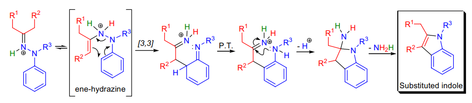

只要是酸都能催化该反应

### 反应机理
然而，然而在杂原子环上不能用酸，否则杂原子将会质子化，直接加热即可反应

对于不对称酮，强酸则取代酸性较强的碳原子，弱酸取代酸性较弱的

### 实际应用
α - β不饱和酮产率较低：得到的吡唑啉不能继续反应

1,3 羰基化合物产率低：生成了吡唑衍生物

1,2 羰基化合物可以反应：生成单吲哚和双吲哚

## Fleming-Tamao Oxidation

### 反应式
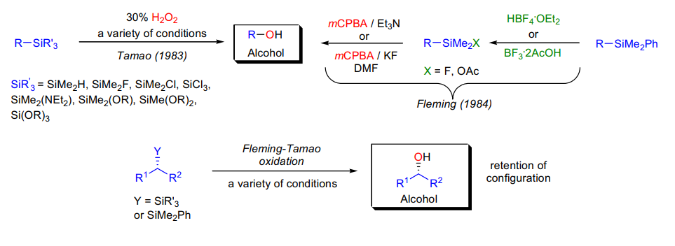

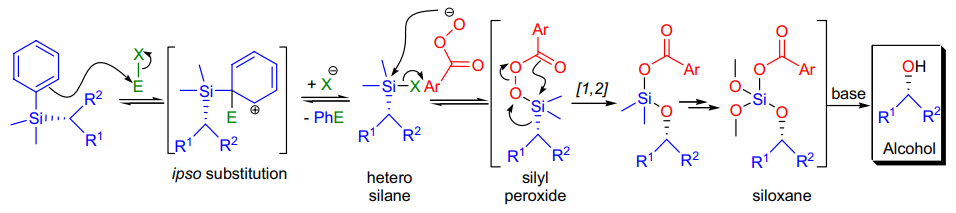

必须要PhSi取代基才可以被取代：该苯非常富电子

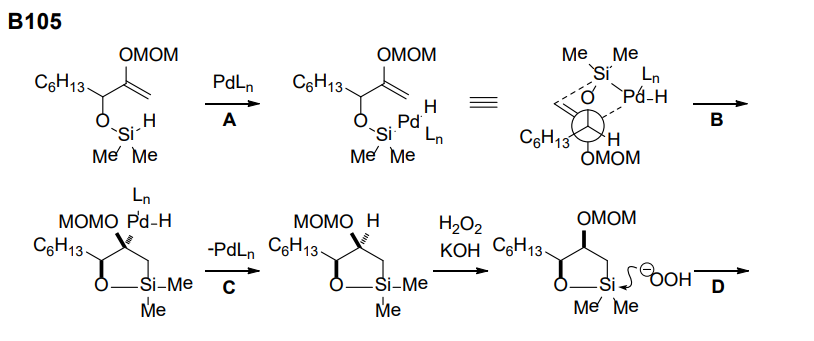

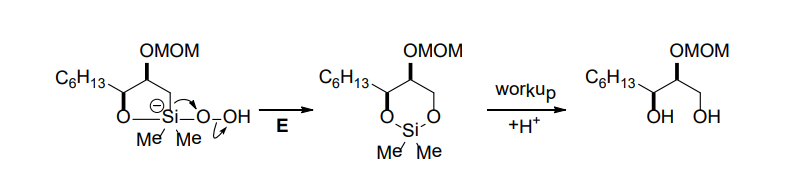

### 反应机理

### 实际应用

## Friedel-Craft Acylation/Alkylation

### 反应式
酰基化

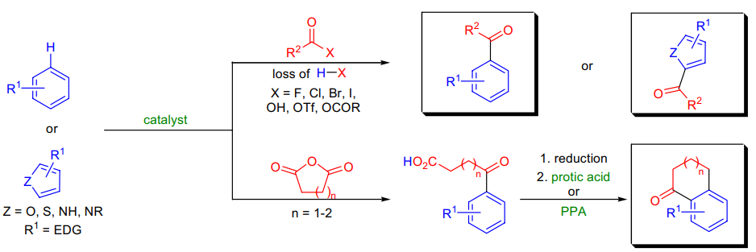

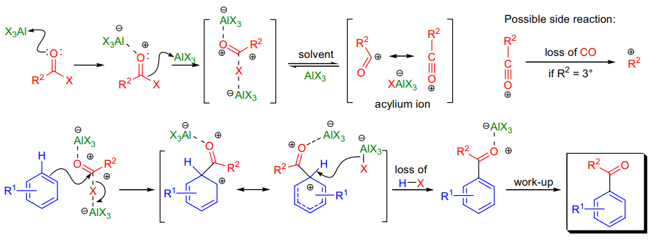

活性： I>Br>Cl>F

需要大于一当量的 LA 催化，且体系内不能有更强的 LB

不会用多取代产物（取代后失活）

烷基化

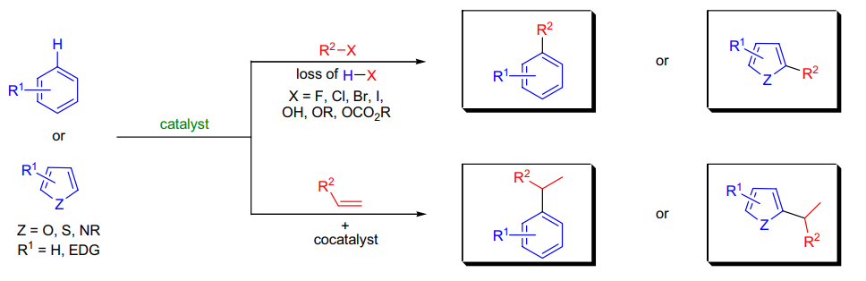

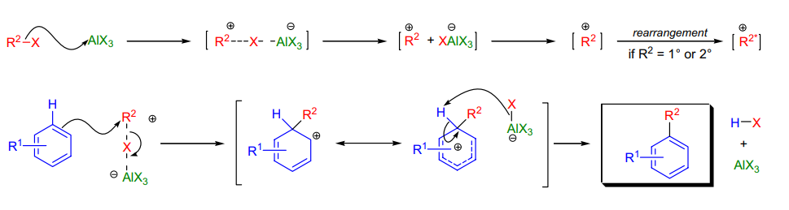

活性： I<Br<Cl<F

常常多取代

### 反应机理
由于经历了碳正离子中间体，可能发生重排

为何活性出现相反？中间体的差异：

酰基化中主要是羰基氧去络合，因此 C-I 键最容易断裂

### 实际应用
烷基化是可逆的，烷基可能去除或重排

LA 通常只需加入催化量（醇需要加入当量）

若试剂为烯烃，也可加入催化量质子酸

烷基化中只能卤素原子配位 LA ，因此更硬的 F 更容易与 LA 配位

一些惊人的例子：原位 F-C 反应

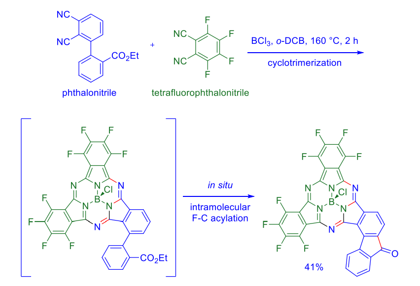

## Friedlander Quinoline Synthesis

### 反应式
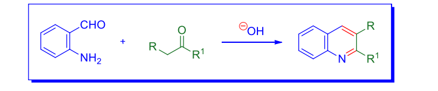

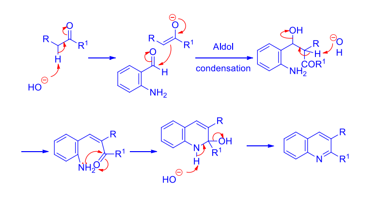

### 反应机理

### 实际应用
也可以将醛换成亚胺避免副反应

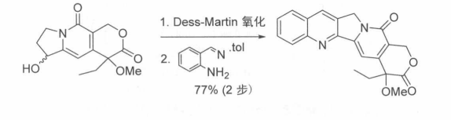

炔基也可以参与反应

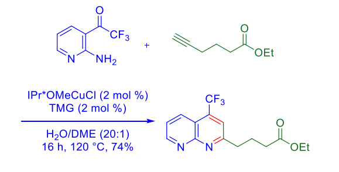

## Fries Rearrangement

### 反应式
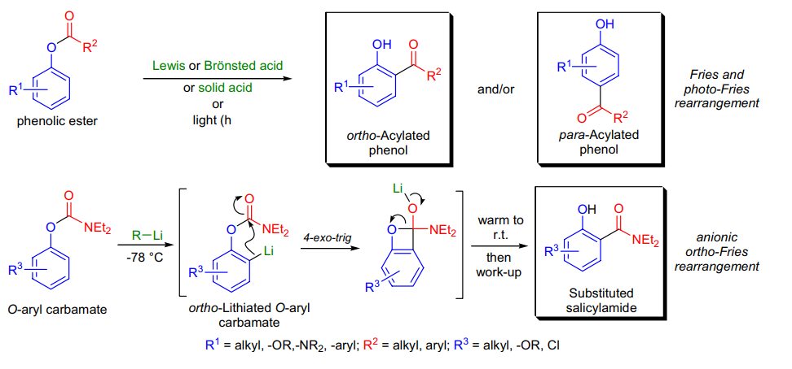

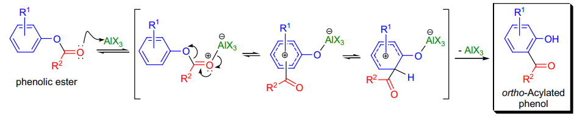

### 反应机理
正确的机理没有定论

一些奇怪的结论：

需要等当量 LA 或 BA ，或光照条件进行

酰基上有给电子基利于反应进行

温度控制：

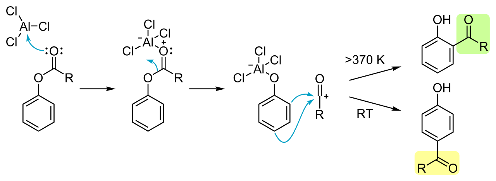

非极性溶剂： RT 生成对位产物（动力学），高温生成邻位产物（ Al 螯合，热力学）

极性溶剂：对位产物

（非极性溶剂中主要为离子对，在邻位反应，极性溶剂中为自由离子，符合正常 FC 规则 ）

### 实际应用
若使用锂则试剂促进很好进行：

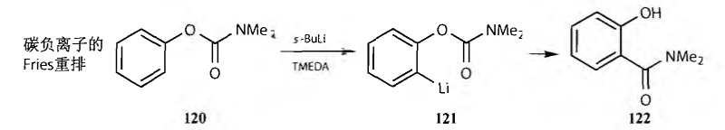

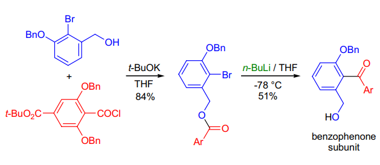

杂原子的 Fries 重排：

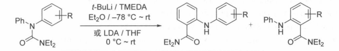

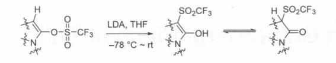

光照也可以促进该反应，该反应会在芳香族聚合物再阳光下发生（脂肪族发生 Norrish 反应

## FBS Rearrangement (Fritsch-Buttenberg-Wiechell Rearrangement)

### 反应式
由烯基卡宾生成炔

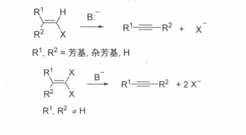

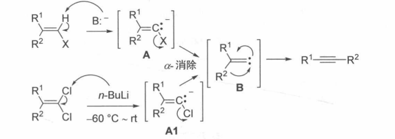

### 反应机理

### 实际应用
可以用于很诡异的炔烃合成：

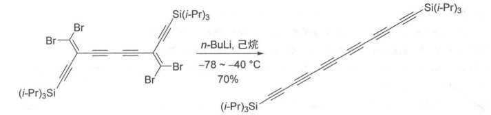

采用电压合成，还能更长

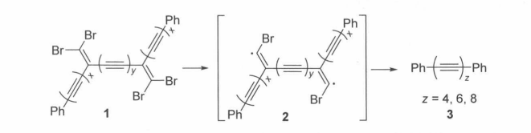

或者用于扩环反应

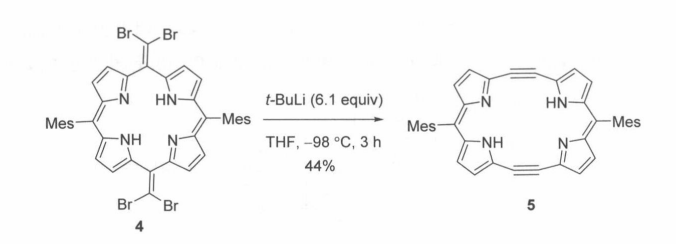

## Fujimoto-Belleau Reaction

### 反应式
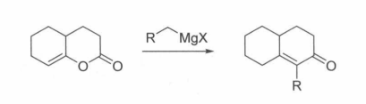

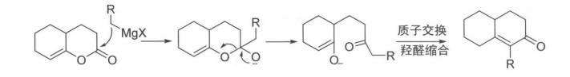

很蠢，但我们可以还一点其他试剂：

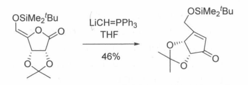

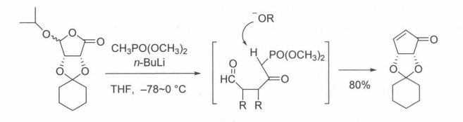

### 反应机理

### 实际应用

## Fukuyama Reduction/Coupling

### 反应式
将羧酸转化为硫酯，然后转化为

还原：醛

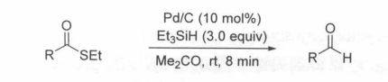

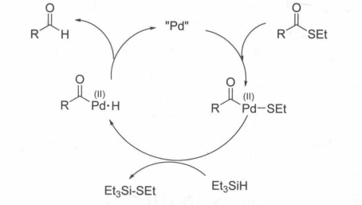

偶联：酮：

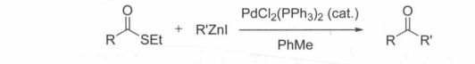

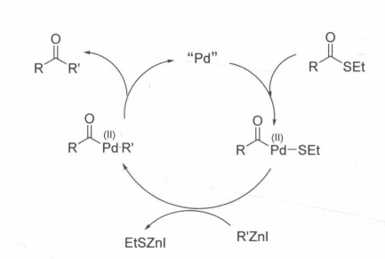

### 反应机理

### 实际应用

## Ferrario-Ackermann Reaction

### 反应式

### 反应机理

### 实际应用
由 S8 参与的反应，通常用于构造 S 桥

