# 人名反应 · G

## Garbiel Synthesis

### 反应式
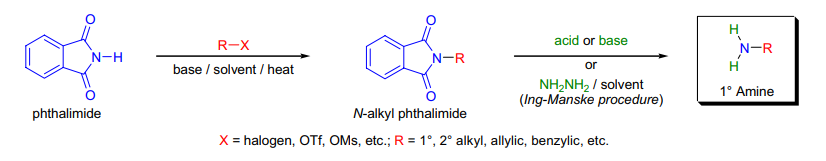

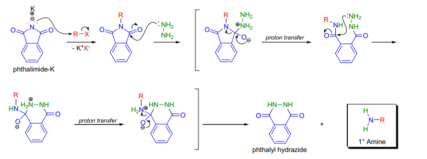

最后一步也可采用碱解 (MeNH2) 或酸解 (HCl) ，然而条件苛刻

副产物的生成：

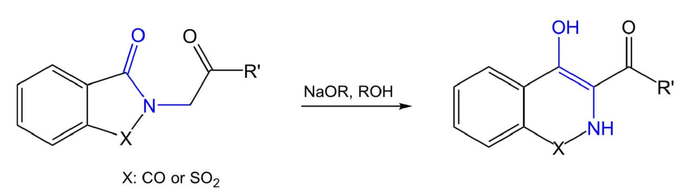

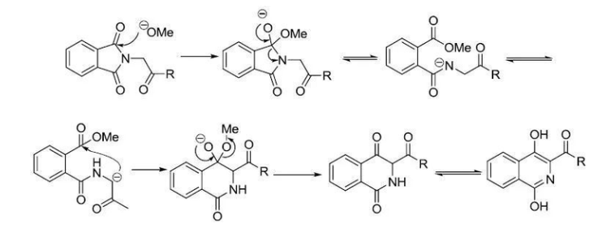

### 反应机理

### 实际应用
X=SO2 时，为糖精衍生物

## Gattermann-Koch Formation

### 反应式
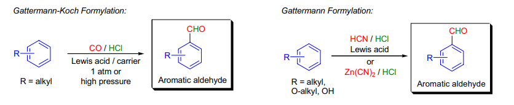

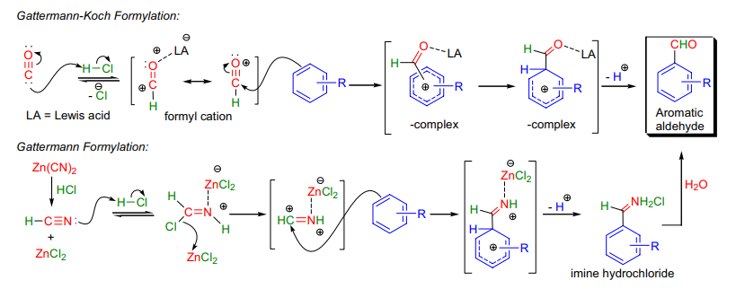

常压下加催化剂对活化底物甲酰化（对位为主），高压下直接可对非活化底物甲酰化，失活底物失效

### 反应机理

### 实际应用
改进法：乙醚相 Zn(CN)2 和 HClgas 造出 HCN

## Gewald Aminothiophene Synthesis

### 反应式
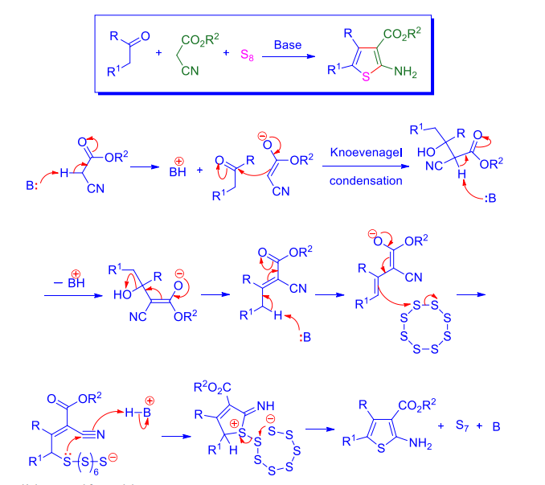

识别：碱性酮 + 酰基腈 + S8 生成氨基噻吩

一些其他的试剂：

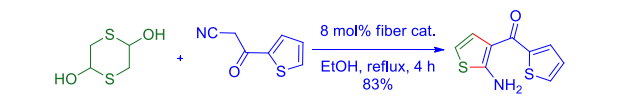

### 反应机理

### 实际应用

## Glaser Coupling

### 反应式
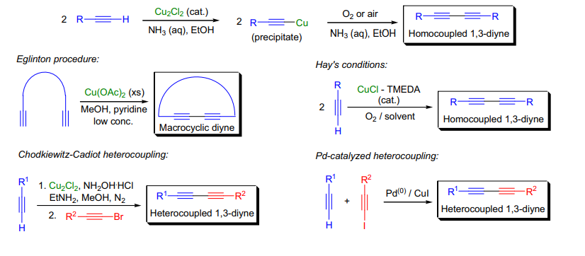

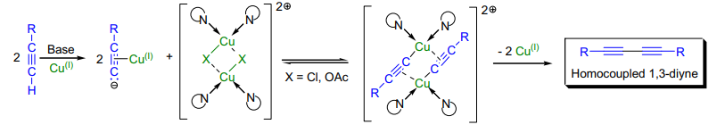

### 反应机理
二炔偶联（自由基机理被证明错误）

### 实际应用
Eglinton 改进法：使用 Cu(OAc)2 和吡啶偶联

Hay 改进法：体系内加入络合试剂 TEMDA ，可溶于更多溶剂

## Gould-Jacobs Reaction

### 反应式
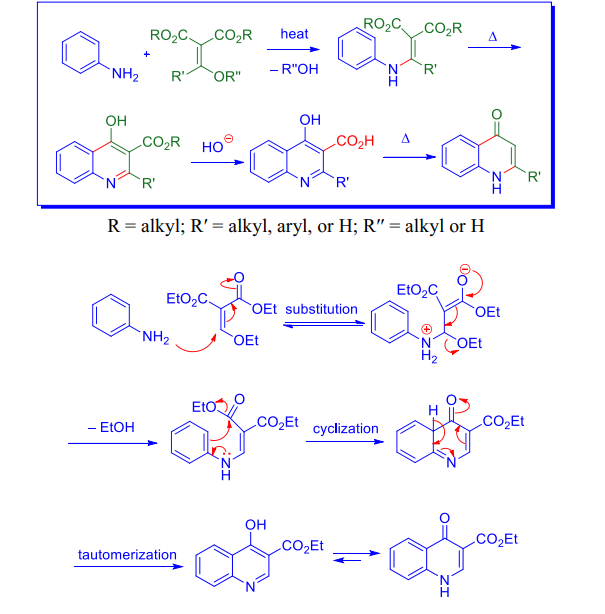

### 反应机理

### 实际应用

## Grignard Reaction

### 反应式
形成：

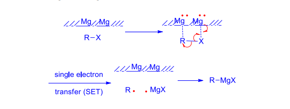

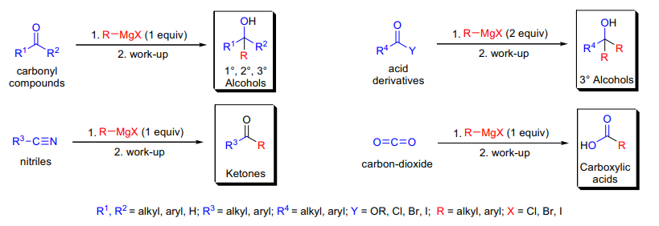

卤代烃将发生 Wurtz 偶联

环氧在取代基较少一侧开环

### 反应机理
可能的机理：

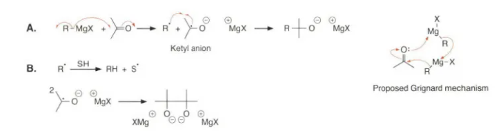

对于能稳定自由基负离子的中间体，走自由基中间体

也有可能经理二级反应历程。

可能产生的副反应：

1 ） Wurz 偶联产物

2 ）空气氧化产物

一例诱导进攻：

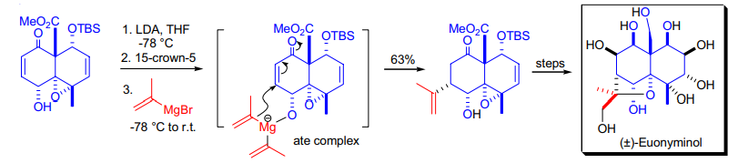

### 实际应用
3 ）α位拔氢产物（可以用 Li 转化为烯醇，或用 Ce 试剂增加亲核度）

4 ）若底物受阻无法进攻，格式试剂可能用β氢还原羰基

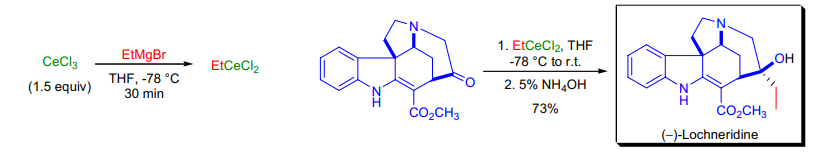

溶液相中的格式试剂其实是多个不同物种的平衡

制备方法：

1 ） Mg 和卤代烃（常加入 I2/MeI/CH2BrCH2Br 以生成 MgI2 活化 Mg ，去除 MgO ； HgCl2 可以与 Mg 形成汞齐，增加反应性；也可以加入预制的格式试剂）

2 ）格式试剂去端基炔质子

3 ） Mg-X 交换

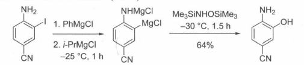

底物有电子受体时，可以进行偶联

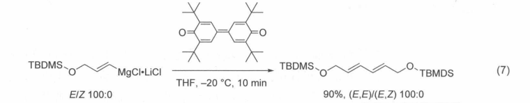

如果底物为酯 / 酰胺，底物会直接烷基化到叔醇，加入 Tf2O 活化后的酰胺可以避免这一点：

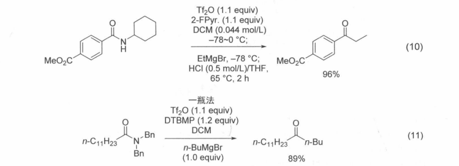

Hoch-Campbell 氮杂环丙烷合成

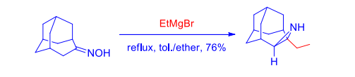

酮肟和过量格式实际生成氮杂环丙烷

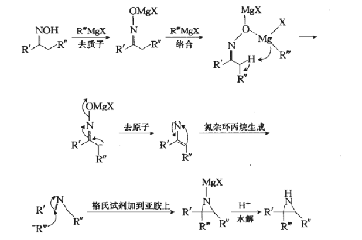

一个奇怪的案例分析：

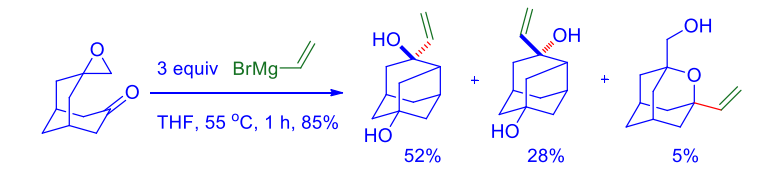

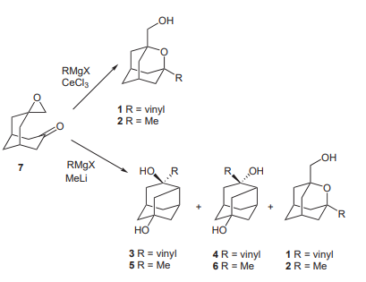

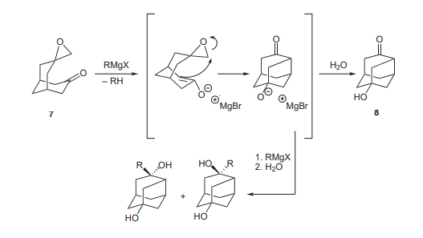

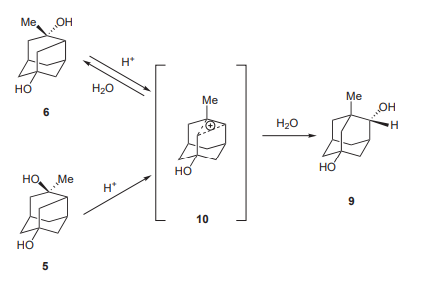

## Grieco Elimination

### 反应式
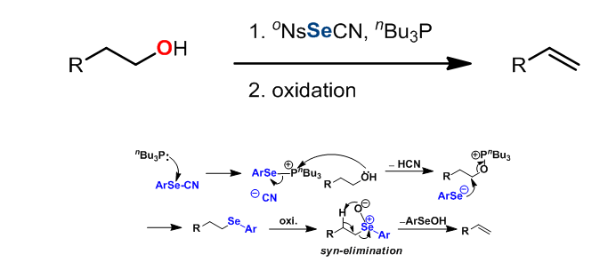

热消除反应

### 反应机理

### 实际应用

## Grob Reaction

### 反应式
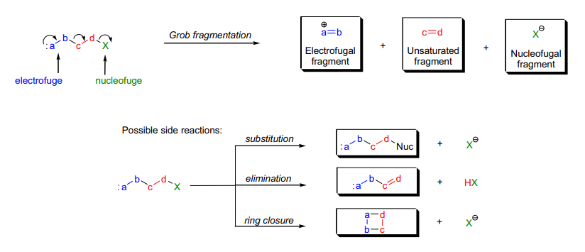

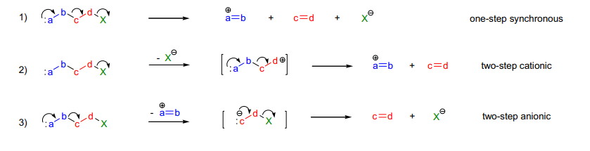

### 反应机理
若五个原子轨道很好匹配，则一步裂解，否则两步裂解（少见）

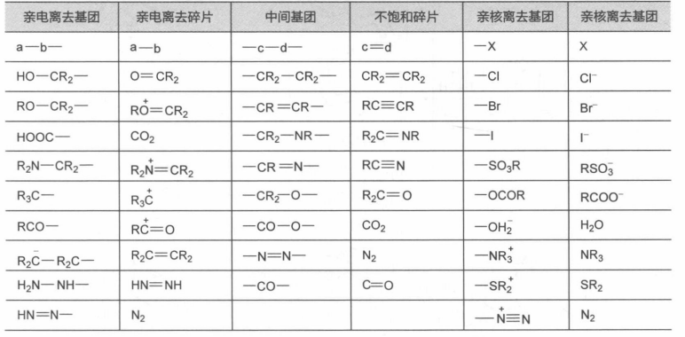

部分串联反应：

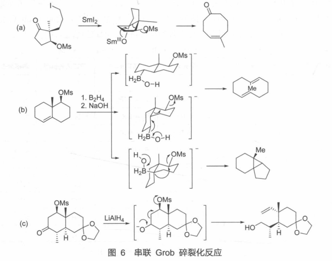

双过氧化合物可以利用此反应造出单线态氧

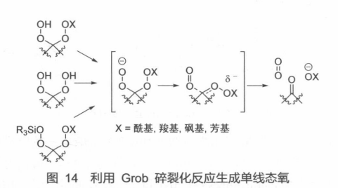

### 实际应用
一个神奇的重排的例子：

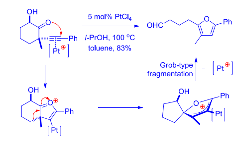

