# 人名反应 · H

## Halogen Dance

### 反应式
根本原因：在芳环上的 Li 需要找到一个合适的位置来稳定（通常是吸电子基），通过拔氢 +Li-Hal 交换进行，对自身反应

反应启动为 LDA （难以交换），但也可用少量（ 0.5equiv ） BuLi 通过 LiHal 交换启动

由于 N 的孤对电子排斥，吡啶上 Li 不喜欢在 N 邻位

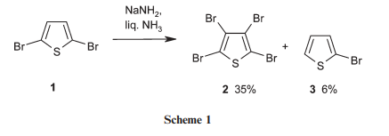

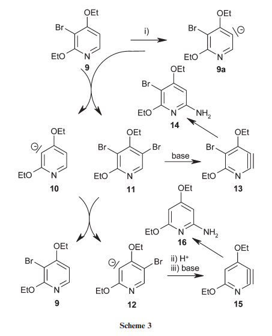

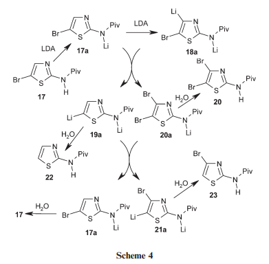

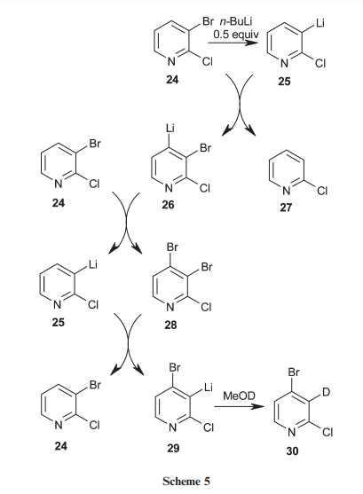

控制因素：需要金属和非金属同时存在，因此金属化反应越慢越好， so ：

1 ）温度↓

2 ）底物活性↓

3 ）将 Base 缓慢加入底物中

有利于 HD

egs ：

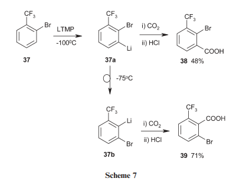

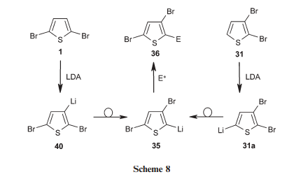

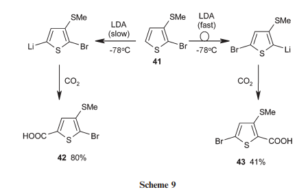

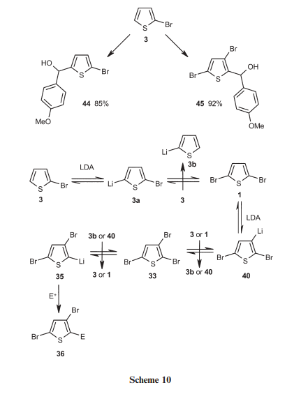

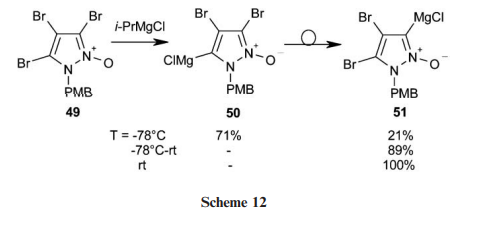

遗憾的是 50 溶解度较低导致低温选择性逆转

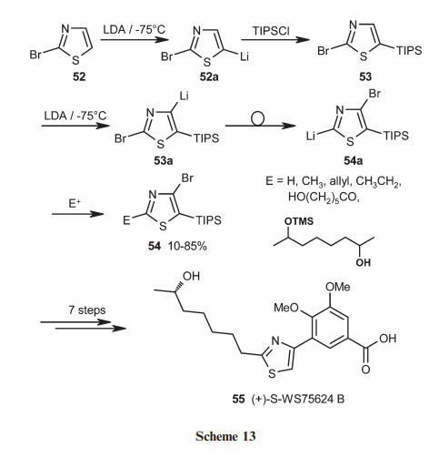

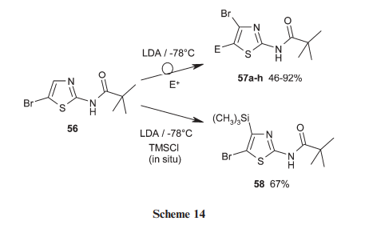

亲电性太强导致的

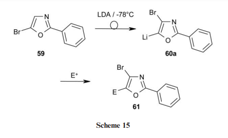

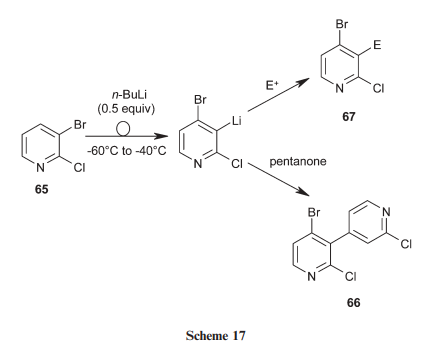

pentanone 太大了， Cl 的位阻也很大，还不如打自己

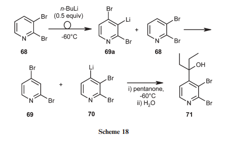

为了更小的位阻进攻，直接 dance 回去了

### 反应机理

### 实际应用

## Hajos–Parrish–Eder–Sauer–Wiechert Reaction

### 反应式
我愿将其奉为名字最长人名

即脯氨酸催化的不对称 Robinson 环化，一般关六元环

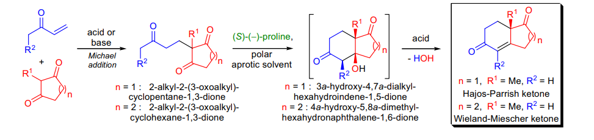

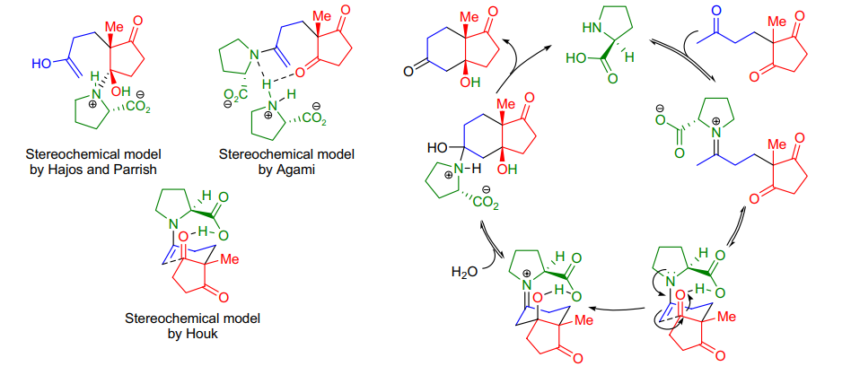

直线型氢键诱导

对映体不利：氢键附近与平伏键甲基相互排斥

### 反应机理
分析过渡态：

对于五六元环：由于构象限制和没那么大的位阻，倾向于采取 cis

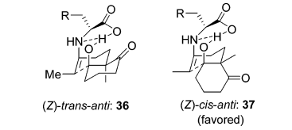

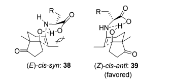

对于七元环：位阻成为主导因素

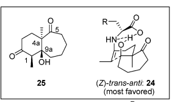

### 实际应用
有时苯丙氨酸也可以表现出更强的催化性能

令人疑惑的选择性：

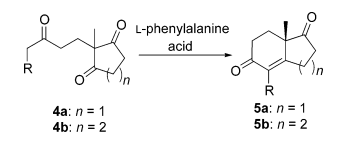

然而：

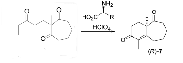

## Haller-Bauer Reaction

### 反应式
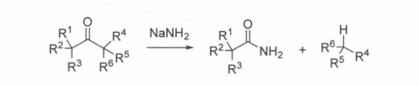

氨基钠作用下的酮的断裂

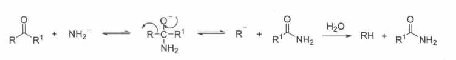

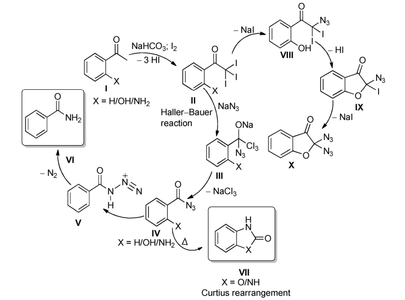

### 反应机理

### 实际应用

## Hantzsch Reaction

### 反应式
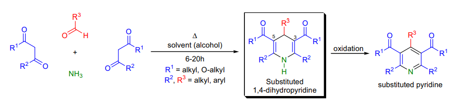

识别：醛 + 两分子αβ + 氨（一般 NH4OAc) →五取代的二氢吡啶

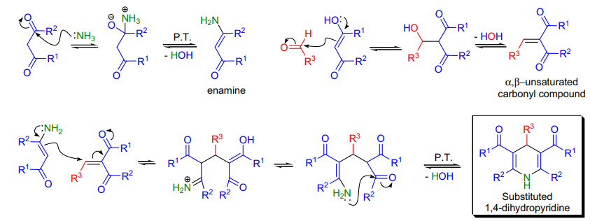

### 反应机理
两个中间体为亚胺缩合产物和 Knv 缩合产物

### 实际应用
二氢吡啶会自发氧化成吡啶，也可以加入氧化剂

也可以加入羟胺，经过脱水直接得道吡啶

得到不对称产物：

1 ）先制得β酮酯的 knv 缩合产物，再与β酮酯和氮源反应

2 ）先制得β酮酯的 knv 缩合产物，再与烯胺反应

3 ） knv 产物若有 15 二羰基，可以直接和氮源反应

4 ）使出金属催化剂

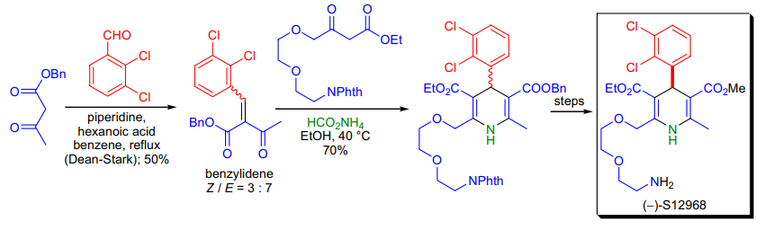

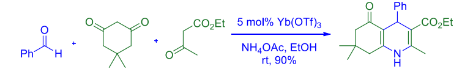

来欣赏一点奇特的：乌洛托品的解离

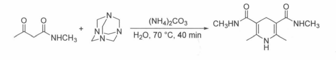

事实上，生成的 Hantzsch 二氢吡啶是一个很强大还原剂，以下是部分用途：

For ene reaction ：

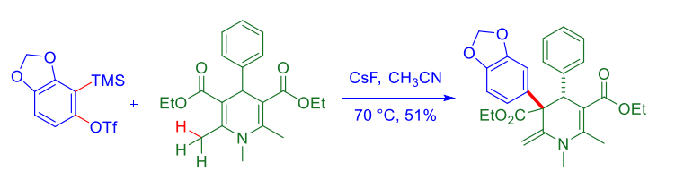

光化学下的烷基化试剂：

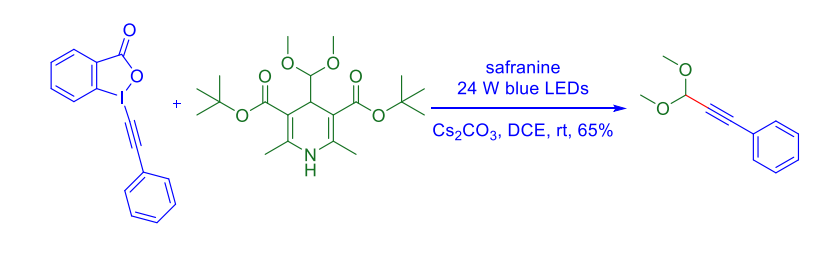

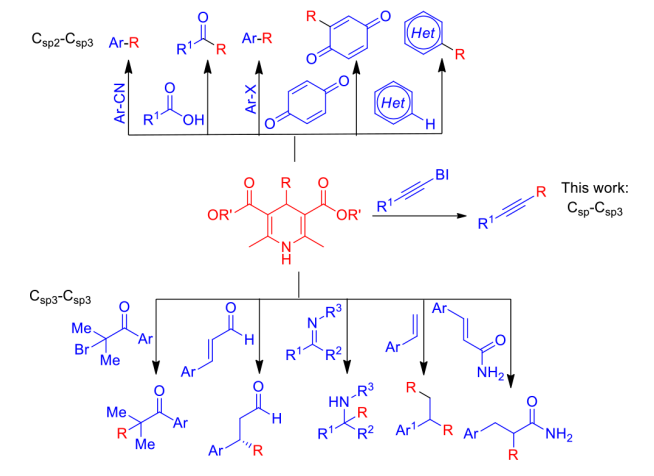

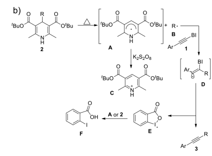

另一些光化学下的烷基化：

## Heck Reaction

### 反应式
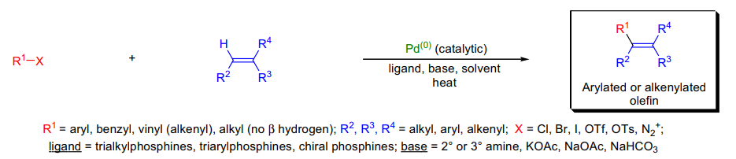

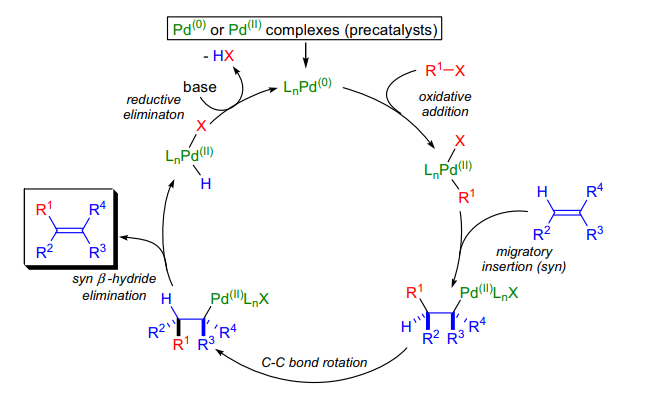

少取代、缺电子烯烃反应更快

几个限制：

1 、 Pd 链接的底物上不能有β -H

2 、芳基氯化物不能很好反应

在消除过程，双键可能发生位移：

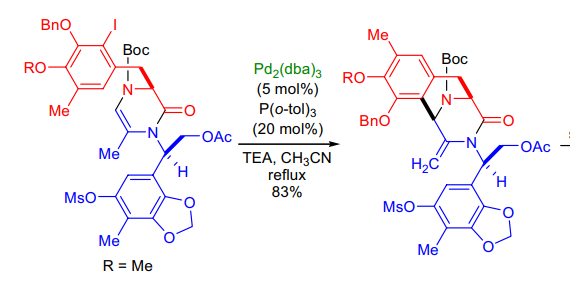

炔底物可发生双 Heck 反应

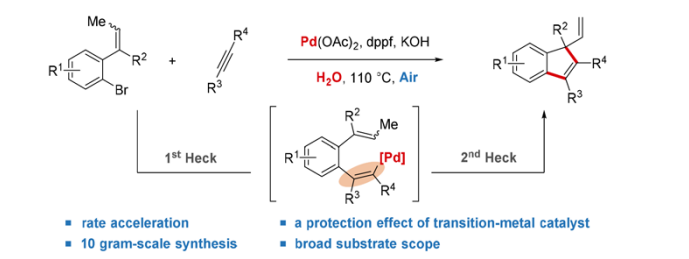

### 反应机理

### 实际应用

## Heine Reaction

### 反应式
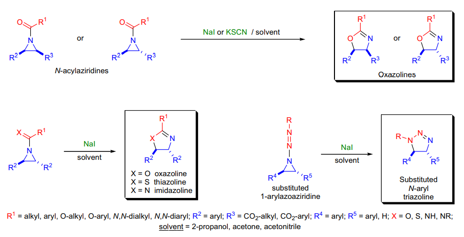

吖啶上 N 取代各种吸电子基，亲核扩环成杂五元环

### 反应机理
立体化学得以保留

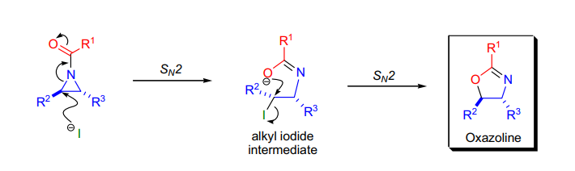

### 实际应用
亲核试剂只能是 NaI 或 KSCN ，溶剂为丙酮，乙腈（促进 SN2 ）

## Hell-Volhard-Zenlinsky

### 反应式
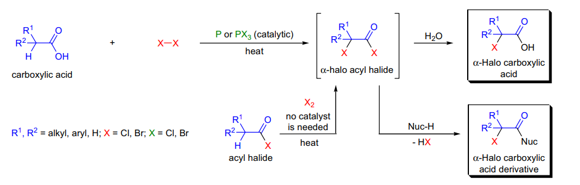

羧酸的α - 卤代

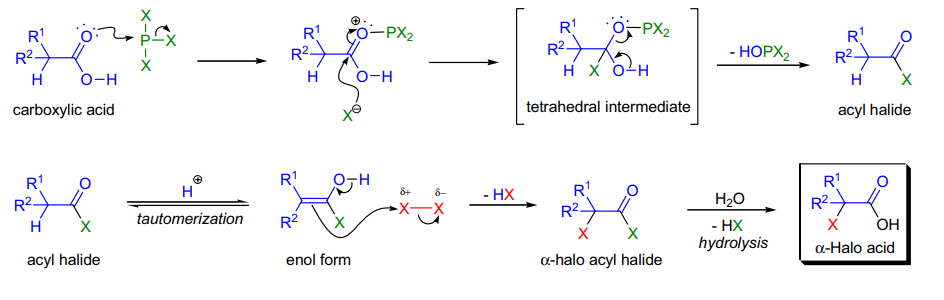

需要在高温下长时间反应

需要催化量的 P 或者 PX3

### 反应机理
仅有溴化能顺利进行，氯化可能会与自由基反应竞争，氟化和碘化失败

### 实际应用
若最后一步不水解，也可以加入其他亲核试剂

改进：

用酰基磷酸酯与 SO2Cl2 反应后水解

## Henry Reaction

### 反应式
通过硝基稳定的亲核反应

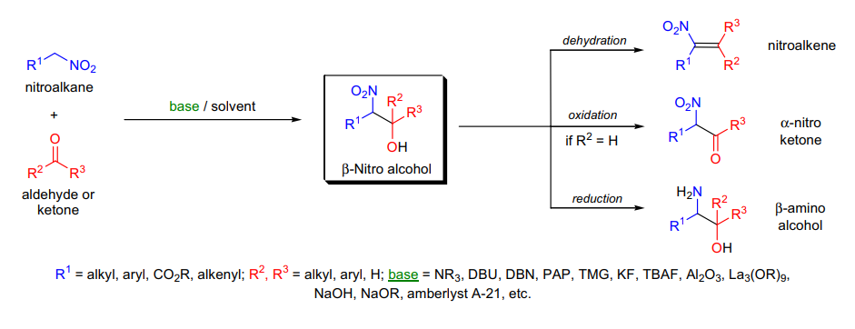

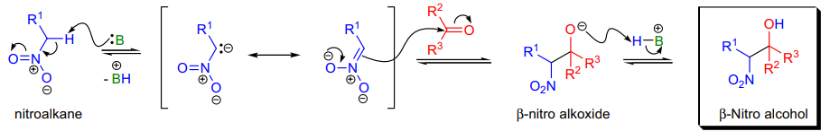

反应完全可逆

反应的位阻起到很大作用

只有脂肪醛能较好反应，酮不会反应

### 反应机理

### 实际应用
也可以和缩醛在 LA 催化下反应

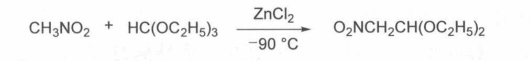

也可以和亚胺发生反应

通常活性顺序：硝基乙烷 > 硝基甲烷 >2- 硝基丙烷

可能是因为酸性 + 位阻原因

共轭硝基只会与极度缺电子的底物反应：

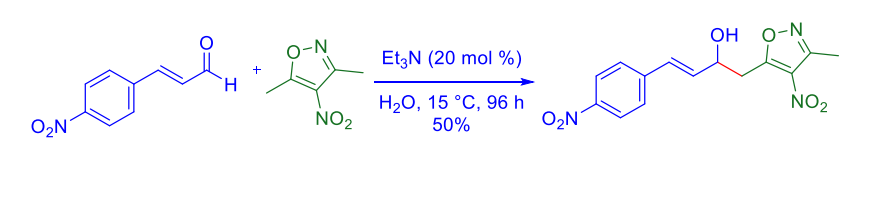

## Hinsberg test

### 反应式
用苯磺酰氯和 KOH 检验胺的级数

1 ）一级胺，生成物可溶于碱，不溶于酸

2 ）二级胺，生成不溶于碱的黄色沉淀，也不溶于酸

3) 三级胺，无反应，沉淀物可溶于酸

### 反应机理

### 实际应用

## Hiyama Reaction

### 反应式
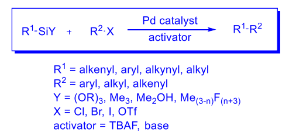

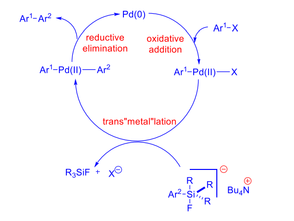

需要将低极性的 R-Si 键活化，常用策略：

a ）引入多个 F 或 OR 集团

b ）使用小环（硅杂环丁烷）

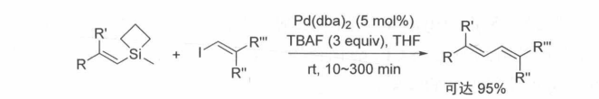

二硅氧烷是一个不错的试剂：

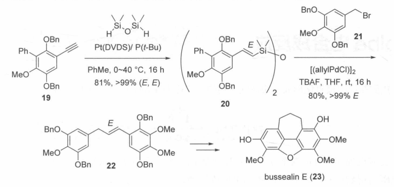

有如下串联反应：

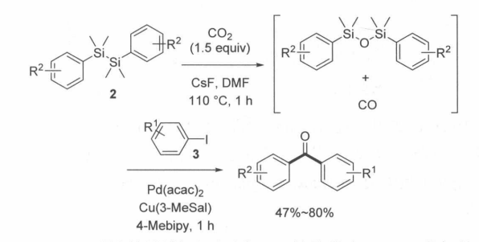

### 反应机理

### 实际应用

## Hofmann Elimination

### 反应式

包含三个步骤：

1 ）碘甲烷完全甲基化

2 ） Ag2O 交换

3 ）减压加热消除

### 反应机理
1 ）双键在过渡态中的形成程度

2 ）氢的酸性

3 ）构象问题

当反式消除不利时，体系内恰好有苄基烯丙基氢，也会往 E1cb 靠消除

当环状体系内消除时，最重要的是氢的可用程度（ available ），因此会消除取代较多的β氢？

### 实际应用
改进法：直接加入 tBuOK 等消除

有三种选择性的控制的解释：

旧时检测化合物氮原子级数方法

完全甲基化后 hofmann 消除，后完全氢化，进行次数等于氮原子级数

方法学：羰基邻位上双键

Eschenmoser 盐 mannich 后 hoffmann

炔的合成：（后消除 HBr ）

由季铵盐产生的烷基化：

非常复杂的杂环构建例子

## Hofmann isonitrile synthesis

### 反应式

由卡宾重排生产异腈

### 反应机理

### 实际应用

## Hofmann-Loffler-Freytag Reaction

### 反应式

远端的五元环关环

非常少见的情况下，可以形成六元环：

### 反应机理

### 实际应用
如何制备卤代氮？

1 ） NCS/NaClO

2 ） I2+PhIO/PhI(OAc)2/Pb(OAc)2

## Hofmann Rearrangement

### 反应式

### 反应机理

### 实际应用
识别：酰胺→胺衍生物

若体系内有亲核试剂，将会被体系内捕获

环状的酰胺也可以进行该反应：

## Horner-Wadsworth-Emmons Olefination

### 反应式

由于 RDS 控制，生成 E 烯烃，位阻越大则生成 E 选择性越好

Still Modification

### 反应机理
将 P 变得更缺电子，引起决速步的改变

减小 ylide 位阻，在 P 上加吸电子基，使碱更裸露（加入 18c6 ）可以增加 Z 选择性

### 实际应用
Masamune-Roush 改良法

Horner-Witttig 反应

## Houben-Hoesch Reaction

### 反应式

需要加强 LA 活化

### 反应机理

### 实际应用

## Hunsdiecker Reaction

### 反应式

### 反应机理

### 实际应用

