# 人名反应 · J

## Julia-Bruylants Rearrangement

### 反应式和反应机理

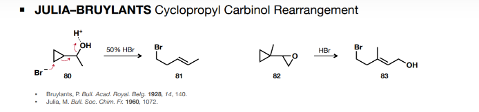

## Jocic-Reeve Reaction

### 反应式和反应机理

三氯甲基 - 羟基重排

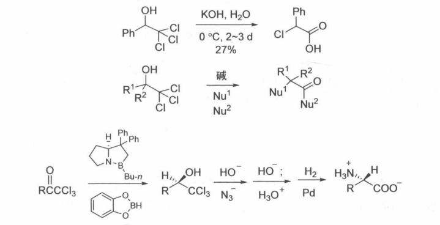

自上至下： Jocic 反应， Corey-Link 反应， Bargellini 反应

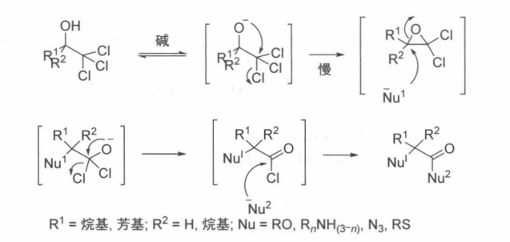

前体可通过还原获得

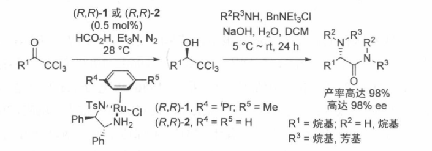

或通过氯仿进攻

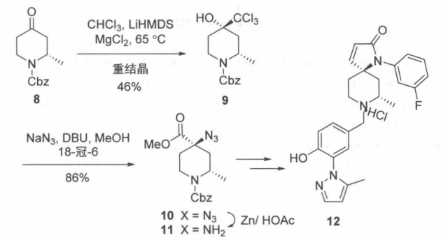

若环氧连着不饱和键，则可能发生 SN2 ’反应

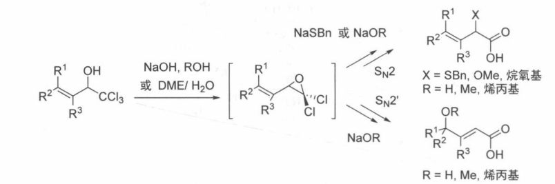

## Jacobsen Hydrolytic Kinetic Resolution

### 反应式和反应机理

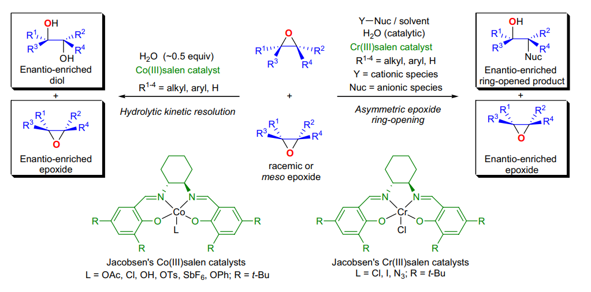

动力学选择性不对称开环氧，我们将在下一节解释这个配体

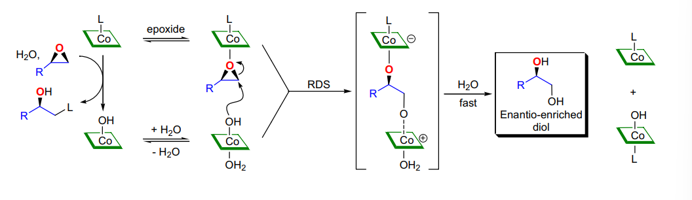

## Jacobsen-Katsuki Epoxidation

### 反应式和反应机理

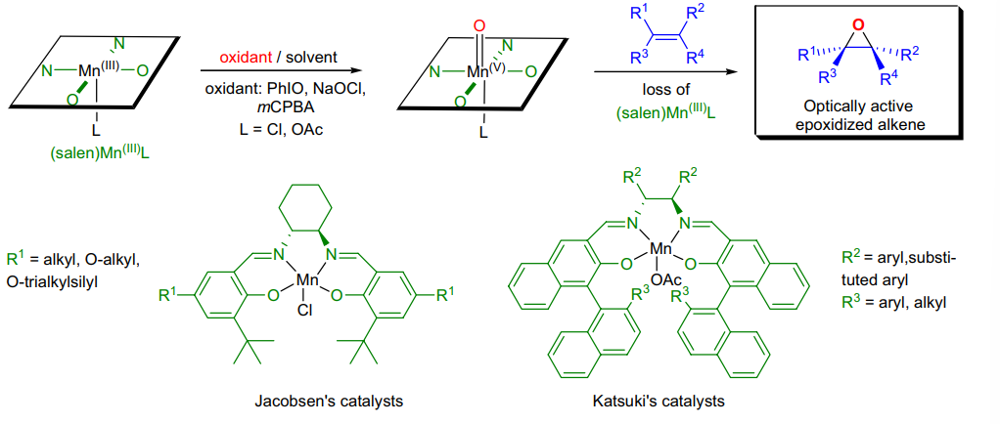

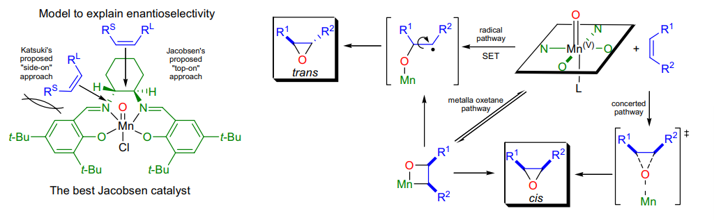

机理经过顶部进行，其中位阻大双键朝向向下弯曲的苯环一侧催化剂的立体结构：

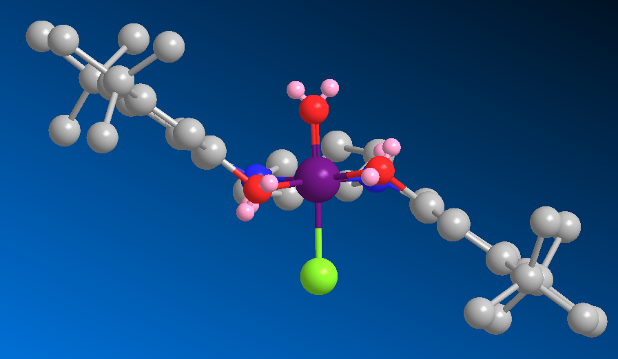

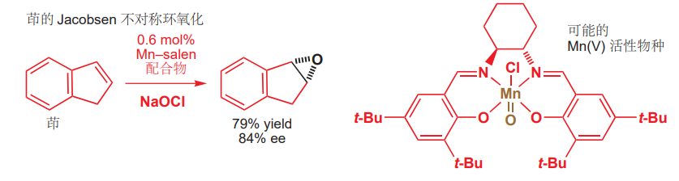

## Japp-Klingemann Reaction

### 反应式和反应机理

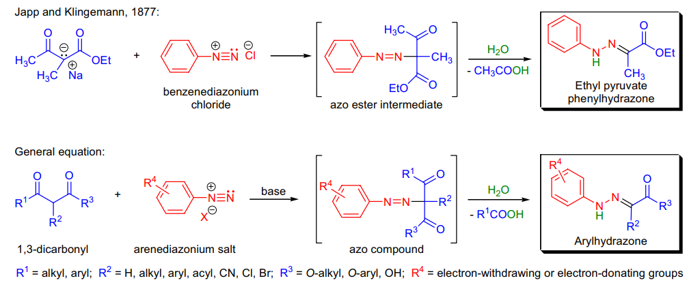

偶联之后迅速脱去了一分子酰基

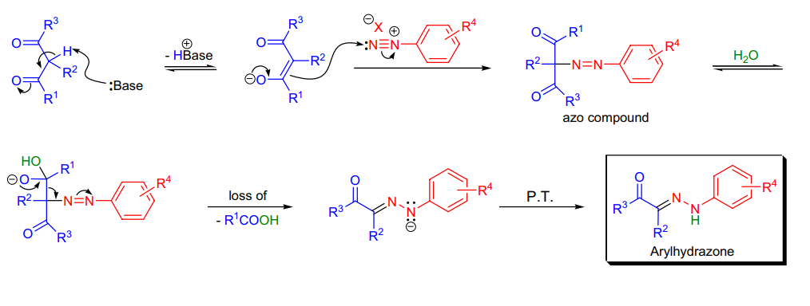

若为羧酸，则会快速脱羧

偶氮显色而腙不显色，可以很方便的观察反应

### 实际应用

之后可能经历 fischer 吲哚合成

## Jones Oxidation

### 反应式和反应机理

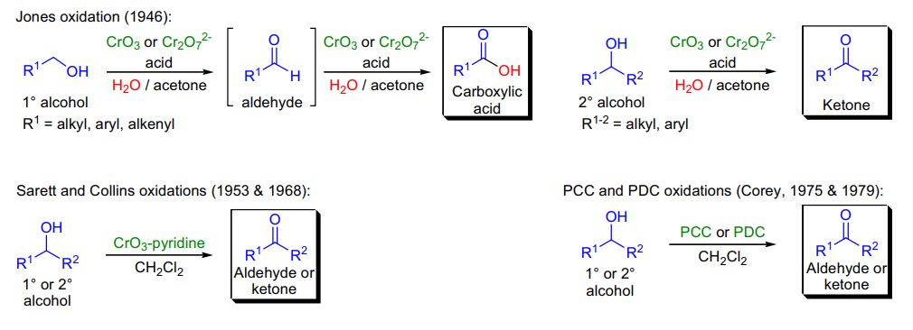

刚性环体系中，轴向醇反应比赤道醇快（决速步为消除， 1,3 排斥有助于该步快速进行）

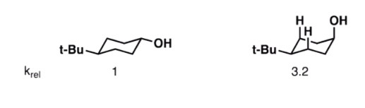

然而，对于无取代的刚性环体系，赤道醇反应更快（ C-H 原理）

若为酸性试剂，则走电离重组机理；反之直接经历σ重排

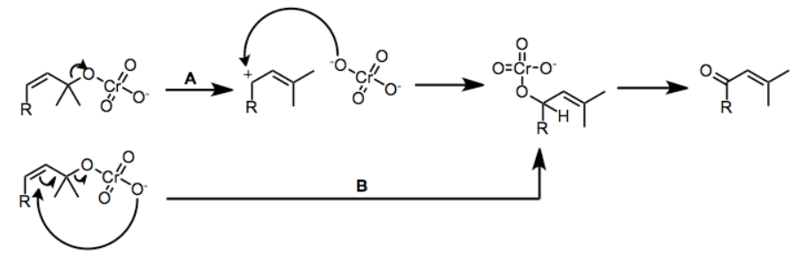

铬酸酯的中间体可以在合适的取向进行环氧化：

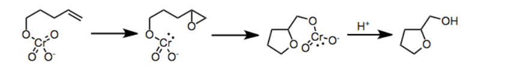

氧化反应可以串联关环反应：

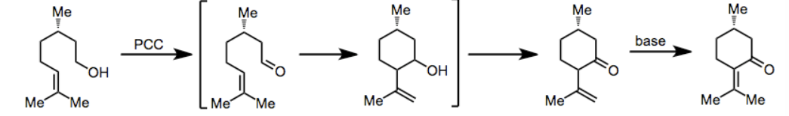

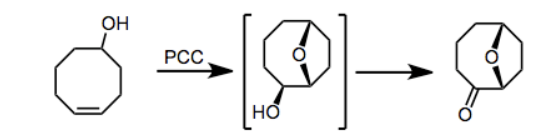

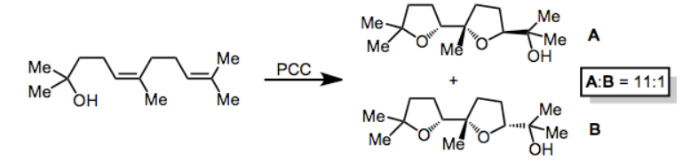

### 实际应用

经典的 Cr 氧化， Jones ， PCC 和 PDC 均为酸性试剂， Collins 为碱性试剂

若反应在水相进行，将伯醇氧化到酸（形成水合物）；在有机相进行都只能氧化到醛

然而 PDC 也可以直接氧化到酸，但烯丙基和苄基醇仍不会氧化到酸

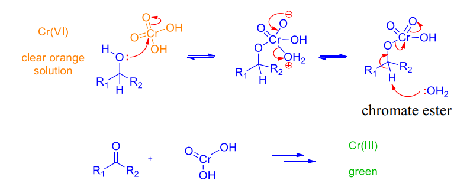

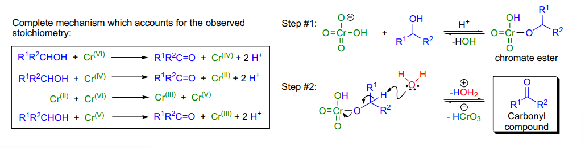

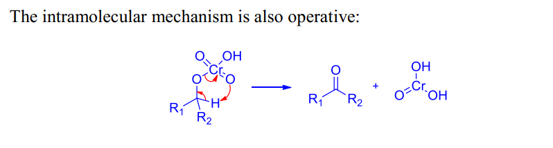

反应需要在丙酮中进行！丙酮可以与过量的氧化剂反应

此外，该反应还可以用于羰基的迁移氧化，这是一个常用的合成策略（ RLi 进攻不饱和羰基 ， Cr 迁移氧化 ）：

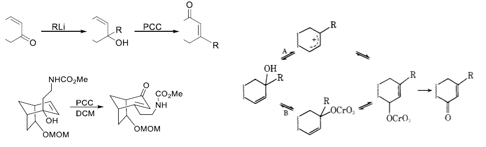

试剂很少氧化不饱和键

试剂可能氧化游离胺，因此需要保护

与 OsO4 同时加入，可以将烯烃裂解成酸

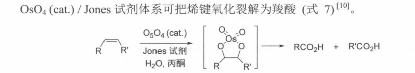

一定条件下可以脱保护后氧化（ Boc 尚未脱去）

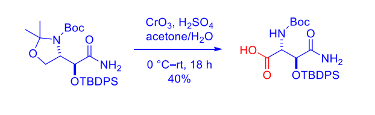

一些烯丙位也可以用这种方式氧化

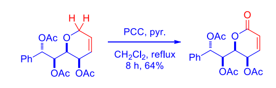

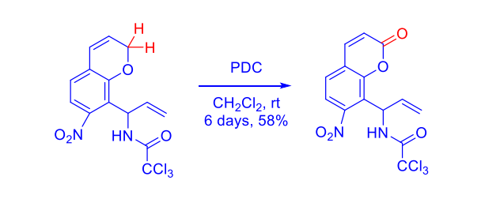

一些奇妙的用法，看看就好

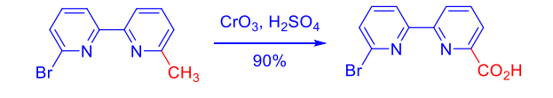

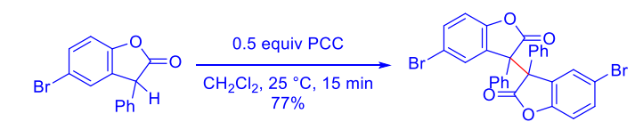

Babler 氧化：烯醇诱导的氧化迁移

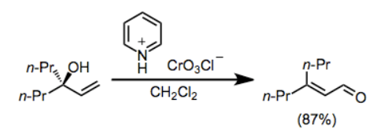

## Julia-Lythgoe Olefination

### 反应式和反应机理

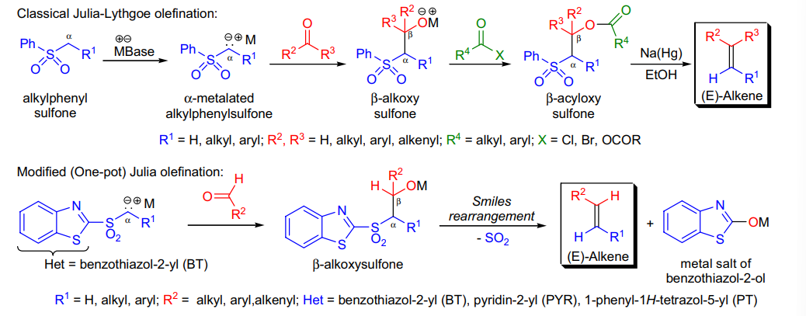

当用钠汞齐时经历消除 - 脱硫过程，当使用 SmI2 时经历脱硫 - 消除过程

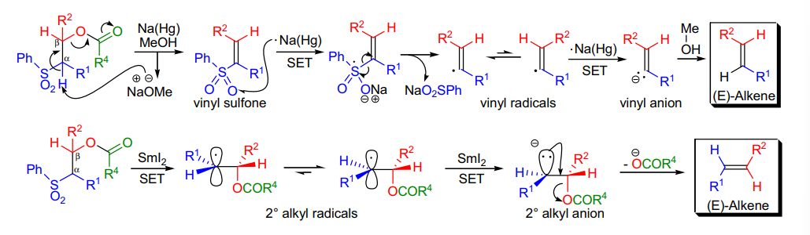

传统 Julia ：

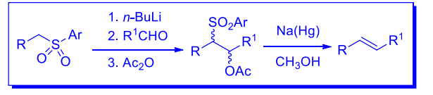

一步 Julia 2 ：

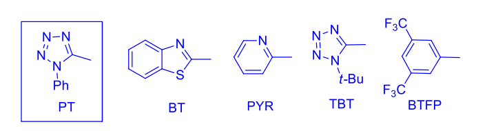

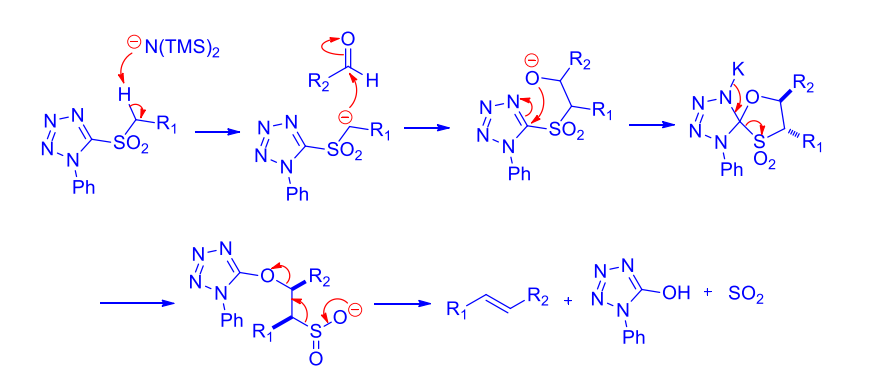

