# 人名反应 · L

## Leimgruber-Batcho indole synthesis

### 反应式

### 反应机理

### 实际应用

## Larock Indole Synthesis

### 反应式

识别：邻碘苯胺 + 炔

只有邻碘苯胺能够作为底物，较大的取代基总是位于吲哚 2 号位

### 反应机理

### 实际应用
改进版本可以制造异吲哚 - 吲哚环系

## Lawesson's Reagent

### 反应式

### 反应机理

### 实际应用
制备：加热苯甲醚和 P2S5

另一种试剂……

可以将羰基转化为硫代羰基，需要 0.5 当量

硫代羰基可以更好的串联取代或 4+2 等反应，不需要硫代过程可以只要求催化量（ 0.1equiv ）

在呋喃合成中加入，可以合成噻吩

与之类似的 Woollins's Reagent ，通过加热 PPh2Cl 和 Na2Se ，或 PPh5 和 Se 反应获得

可用于羰基的硒化或羧基的硒醇化

一个奇怪的案例

## Leuckart Reaction

### 反应式
即亚胺通过甲酸还原

### 反应机理

### 实际应用
需要高温进行，若水能够及时去除可以温和条件

过时的 reaction ，不好玩

## Ley Oxidation

### 反应式

TPAP 实在是太贵了，用 NMO 辅助氧化

RuO4 比 OsO4 还猛（次级周期性） ( 可以直接切开双键！），因此使用七价 Ru

### 反应机理

### 实际应用
不加入水就只能氧化到醛

反应体系会不可避免的产生 RuO4 ，对于双键体系不适用

## Lieben Haloform Reaction

### 反应式
即卤仿反应

需要加 3 当量 X2 或 halogen source:NaOCl/NaOBr/NaOI/ICN

### 反应机理

### 实际应用
醇也可以被氧化后反应

大位阻基团难以反应

先来看看卤仿的外观！

氯仿：难溶于水的易挥发液体，气味强烈

溴仿：甜味的无色液体，难溶于水

碘仿：黄色固体沉淀，甜味

甲基酮→羧基，使用其他碱还可以制造其他等价物

一种三氟甲基化方法

## Liebeskind Coupling

### 反应式
感觉是 Fukuyama+Suzuki

### 反应机理

### 实际应用

## Lossen Rearrangement

### 反应式
nitrene 重排第 n 弹……

这次离去的是 OR （需要吸电子 R 基活化）

电子需求： R3 缺电子， R1R2 富电子

可能的活化基团：

OTs/OMs/OAc ……

吸电子芳基

DCC/EDC ……脱水剂

乙腈：

### 反应机理

### 实际应用

## Luche Reduction

### 反应式

一般还原不饱和羰基都会不小心还原到双键，此时可加入 Ce(III) 盐：

Ce(III) 作用：

### 反应机理

### 实际应用
1 ）促进 BH4- 水解，使 BH 试剂更硬

2 ）自己配位醇（不是羰基），加强羰基缺电子程度

通常用甲醇作为溶剂

六元环酮直立进攻生成平伏醇

## Lu 3+2 Cycloaddition

### 反应式

必须水体系下发生：促进质子转移

### 反应机理

### 实际应用

## van Leusen Reactions

### 反应式

### 反应机理
注意：进攻 NC 一步，负电荷轨道和被进攻轨道正交，仍符合 Baldwin 规则（ 5-endo-dig ）

之后加入醇，得到氰：

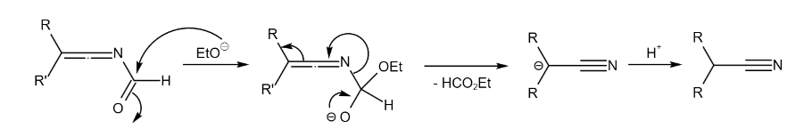

若一开始加入醇过多，则可能发生副反应：

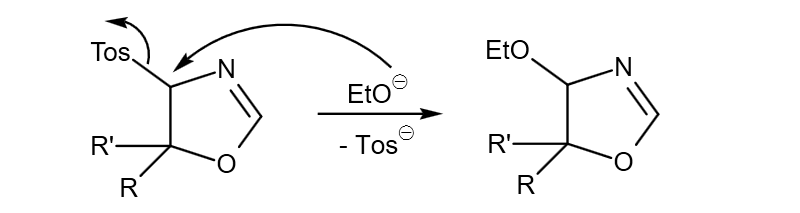

若加入碱消除，则得到芳环产物

若一开始底物为亚胺，则可得到咪唑：

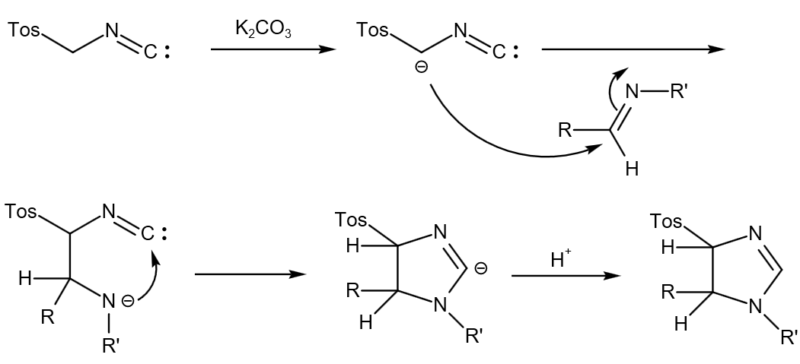

该物质作为中间体时的反应：

对亚甲基的取代：

还原：

### 实际应用
均为 TosMIC 的应用

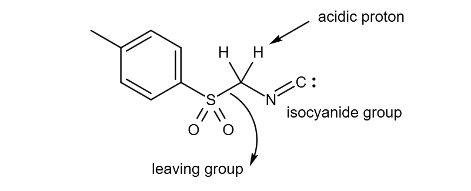

酮→还原氰化反应：

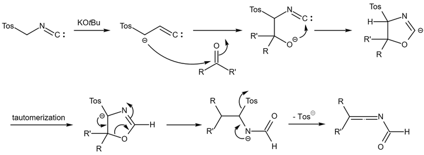

反应总结：

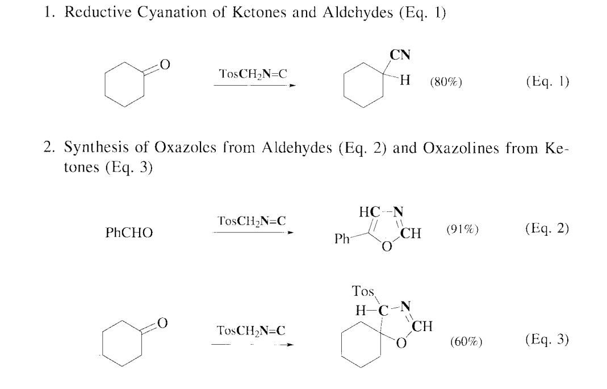

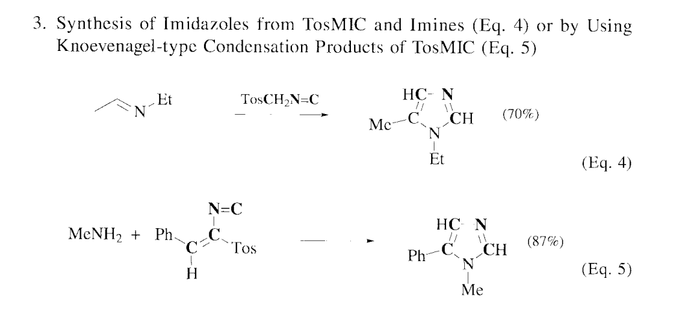

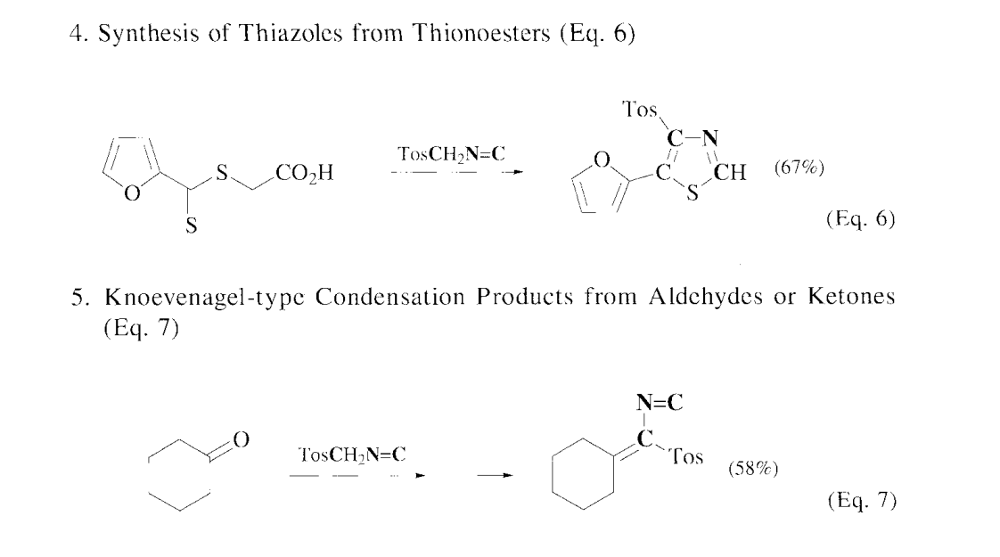

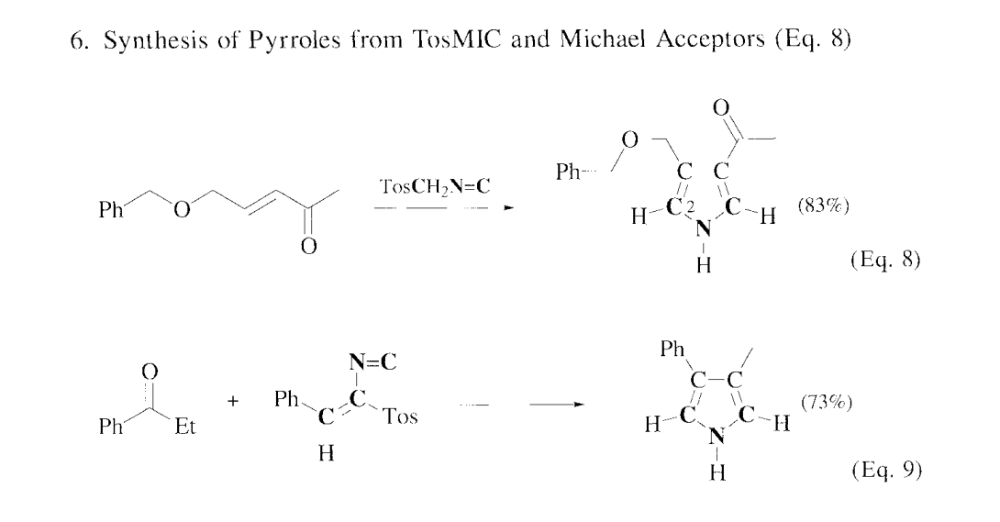

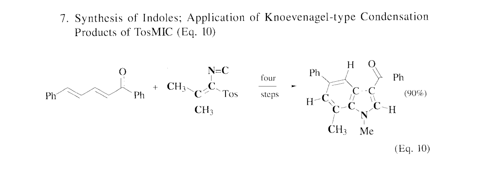

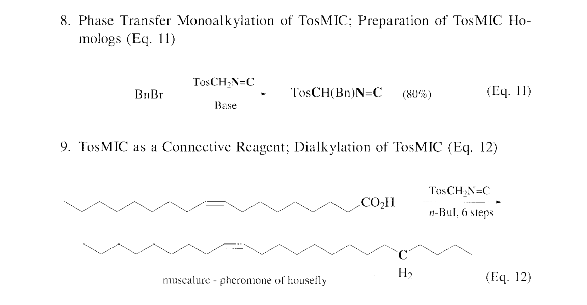

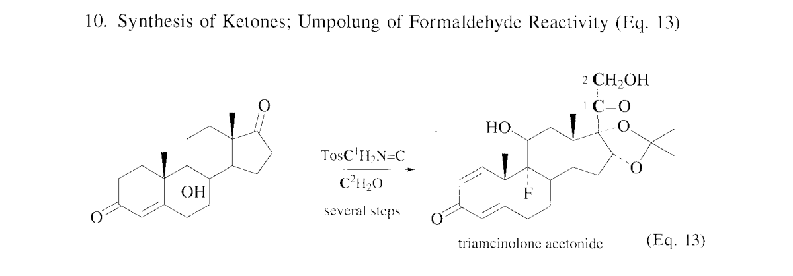

总结：

亚甲基上的氢酸性很强，很容易负离子进攻

之后往往经历环化步骤

之后往往消除 OTos

制备： NaOTos+HCHO+HCONH2 ，两步

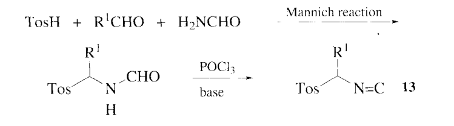

若在非质子条件和低温下进行，生成类似 Wittig 物种：

