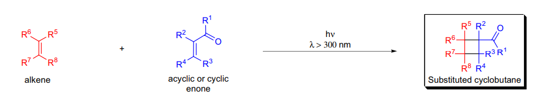
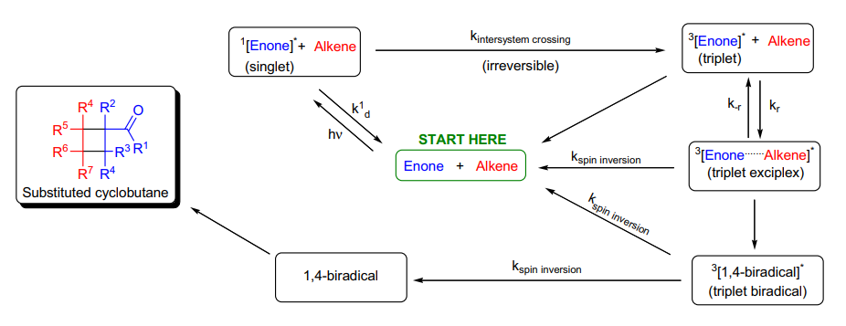
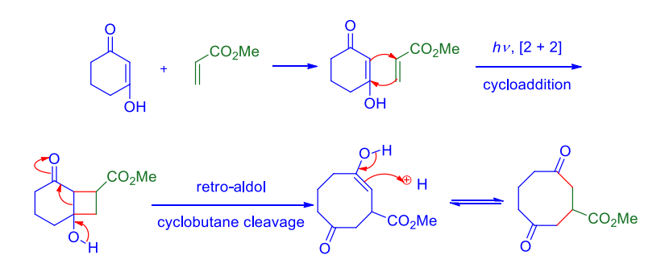
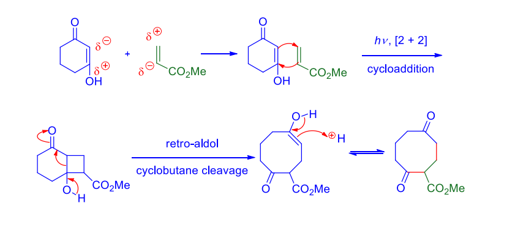
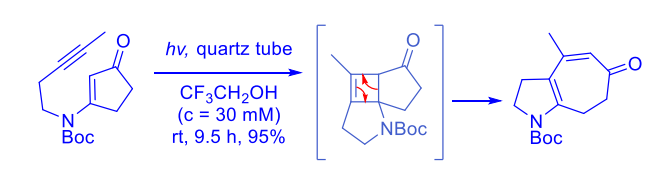
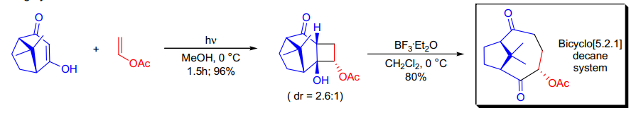
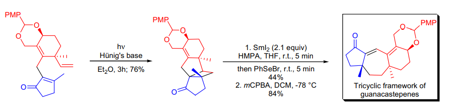
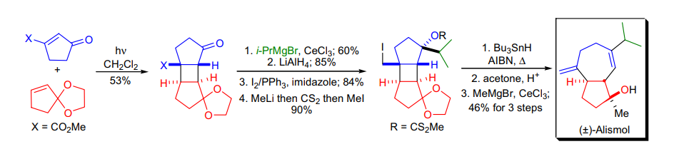

# 人名反应 · M

## De Mayo Cycloaddition

### 反应式和反应机理

在 13 羰基化合物或不饱和羰基化合物中插入片段

选择性很高，但是不知道为什么这么选择，令人感叹

逆电子需求为主要产物：

而正常电子需求为 minor

炔烃也可以参与反应：

不妨来看一些环丁烷碎裂化实例：

若为 13 羰基，加入 LA 辅助羟基开环碎裂

若不饱和羰基，加入自由基辅助碎裂

左右端经过修饰后一步自由基得到产物

### 实际应用

解释： SmI2 还原碎裂后烯醇被 Se 试剂亲电捕获， mCPBA 氧化 Se 后消除

## Mander Reagent

### 反应式和反应机理

上图的反应，若使用 Cl ，则得到 O 烷基化的 B 产物

### 实际应用

若想得到 C 烷基化产物，使用氰基软化的 Mander 试剂

## Madelung Indole Synthesis

### 反应式和反应机理

机理

识别：邻氨基甲苯 + 酰基化 +Base →吲哚

### 实际应用

可以从 C 上取代酰基， N 进攻（此时需要 2 当量 Base 来取代）；也可以相反

## Malonic Ester Synthesis

### 反应式和反应机理

活性亚甲基的二取代

## Mannich Reaction

### 反应式和反应机理

### 实际应用

一个经典的合成：

插烯的 Mannich 反应

Mannich-Eschenmoser 亚甲基化

在羰基α位上亚甲基

## Martin's Sulfurane

### 反应式和反应机理

脱水剂

### 实际应用

也可用于上 SPh2 yilide 基团

## McLafferty Rearrangement

### 反应式和反应机理

质谱仪中的碎裂反应（电子轰击）

含酮基的分子会经过解离得到碎裂产物

## McMurry Coupling

### 反应式和反应机理

低温下可以分离出 pinacol 中间体，高温下直接生成烯烃

底物中不能存在易还原的基团

反应活性：醛 > 酮

### 实际应用

通常用于均偶联，但过量使用一种反应物也可以混合偶联

可用于合成中环 / 大环

## Meerwein Arylation

### 反应式和反应机理

芳基自由基加到烯烃缺电子一段的另一边

可能与 Sandermayer 等反应竞争

## Meerwein-Ponndorf-Verley Reduction

### 反应式和反应机理

与 Oppennauer 氧化法为逆反应，哪个多往哪边走

可能的副反应： Tishchenko ，消除，不饱和羰基的双键移位

碳碳双键、硝基、卤素等不受影响

## Meisenheimer Rearrangement

### 反应式和反应机理

1,2 重排走自由基机理（周环禁阻）（生成外消旋产物）， 2,3 走周环机理

2,3 大大快于 1,2

Cope 消除在有 available 氢的情况下竞争发生

若邻位有可以稳定自由基的物种（芳基等）则走 1,2 ，有烯丙基走 2,3

选择性还取决于立体构型，右侧反应孤对电子可以发生 2,3

## Meyer-Schuster Rearrangement & Rupe Rearrangement

### 反应式和反应机理

竞争的反应机理

M-S 重排

Rupe 重排

底物为末端炔，产物为醛，否则为酮

产物总是不饱和酮

羟基 13 移位

羟基 12 移位

任何酸或 LA 均可催化

强酸或脱水剂或汞盐，需要后处理

## Michael Addition

### 反应式和反应机理

需要注意的是，炔烃也属于 michael 加成的一种

### 实际应用

通过两次 14 加成构建骨架

## Midland Alpine-Borane Reduction

### 反应式和反应机理

船式过渡态，由 pinene 引发的不对称还原

## Minisci Reaction

### 反应式和反应机理

这些都很 easy ，问题是如何选择合适的自由基？

1 ）由 S2O82-（可能经历脱羧）

对于吡啶底物，需要活化

2 ）由碘代物或其他自由基引发物

## Mislow-Evans Rearrangemnt

### 反应式和反应机理

烯丙基亚砜的外消旋与捕获

捕获：使用 P(III) ，得到羟基产物

## Mitsunobu Reaction

### 反应式和反应机理

羟基的立化反转取代

关于进攻解释，知乎上有一篇回答，但是我懒得写

只有一级和二级醇可以被取代

### 实际应用

也可以运用于醇的手性反转

一个变体：使用的苯醌作为氧化剂

PPh3O 的去除

尝试使用催化剂来进行光延 (Science) ，而不是用 Redox 促进

## Miyaura Boration

### 反应式和反应机理

创造 Suzuki 前体！

Base （ KOAc ）的作用：

与 Pd 配体交换，更容易作用

B 原子（在产物中）与 O 结合，驱动反应，阻止 suzuki

## Mukaiyama Aldol

### 反应式和反应机理

又是一个立体选择性的 Aldol 反应！！！

R3>R2 ， A 主导； R2>R3 ， D 主导

一般用开链模型解释，位阻最小化

烯醇硅醚的活性不够强，需要加入 LA 活化后才能反应

## Myers Alkylation

### 反应式和反应机理

OLi 位阻巨大（有很多 THF 配位）

## Mukaiyama Reagent

### 反应式和反应机理

酯化其三

## Matteson Homologation

### 反应式和反应机理

## Myers Allene Synthesis

### 反应式和反应机理

类似 NH2NHTs 的用法

## Mukaiyama Redox Cindensation

### 实际应用

也用来做大环合成，不常见

