# 人名反应 · P

## Paal-Knorr Furan/Pyrole Synthesis

### 反应式和反应机理

制呋喃

1,4 羰基化合物的脱水成环

可以使用的催化剂：各种酸，脱水剂， LA

请注意：碱性环境生成烯醇关环产物

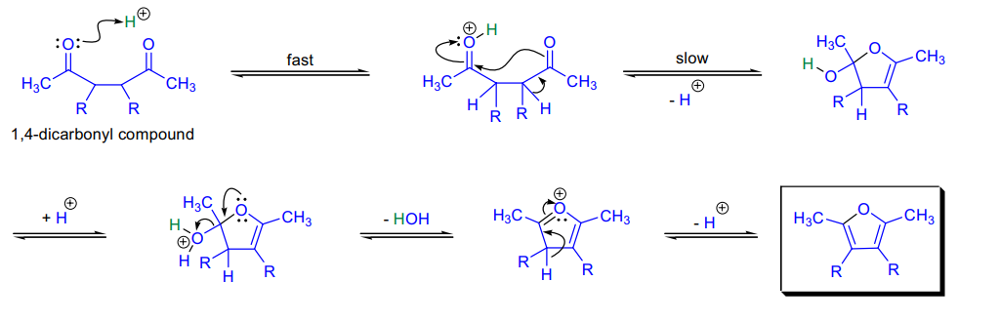

制吡啶，只需在体系内添加氨

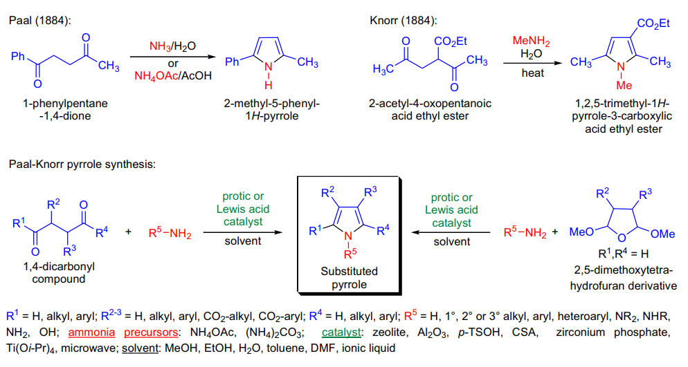

### 实际应用

胺同样也可以在分子内

在体系内加入 Lawesson 试剂，还可以制备噻吩

由于 14 羰基很难制备，我们来看一些制备的例子

偶联 +14stetter

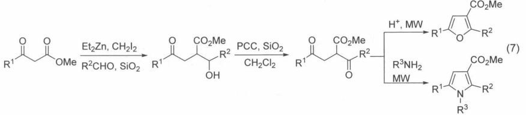

一个很厉害的大环构建：

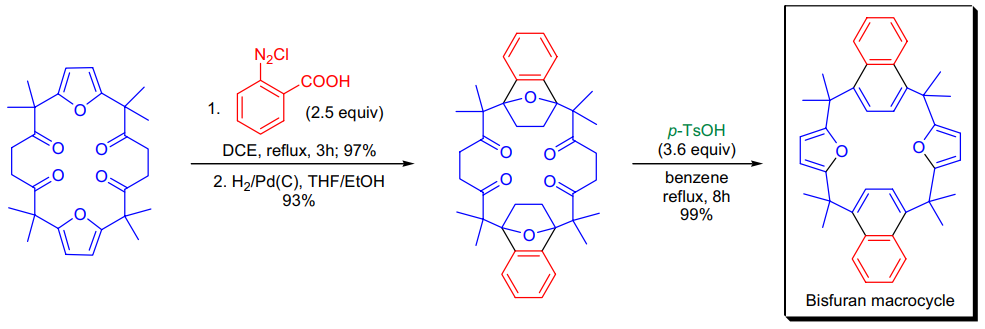

## Parham Cyclization

### 反应式和反应机理

即锂卤交换 - 亲核

## Passerini Multicomponent Reaction

### 反应式和反应机理

典型的三组分反应

### 实际应用

这只是三个经典的反应模式，改变底物，可形成不同的杂环

## Paterno-Buchi Reaction

### 反应式和反应机理

光照下双键与羰基的 2+2

注意：加成的选择性与通常离子机理相反

缺电子烯烃的反应具有选择性，富电子烯烃往往没有， why ？

羰基跃迁后：π * 电子呈现亲核性， n 电子呈现亲电性

与缺电子烯烃反应，则π * 先与 LUMO 重叠，有利

与富电子烯烃反应，则 n 先与 HOMO 重叠，形成电荷转移的中间体（极端：羰基阴离子自由基和烯烃阳离子自由基），此时两端电子云差异减小，区域选择性降低；同时 D3 单键旋转，立体选择性降低

通常生成反式产物：由 14 自由基中间体决定

五元环或六元环会生成顺式产物

与呋喃的加成：

硫酮更先发生反应

若为炔烃反应物，则产物会因张力过大而断裂

## Pauson-Khand Reaction

### 反应式和反应机理

### 实际应用

便利的合成环戊烯酮

烯烃活性：张力烯烃 > 单取代 > 二取代 > 三取代（四取代不反应）

具有强吸电子基团的烯烃不反应

区域选择性：炔基较大的取代基靠近羰基，烯基在分子间反应难以预测

立体选择性：生成 exo 产物

氧化剂（胺氧化物）或光照可以促进反应（在 Co 上创造活性位点）

（或使CO变为CO 2 离去）

## Payne Rearrangement

### 反应式和反应机理

环氧重排！需要强碱 + 质子溶剂进行

之后亲核或亲电

选择性讨论：

重排的选择性遵循 C-H 原理

对于非环状体系：

1 ）环氧上取代多优先

2 ）稳定性：反式 > 顺式

3 ） EDG （乙烯基或苯基）有稳定作用，而 EWG 有去稳定作用

4 ）一级醇产物优先

对于环状体系：

1 ）取代基效应更显著

2 ）环状体系中 pseudo- 赤道产物主导

### 实际应用

3 ）分子内氢键或其他作用不显著

对于 N-O 体系：

进攻能力： O （两对 lp ） >N （一对 lp ）

稳定性：环氧 > 丙吖啶（键角）

除非 N 为 N- 且未连接吸电子基，否则均生成环氧体系

由于 O 的配位能力更强，使用 lewis 酸也可达到相反效果

对于 S-O 体系：

总是环氧到环硫

插烯 payne ：

其他：另一些环氧重排反应

由硫酸酯介导，不需要强碱性：

由转化离去基团：

## Pechmann Condensation

### 反应式和反应机理

## Perkin Reaction

### 反应式和反应机理

醛类无α氢（否则醛更容易互变异构）

两个变式：

1 ）和 N- 酰基甘氨酸生成恶唑酮

体系内合适的 Nu 可以捕获恶唑酮中间体

2 ）和α芳基乙酸生成取代消除产物

看上去很像 knoevenagle 的变式：

### 实际应用

合成不饱和羧酸……以及各种变式

酸酐参与了 2 次反应

需要碱 + 热

## Petasis Reaction

### 反应式和反应机理

对于一般的醛，经历“ Ate 中间体”

若为羟基醛，机理有所不同：

### 实际应用

胺上的硼取代基（也许算个三组分反应），硼酸酯起到类似 Mannich 的亲核试剂的作用

B 上也可以是芳基

一种一步制备氧杂环的方法：

底物拓展：苯磺酰肼，原位离去 N2 生成连烯

## Petasis-Ferrier Rearrangement

### 反应式和反应机理

通过形成亚甲基，转换环内和环外原子，之后经过 Al 还原，类似于 FerrierII 重排

Al 还原一步取决于取代基，使用甲基取代的 Al 不会发生还原反应

五元环重排温度远远高于六元环重排

## Peterson Rearrangement

### 反应式和反应机理

### 实际应用

使用硅叶立德进行羰基→双键，由于弱的稳定化作用，该试剂很活泼，只能原位制备，可以完成 Wittig 做不到的事（位阻过大）

Base 为顺式消除，而 acid 为反式消除

## Pfitzner-Moffatt oxidation

### 反应式和反应机理

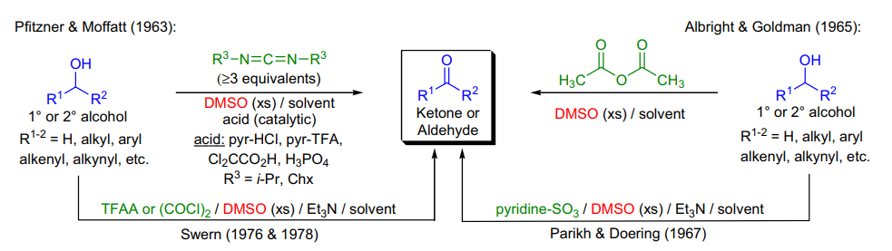

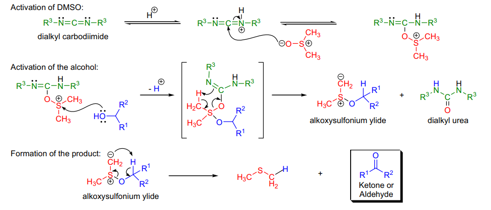

通过 DMSO 的活化氧化汇总：

1 ）乙酸酐（ Albright-Goldman ）

2 ） SO3-Py （ Parikh-Doering ）

3 ） (COCl2)2 （ Swern ）

4 ）这个

## Pictet-Spengler Synthesis

### 反应式和反应机理

制取四氢异喹啉

## Pinacol and Semipinacol Rearrangement

### 反应式和反应机理

该反应的迁移选择性取决于酸：

若反应为 H2SO4(conc.) 体系，经历类碳正离子过渡态，迁移基团为较好消除的基团（氢最优）

若反应为 HOAc 体系，经历迁移过渡态，迁移基团为能带着电子转移的基团（氢最次）

羰基的迁移能力好，来自于其 n →σ * 作用

## Pinner Reaction

### 反应式和反应机理

干 HCl ，氰基上的亲核

加入 LA 或质子酸也能祈祷同样的效果

### 实际应用

原位生成 NHC

## Pinnick Oxidation

### 反应式和反应机理

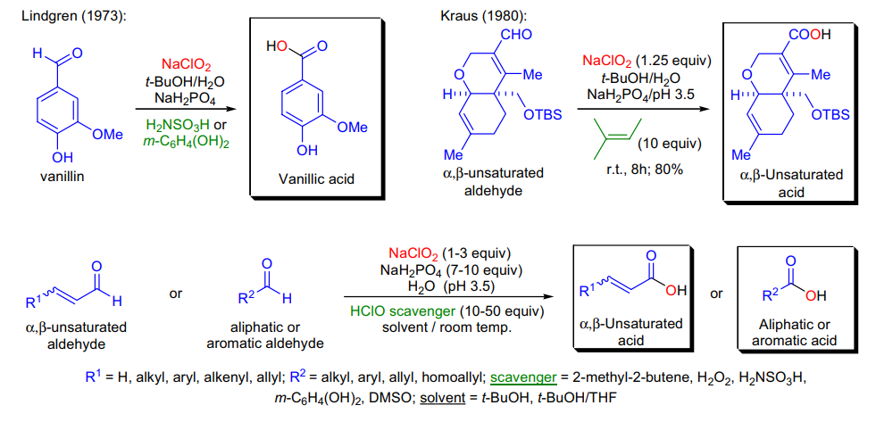

将醛氧化为酸

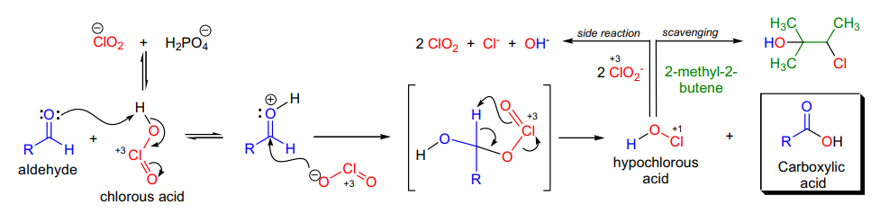

三个组分： NaClO2 、 NaH2PO4 （控制 pH ）， 2- 甲基 2- 丁烯（清除 HClO ）

常用的温和氧化到酸： Dess-Martin + Pinnick

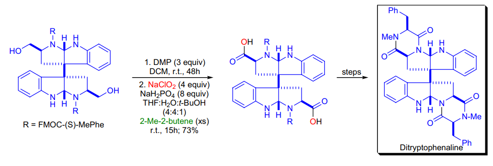

## Polonovski Reaction

### 反应式和反应机理

使用 Ac2O 和氨氧化物进行反应，离去醛生成酰胺

消除亚甲基

Polonovski-Potier Reaction

### 实际应用

使用 TFAA 代替 Ac2O 处理胺，得到官能化产物

## Prevost & Woodward Reaction

### 反应式和反应机理

加入 1 当量醋酸银 + 水溶剂得到顺式，加入 2 当量醋酸根得到得到反式

注意 Ac 参与的中间体很容易被亲核试剂（此处为 H2O ）进攻，从而产生顺式立体化学

### 实际应用

Woodward 方法制得的双羟从位阻较大的一侧进行（其他金属氧化剂为较小一侧）

体系内产生了银盐，可以改进：

## Prilezhav reaction

### 反应式和反应机理

过氧酸的加成立体构型为螺环过渡态

富电子烯烃和缺电子过酸优先反应

若酸为 m-CPBA ，过酸旁边的羟基可以诱导配位；若酸为 CF3CO3H ，则分子内的氧可以与氢诱导配位

## Prins Reaction

### 反应式和反应机理

由于 Baldwin 规则，只能关出六元环（五元环禁阻）

对于这种加成 - 消除机理 ，往往走oxy -ene ━生成端位烯烃

双prins反应：

识别：邻二醇 + 醛（或直接加入其缩合产物） + 烯基 +LA →高取代四氢呋喃

反应具有高度立体选择性

讨论： prins-pinacol or 33-Aldol ？

若有羟基推动：

取决于立体化学：

手性→ prins-pinacol

消旋→ 33-aldol

取决于中心原子的性质

O （急需要快速猝灭正电中心）→ prins-pinacol

N （较稳定）→ 33-aldol

若无羟基推动：（春联）

### 实际应用

烯烃作为亲核试剂进攻羰基

质子酸和 Lewis 酸都能促进该反应

甲醛和高取代烯烃反应最快

一个串联例子： Ritter

策略：合成四氢吡喃

与 Pinacol 串联： Prins-Pinacol Rearrangement

prins不利，只能 33

## Pummerer Rearrangement

### 反应式和反应机理

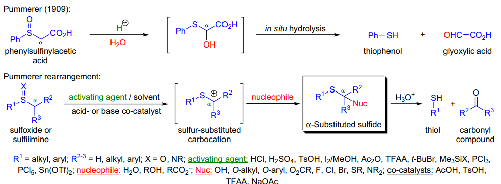

硫的特征重排反应

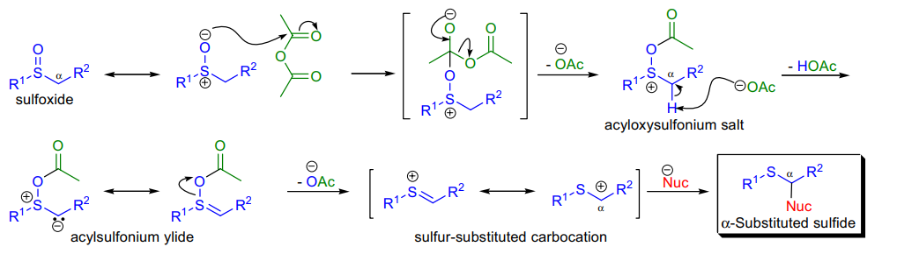

### 实际应用

该反应的变体详见 C-S

