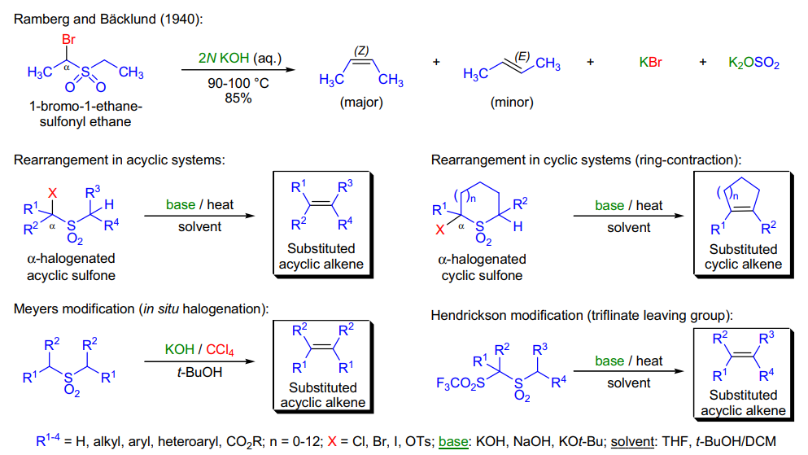
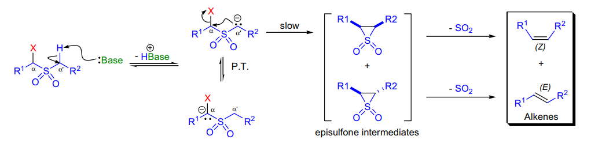
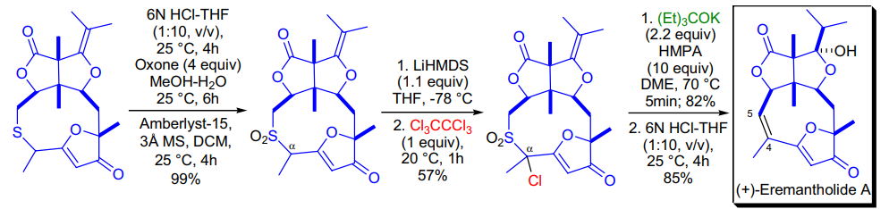
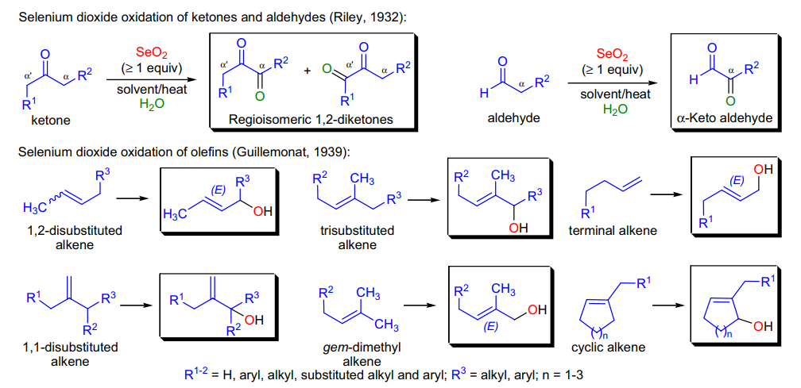
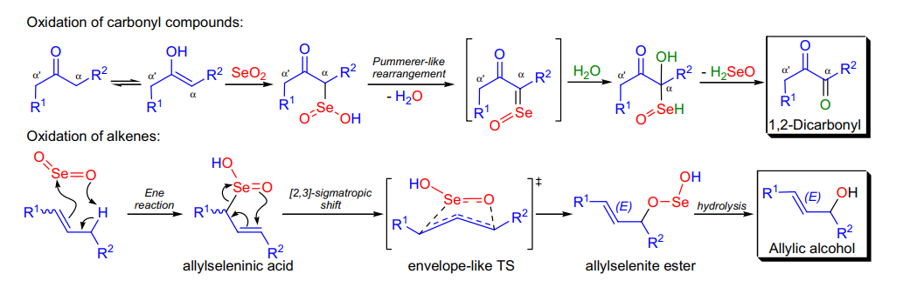

# 人名反应 · R

## Ramberg-Backlund Reaction

### 反应式

挤出 SO2 并生成烯烃的反应

### 反应机理
第二步反应控制了立体化学，此时若使用tBuOK，则碱性足以发生互变，产生热力学稳定 E 产物 ，若使用 KOH ，则产生 Z 产物

令人迷惑的立体化学

### 实际应用
该过程通常用于形成张力环，此时需要如 tBuOK 之类的强碱

通过连续的过程，消除 S 原子的反应

虽然很缺德，但是这个消除双硫的过程也没什么关系

## Reformatsky Reaction

### 反应式

### 反应机理

### 实际应用
使用有机 Zn 试剂活化卤代酯

立体选择性符合螯合控制规则

Zn 试剂也可以由其他试剂生成，或替换为其他试剂

然而，一般不能使用 Mg ，否则自缩合反应将会先发生（活性高），但也可以通过增加空阻强行使用，，此时 Zn 等低活性试剂往往不太好

## Regitz Diazo Transfer

### 反应式

### 反应机理
对于单酮，有什么好的邻位重氮化方法吗？可以通过 Claisen 在邻位上甲酰基，重氮化之后脱除磺基甲酰胺（如上图第二个机理

### 实际应用
制造 13 羰基重氮化合物的方法

其实如果只有烯烃，也可以通过关环开环形成邻取代的重氮之后反应

## Reimer-Tiemann Reaction

### 反应式

每次看到氯仿 + 碱一定要想到这个！！

### 反应机理

### 实际应用
其实我觉得这个和 blanc 挺对仗的，一个加氯试剂和碱出甲酰基取代，一个加甲醛和 HCl 出氯甲基取代

可能出现的副产物：

1 ）有一个可能发生π插入的烯烃，扩环

2 ）没有 H 可以消除，保留 CCl2

通常操作：将底物溶于 NaOH 溶液，剧烈搅拌 CHCl3 和溶液两相

通常只有活泼苯环可以高产量反应

在 N 上可以能发生类似反应

## Riley SeO2 Oxidation

### 反应式

邻位羰基化或烯丙基位羟基化

选择性漫谈

对于羰基

遵循空阻小的先氧化

对于烯丙基

1 、 1 、 2 级取代有 CH>CH2>CH3

2 、 3 级取代有 CH2>CH3>CH

### 反应机理
3 、末端烯烃将会异构化为段位羟基产物

### 实际应用

## Ritter Reaction

### 反应式

### 反应机理
氰捕获碳正离子，之后碳正离子又被其他亲核试剂捕获

需要在强酸性 /LA 下进行（以产生足够稳定的碳正离子）

碳正离子可以来源于 W-M 重排，质子化，碎裂化，双键环鎓碎裂……

Hg 诱导碎裂化生成稳定碳正离子，插入一分子氰之后关环

环三元环的反应：

### 实际应用
一个有趣的例子：

又一个例子：

令人奇怪的合成：

## Robinson Annulation

### 反应式

### 反应机理

### 实际应用
识别：酮 +MVK （甲基乙烯基酮）衍生物 + 酸 / 碱催化

依次经过： Michael → Aldol → Dehydration

区域选择性：通常热力学控制

立体选择性：正常 Michael 选择性

## Robinson-Schopf Reaction

### 反应式

### 反应机理

### 实际应用
经典托品酮一锅合成

旧饭新吃

新吃 2 ：

## Roush Asymmetric Allylation

### 反应式

一定在哪里见过这个类似的反应→ Keck Radical Allylation

核心：为了避免氧和位阻基团的 VdW 作用

### 反应机理

### 实际应用

## Rosenmund Reduction

### 反应式
欢迎收录你以为你已经会了的反应

中毒 Pd 还原酰氯

### 反应机理

### 实际应用
可以间接从羧酸合成醛

## Rubottom Oxidation

### 反应式
对烯醇硅醚的氧化

### 反应机理
由于较弱的轨道相互作用，此时可以发生较强极化的环氧化，酸性环境可以开环

### 实际应用

## Ruppert-Prakash reagent

### 反应式
即 TMS-CF3

### 反应机理

### 实际应用
制备： P(III) 存在下混合 CF3Br 和 Me3SiCl

在引发剂存在下，插入羰基生成三氟甲基硅醚

## Reissert Reaction

### 反应式

### 反应机理

### 实际应用
决赛考题

