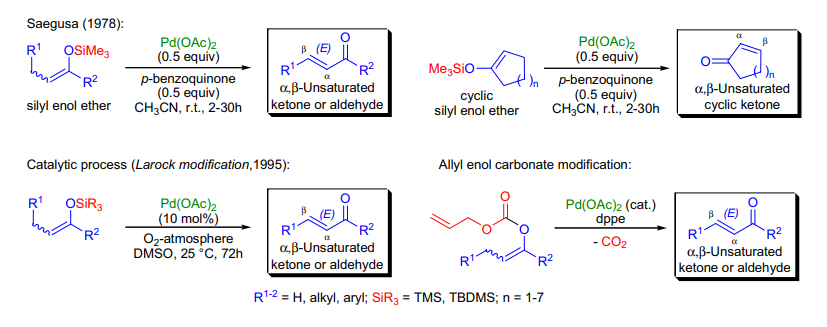
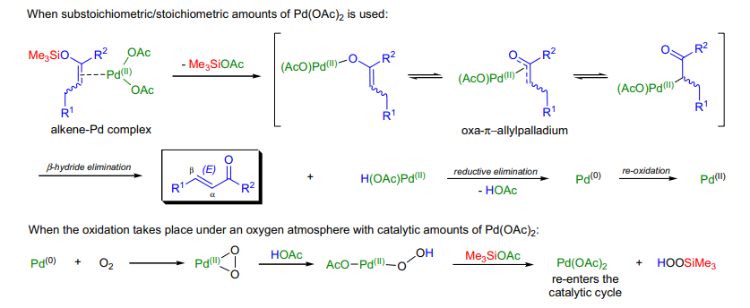
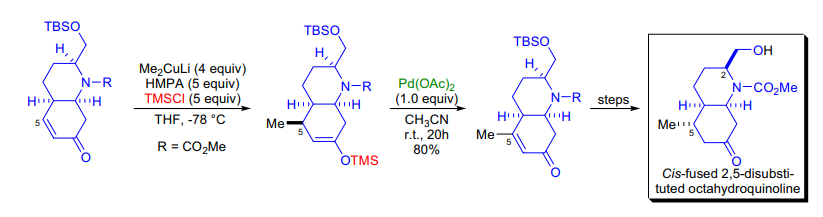

# 人名反应 · S

## Saegusa Oxidation

### 反应式

使用 Pd(OAc)2 氧化烯醇硅醚到不饱和酮

取代 - 恢复共轭

### 反应机理

### 实际应用

## Sakurai Allylation

### 反应式

### 反应机理
催化反应的可能机理，由于 SiF 键能很大， TBAF 很可能不作为催化剂而是作为引发剂：

令人迷惑的机理：先发生 ene ，之后 sakurai

多次 Sakurai ：

### 实际应用
硅试剂 +LA 的烯丙基化

双键加成生成 Si 稳定碳正（利用此点驱动）后消除

E 型双键有较好的选择性

对于共轭双键，也可以进行共轭加成，这是最初的 Sakurai 反应

此时可能的副反应： 2+2

2+2 反应通常在低温下发生，高温下或大位阻基团存在下发生 Sakurai

环外双键具有更高的活性

分子内的 Sakurai 反应

有时可能会有 SiMe3 水解的副反应，此时可以加入 TBAF 解决

## Sandermayer Reaction

### 反应式

铜催化的芳香重氮取代

需要注意的是，有一些不需要催化剂的情况：

1 ） HBF4 可以直接取代上 F

2 ） KI 可以直接取代上 I （ SnR1 ）

3 ）水溶液加热生成苯酚

### 反应机理

### 实际应用

## Schmidt Reaction

### 反应式

氮宾重排 - 其四

使用叠氮进行重排（需要酸催化！）

若为醛则转化为腈，酸转化为异氰酸酯，之后后续转换

### 反应机理
反应机理：

固定反应构象（通过静电作用），生成桥环酰胺产物

一些串联反应：

Semi-pinacol → Schmidt

Schmidt → Ritter

### 实际应用
分子内的叠氮基团也可以进行分子内反应，注意反应位点

## Schotten-Baumann Reaction

### 反应式

反应活性：伯醇最强（不需要碱即可发生反应）

### 反应机理

### 实际应用
其他醇均需要碱参与反应

胺需要碱式反应，亲核性比醇更强

## Schwartz Hydroziconation

### 反应式

Zr 化后把金属拉向位阻最小的末端

之后偶联 / 插入 / 亲电猝灭

### 反应机理

### 实际应用

## Seyferth-Glibert Homologation

### 反应式

各种醛 / 酮→炔

重氮硅叶立德和磷叶立德（ Oriha-Bestman 用的最多）

磷酸酯加入 K2CO3 和醛的 MeOH 溶液

生成烯基卡宾之后重排

对于不饱和羰基，生成甲醇共轭加成产物

原位制造试剂：

### 反应机理

### 实际应用

## Sharpless Asymmetric Aminohydroxylation

### 反应式

### 反应机理

### 实际应用
利用手性配体和 Os 和 N 试剂对双键进行加成

## Sharpless Asymmetric Dihydroxylation

### 反应式

同上

### 反应机理

### 实际应用

## Sharpless Asymmetric Epoxidation

### 反应式

与环氧化反应基本相同，但注意夹角为 60 °

### 反应机理

### 实际应用

## Shi Asymmetric Epoxidation

### 反应式

### 反应机理

### 实际应用
由果糖制取的不对称环氧化试剂

为避免试剂失活（经过 B-V ），需要碱性环境

制备：

## Shiina Macrolactonization

### 反应式

### 反应机理

### 实际应用
不常见的大环合成

## Simmons-Smith Cyclopropanation

### 反应式

环丙烷化

### 反应机理
注意 3spiro3 过渡态

### 实际应用

