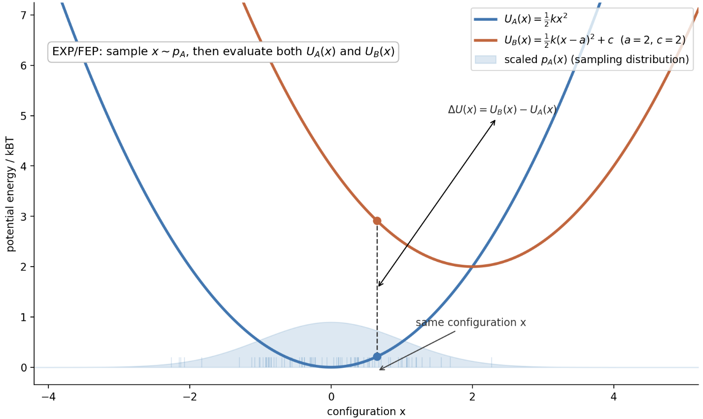
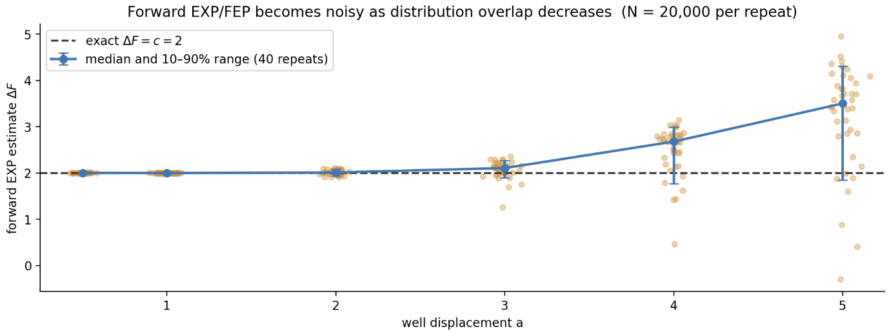
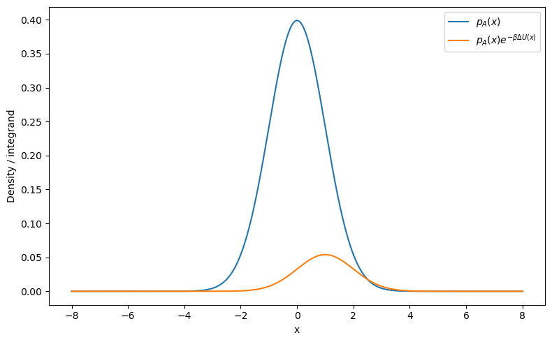
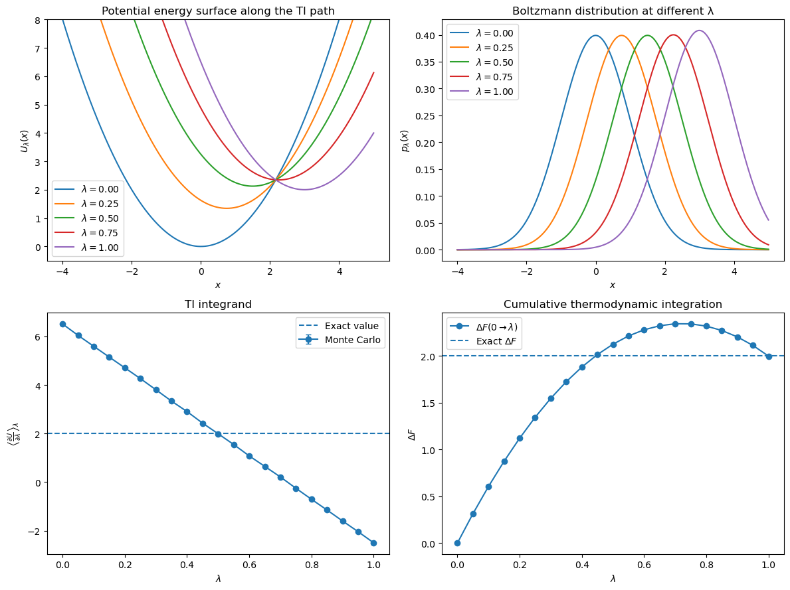
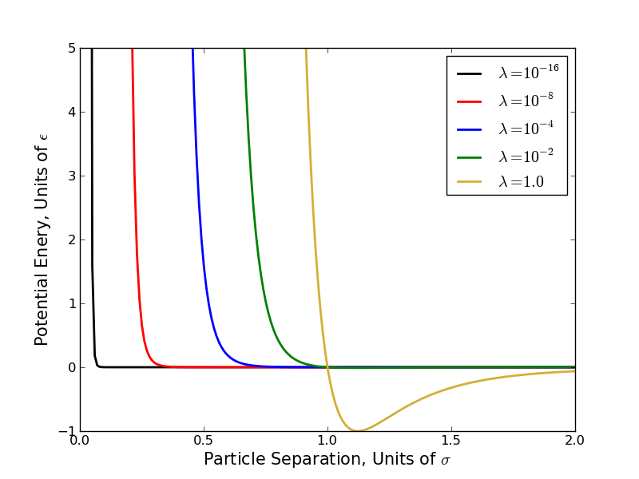

# 自由能计算方法

> 参考：
>
> [Free Energy Fundamentals - AlchemistryWiki](https://www.alchemistry.org/wiki/Free_Energy_Fundamentals#Core_Free_Energy_Equation)

### 自由能差方程

大部分计算是基于NVT系综的。从一个基本事实
$$
\Delta F_{ij} = -k_{B}T\ln( \frac{Q_j}{Q_i} ) = -k_{B}T\ln( \frac{\int_{\Gamma_j}e^{ U_j( q )/k_{B}T  }\dd{\va{q}} }{\int_{\Gamma_j}e^{ U_j( q )/k_{B}T }\dd{\va{q}}} )
$$
这是从经典统计得到的。

我们可以从中获得几个信息：

- 统计所有相空间的点是非常复杂的，因此无法获得绝对自由能值，**只能得到自由能计算差值**
- **通常不会计算不同温度下的自由能差值**，因为这样就不是比值的范畴了
- 这里存在两种相空间。一般情况下，两种相空间会有部分重叠的区域，称为**相空间重叠**，而往往相空间重叠高意味着计算更高效。

我们可以近似用两个简谐面来表述。对于两个个简谐面而言：
$$
y=x^{2} \leftrightarrow  y=k( x-a )^2 + c
$$
如果 $c$ 越大，意味着绝对能量（内能）差值越大；如果 $a$ 越大，代表着相空间重叠越小；$k$ 是一个和熵有关的量，可以预见的是当 $k$ 越大时，势能面约窄，代表熵变越小。

---

### EXP 指数平均

当两个相空间重叠足够时，直接利用差方程
$$
\begin{align}
\Delta A_{10}  & = -k_{B}T\ln( \frac{\int_\Gamma e^{ -\beta( U_1( q ) - U_0( q )+U_0( q ) )\dd{\va{q}}  }}{Q_0} ) \\
 & = -k_{B}T\ln( \frac{\int_\Gamma e^{ -\beta( U_1( q ) - U_0( q )}e^{U_0( q ) }\dd{\va{q}} }{Q_0} ) \\
 & = -k_{B}T\ln\ev{ e^{ -\beta\Delta U( \va{q} ) } }_0
\end{align}
$$
然而直接积分时非常低效的，因为需要很大的相空间重叠，而且收敛也不好。

我们用一个非常简单的例子。假设有两个简谐势能面，通过Mount-Carol统计（因为做不到全空间采样）势能差值



可以看到相空间重叠应该是随着偏离参数a增大而减小的。我们统计偏离精确结果 $\Delta F = 2$ 的程度：



由于这里需要从A的构象空间里抽取构象计算B，所以当相空间重叠不大时，只有很小一部分进入了B的构象空间。

另一种理解方法是从概率角度出发，考虑函数
$$
p_A e^{ -\Delta U/k_{B}T }
$$
这一部分积分也就是需要得到的期望值。作图得到：



可以看到势能项的加入实际上是为了让采样往B的方向偏。当偏差极大时，势能项的存在会使得采样到的点**全是0**，导致得到非常错误的结果。

```python
def U_A(x):
    return 0.5 * k * x**2

def U_B(x):
    return k * (x - a)**2 + c

sigma = np.sqrt(1 / (beta * k))

samples = np.random.normal(
    loc=0.0,
    scale=sigma,
    size=N
) # 这里省略了MD找构想的步骤，因为和高斯抽取随机数时相同的。

delta_U_samples = U_B(samples) - U_A(samples)

weights = np.exp(-beta * delta_U_samples)

exp_average_MC = np.mean(weights)

delta_F = -(1 / beta) * np.log(exp_average_MC)

```

---

### 热力学积分 TI

自由能对一个给定参数 $\lambda$ 求导可得：
$$
\dv{ A }{ \lambda } = -k_{B}T \frac{\dv{ \lambda }\int_{\Gamma}e^{ -\beta U( \lambda,\va{q} ) }\dd{\va{q}} }{Q}
$$
交换求导和积分得到：
$$
\dv{ A }{ \lambda } = -k_{B}T \frac{\int_{\Gamma}\dv{ U( \lambda,\va{q} ) }{ \lambda }e^{ -\beta U( \lambda,\va{q} ) }\dd{\va{q}} }{Q}
$$
之后对整个 $\lambda$ 积分得到TI方程：
$$
\Delta A = \int_{0}^{1} \ev{ \dv{ U( \lambda,\va{q} ) }{ \lambda } }_\lambda \dd{\lambda}
$$
在数值计算中，我们往往用数值积分（一般情况下用到提醒 `np.trapezoid` 积分权重）：
$$
\Delta A \simeq \sum_{k=1}^{ K } w_k \ev{ \dv{ U( \lambda,\va{q} ) }{ \lambda } }_\lambda 
$$

> 正如拉井绳要一下一下拉，这相当于通过多个阶梯从A的构象空间变换到B的构象空间。



实际操作中，一个最简单的热力学路径是线性路径：
$$
U( \lambda,\va{q} ) = \lambda U_0(\va{q} ) + ( 1-\lambda )U_1( \va{q} )
$$
这种路径也被称为炼金术路径，因为很大程度上中间的状态是不可观测的。

有一个问题：部分势能可能在某些区域得到无穷大，例如L-J势能在 $r=0$ 处。这一操作即使线性路径也无法幸免。
$$
U( \lambda,r ) = 4\varepsilon\lambda^{n}\qty[ \qty(\qty( \frac{r}{\sigma}  )^6)^{ -2 } - \qty(\qty( \frac{r}{\sigma}  )^6)^{ -1 } ]
$$


一种方法是添加**软核势**（Soft core potential），形式为：
$$
U( \lambda,r ) = 4\varepsilon\lambda^{n}\qty[ \qty(( \alpha( 1-\lambda )^m )+\qty( \frac{r}{\sigma}  )^6)^{ -2 } - \qty(( \alpha( 1-\lambda )^m )+\qty( \frac{r}{\sigma}  )^6)^{ -1 } ]
$$
也就是在粒子出现的时候，在 $r=0$ 附近不再是一个奇点，相当于软化了一下。

经验上比较准确的结果是 $\alpha = 0.5\qc m=n=1$。

对此有一些神秘的法则，详见 [构建中间态路径 - 炼金术 Wiki --- Constructing a Pathway of Intermediate States - AlchemistryWiki](https://www.alchemistry.org/wiki/Constructing_a_Pathway_of_Intermediate_States#cite_ref-Anwar2005_13-0)

```python
def U_A(x):
    return 0.5 * k * x**2


def U_B(x):
    return k * (x - a)**2 + c


def U_lambda(x, lam):
    return (1.0 - lam) * U_A(x) + lam * U_B(x)


def dU_dlambda(x):
    return U_B(x) - U_A(x)

mean_dU = []
std_error = []

for lam in lambdas:

    mean_x = lam * a
    sigma_x = np.sqrt(kBT / k)

    samples = rng.normal(
        loc=mean_x,
        scale=sigma_x,
        size=n_samples
    )

    values = dU_dlambda(samples)

    mean_dU.append(np.mean(values))
    std_error.append(np.std(values, ddof=1) / np.sqrt(n_samples))


mean_dU = np.array(mean_dU)
std_error = np.array(std_error)

delta_F_TI = np.trapezoid(mean_dU, lambdas)
```

---

### 加权直方图 WHAM

我们把配分函数写成态密度的形式
$$
Q_i = \int_{V_i}\Omega_i( \va{q} )e^{ -\beta U( \va{q} ) }\dd{\va{q}}
$$
我们想要分析在这样一个坐标上，每一个位置对应多少微观态。考虑离散情况下的态密度，这里我们把连续的 $q$ 切成若干个离散的bins。然后开始做 MD ，对每个bin进行collect。比如说对简谐势，采样的结果可能类似高斯分布。我们把每个bins collect到的数目归一化后计数为 $B$，可以模拟概率：
$$
p_i( \va{q} ) = \ev{ B_i } \simeq  B_i
$$
代入到自由能公式，因为配分函数有
$$
Q_i = e^{ -\beta_iF_i }
$$
带入得到
$$
p_i( \va{q} ) = \Omega_i( \va{q},\lambda_i ) \exp( -\beta_iU_i( \va{q} )+\beta_iF_i )
$$
之后代入势能得到：
$$
\Omega_i( \va{q},\lambda_i ) = B_i( \va{q},\lambda_i ) \exp\qty[  \qty( \sum_{j = 0}^{K} \beta_i \lambda_{j,i}U( \va{q}_j ) )-\beta_iA_i ]
$$
其中 $\lambda$ 大概是一个炼金术态，对于每一个 $\{\lambda\}_i = \{\lambda_{1,i},\lambda_{2,i},{\cdots } \}$ 代表控制一组变量（例如键长，LJ势能等等）的若干个中间状态。

至此为止，对于总共的 $i$ 个状态，我们获得了两个方程和两个未知数。理论上解超级非线性方程就能把每个状态的态密度求出来了，之后回代到Q的值即可得到解。

---

### Bennett接受率 BAR

不妨把一个体系想象成由两种目标计算自由能的分子共同组成，于是对于一个特定的构型 $x$ 有
$$
p( x ) = \frac{N_0}{N} \frac{ e^{ -\beta U_0( x ) } }{ Z_0 } + \frac{N_1}{N} \frac{ e^{ -\beta U_1( x ) } }{ Z_1 }
$$
通过 Beyers 公式，我们知道条件概率
$$
p( 0|x ) = \frac{ \frac{N_0}{N} \frac{ e^{ -\beta U_0( x ) } }{ Z_0 } }{ \frac{N_0}{N} \frac{ e^{ -\beta U_0( x ) } }{ Z_0 } + \frac{N_1}{N} \frac{ e^{ -\beta U_1( x ) } }{ Z_1 } }
$$
把配分函数用自由能表示
$$
p( 0|x ) = \frac{ N_0 e^{ -\beta U_0( x ) + \beta A_0 } }{ N_0 e^{ -\beta U_0( x ) + \beta A_0} + N_1 e^{ -\beta U_1( x ) + \beta A_1} }
$$
现在我们考察状态。